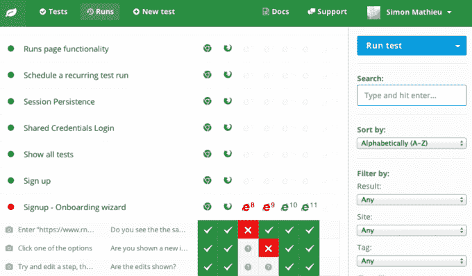

# 雨林筹集 400 万美元建立可扩展的 QA 

> 原文：<https://web.archive.org/web/https://techcrunch.com/2015/02/10/rainforest-raises-4m-to-build-scalable-qa/>

质量保证测试是一个问题，它可以迅速升级，超出初创公司的资源范围，通常需要大公司的整个部门。越来越容易构建具有更多功能、更多数据源、用户可能遇到更多情况的应用程序。

[雨林](https://web.archive.org/web/20221210010459/https://www.rainforestqa.com/)已经筹集了 400 万美元来扩展其解决方案，该解决方案结合了 API 的强大功能和让实际用户查看你的应用程序所带来的洞察力。产品经理(或产品团队中的其他工程师)用简单的英语解释需要测试的内容。在雨林的一端，真实的人然后经历描述的过程，注意任何出现的问题。

这是雨林公司在 Y Combinator 的 2012 年夏季班中为其他批量公司做了合同质量保证工作后想出的一种方法。这家初创公司在离演示日还有三周的时候才提出自己的核心想法，但他们意识到，大多数 QA 团队和第三方顾问采用的方法并不适合初创公司。当你在一个稳定的基础上工作时，为所有事情构建自动化测试是很好的，但是当你不断推出新的特性和界面变化时，很难证明投入资源来构建一个测试套件是合理的，当你重构实际的产品时，这个测试套件需要重新构建。

雨林通过在亚马逊的[机械土耳其人](https://web.archive.org/web/20221210010459/https://www.mturk.com/mturk/welcome)上不断测试新工人来提升其测试能力。它在服务的基础上建立了一个测试层，测试员工对创业公司进行实际测试所需的各种技能。它必须付钱给他们来完成练习任务，但这导致了一大批拥有快速进入新应用程序并识别错误的技能的实际人员。

该公司也并不完全反对使用自动化测试——rain forest 首席执行官 Fred Stevens-Smith 表示，该公司的软件会记录测试人员的按键和点击路径，以创建自动化任务的草稿。由于它将在自己的虚拟机堆栈上运行应用程序，该公司还可以根据基于 PHP 和 Javascript 的应用程序的日志提供性能数据。

目前，雨林能够对运行在 Windows 或 Android 上的网络应用进行[人工自动化](https://web.archive.org/web/20221210010459/https://beta.techcrunch.com/2014/08/15/how-people-are-filling-in-when-ai-cant-do-the-job/)质量保证测试。Stevens-Smith 表示，Mac 和 iOS 网络支持将在下个月的某个时候登陆，实际的原生应用支持正在与[企业级客户](https://web.archive.org/web/20221210010459/https://www.rainforestqa.com/pricing/)进行测试，并计划于 2015 年第四季度发布。

雨林的种子资金来自 Storm Ventures、Rincon、Andreessen、Horowitz、Morado 和 Crosslink。它的客户包括 Zenefits 和 Soylent 的校友以及 IBM 的团队。