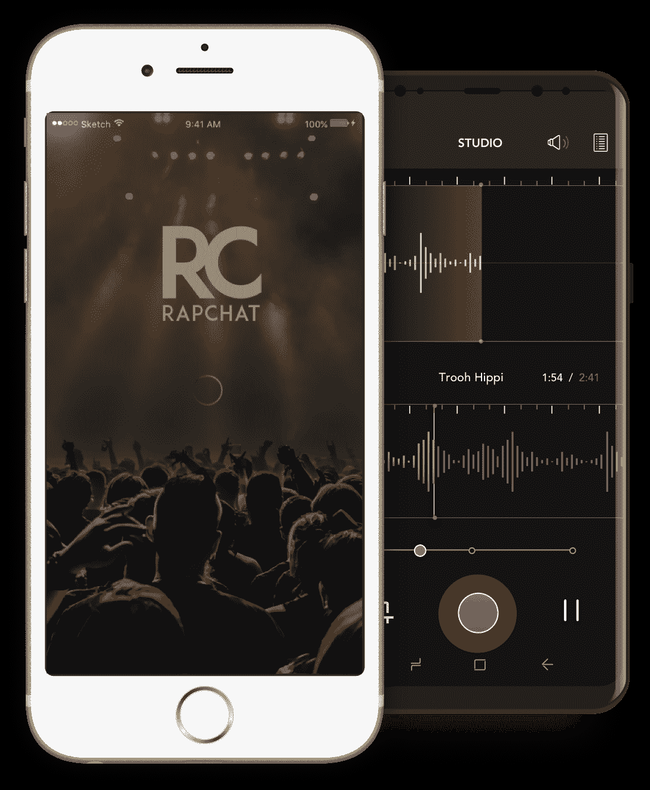

# Rapchat 筹集了 160 万美元来帮助您制作和分享您的 def jams 

> 原文：<https://web.archive.org/web/https://techcrunch.com/2018/04/23/rapchat-raises-1-6-million-to-help-you-make-and-share-your-def-jams/>

关于媒体共享应用 Rapchat，首先要了解的是，联合创始人塞思·米勒不是说唱歌手，而他的另一位联合创始人帕特·吉布森是。他们一起创建了 Rapchat，一个制作和分享 rap 的服务，说唱歌手和书呆子的结合似乎真的开始了。

自从我们上次在 2016 年看了 [app(你可以在下面看到 Tito 的评论)，很多都变了。该团队已经从奥克兰和中西部的投资者那里筹集了 160 万美元的资金。他们的应用程序是一款类似于 T4 音乐的说唱应用，是 iOS 和 Android 上排名前 50 的音乐应用程序，自发布以来已有 1 亿次收听。简而言之，他们小小的社交网络/分享平台是“正在成长的百万富翁，团队的老板，养家糊口的人。”](https://web.archive.org/web/20221210070524/https://techcrunch.com/2016/04/07/rapchat-makes-me-the-rapper-i-always-knew-i-was/)

这对说唱歌手的真诚是真实的。Gibson 曾与大肖恩、维兹·卡利法和玛奇恩·冈·凯利合作演出，他还将 beats 卖给了 MTV。“我的音乐已经在 YouTube、SoundCloud 等网站上获得了超过 2000 万次的播放量，”他给我写道，以一个说唱歌手带着“牛肉”的半粗鲁方式夸耀道。另一方面，米勒喜欢自由泳。

“我从小就喜欢和 OU 的朋友一起自由泳，我注意到许多其他千禧一代也这样做(即使大多数人都很烂)……在凌晨 3 点的任何派对上，总会有一群人在角落里自由泳，”他说。“与此同时，Snapchat 在校园里风靡起来，我想你也应该能为说唱做同样的事情。”

另一方面，吉布森认为这是帮助他学习音乐的重要工具。

“我花了很多时间、精力和资源做音乐，”他说。“我自己制作节拍、写歌、录音/混音、掌控项目，然后分发和推广音乐。有了 Rapchat，顶级制作人的 1，000+节拍库、口袋里的即时录音室以及在全球分发您的音乐并被发现的网络…全部来自一个免费的应用程序。Rapchat 正在通过手机颠覆音乐的创作、合作、分发和发现。”

“我们有一个比任何其他音乐创作应用都大得多但也更活跃的社区，”米勒说。

虽然很明显，这个世界需要另一个分享平台，就像它需要一个脑袋上的洞一样，但由于狂热的粉丝群和一个伟大的想法，该团队已经确保 Rapchat 不会像他们所说的那样，是一个疯狂的游戏。最终，这才是最重要的。