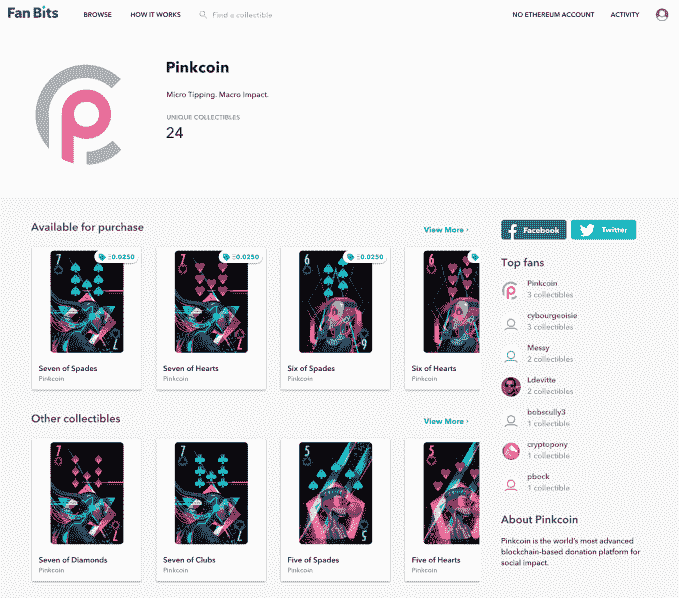

# 稀有比特开创数字收藏品市场 

> 原文：<https://web.archive.org/web/https://techcrunch.com/2018/05/08/rare-bits-launches-a-market-for-digital-collectables/>

# 稀有比特开创了数字收藏品市场

当我们陷入令人困惑的未来时，人们相信，在某个时刻，我们将会交易加密安全的小猫、怪兽和扑克牌。虽然还不清楚为什么会发生这种情况，但稀有比特和它们的新服务 Fan Bits 已经为即将到来的热潮做好了准备。

该公司由戴夫·佩卡尔(Dave Pekar)、阿米特·马哈詹(Amitt Mahajan)和李修贤(他们在将自己的游戏初创公司出售给 Zynga 后相遇)以及帕约姆·杜斯蒂(Payom Dousti，前金融科技风投基金 1/0 Capital)共同创立，从事数字商品交易，并建立了一个基于区块链的买卖数字收藏品的解决方案。李开复引入了一个由前 Zynga 和其他数字平台创造者组成的团队，建立一个基于区块链的买卖数字收藏品的解决方案。例如，在稀有位上你可以买到[这个怪物](https://web.archive.org/web/20221207215019/https://rarebits.io/item/ChainMonsters/85)，并与区块链上的其他怪物战斗。此外，通过他们名为 [Fan Bits](https://web.archive.org/web/20221207215019/https://fanbits.com/) 的新平台，你可以购买与区块链相关的实际收藏品。例如，你可以出售收藏卡，并将部分收益捐给慈善机构。如果新的所有者转售这些卡，那么转售价格的一部分也会捐给慈善机构，这是对智能合同的一种有趣但有点侵入性的使用。

该团队已经在首轮融资中筹集了 600 万美元。Fan Bits 将于 5 月 17 日推出。

“到目前为止，可收集的内容只由开发者为他们自己的 dapps 创建——我想这可以被认为是我们的竞争对手，”Lee 说。“Fan Bits 是第一个让任何人，尤其是不懂技术的人，去创作收藏品的。这将创造出前所未有的大量供应。”

“我们创建了稀有比特，让人们购买、出售和发现加密资产。我们相信，区块链的资产标志着我们拥有和交换财产方式的根本性转变。我们的总体使命是在区块链实现全球在线和离线财产交换，”他说。

李认为这是一种特洛伊木马，让不懂技术的创作者在网上销售数字艺术和设计，而不必了解区块链的变化莫测。

“对于创作者来说，这是一个 DIY 平台，可以将他们的内容转化为独特的收藏品，并在每次销售中赚取以太坊，”他说。“这是第一次，创作者可以在没有任何技术知识的情况下，在现场市场上从想法到发布的加密收藏品。”

鉴于其他数字收藏品的流行——包括许多多人游戏的游戏内装备——在未来几年内，这些东西看起来会变得非常有趣。