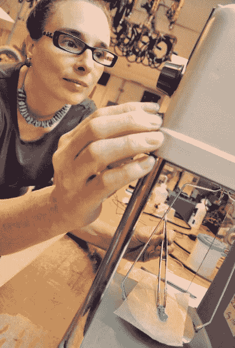
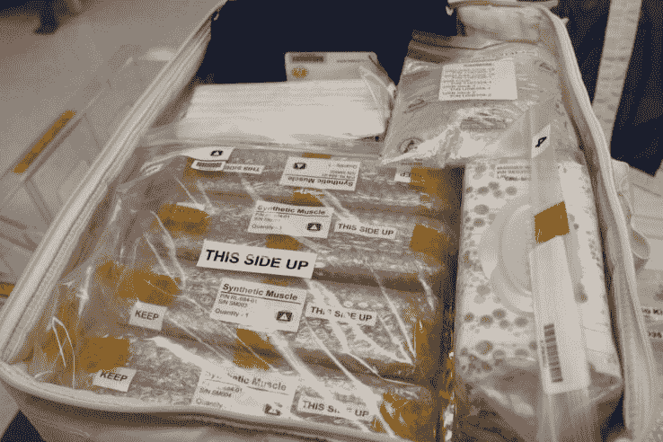

# Ras 实验室正在测试未来的肌肉材料，这种材料可以让机器人感觉更像人类 

> 原文：<https://web.archive.org/web/https://techcrunch.com/2015/09/12/ras-labs-is-testing-futuristic-muscle-material-that-could-make-robots-feel-more-human/>

合成材料初创公司 [Ras Labs](https://web.archive.org/web/20230106053441/http://www.raslabs.com/) 正在与国际空间站合作，测试像活组织一样收缩的“智能材料”。当电流通过时，这些“电活性”材料可以像人类肌肉一样扩展、收缩并符合我们的肢体——它们可以用来让机器人移动，触摸起来更像人类。

Ras 实验室的联合创始人 Lenore Rasmussen 几年前在弗吉尼亚理工大学的实验室里混合化学品时偶然发现了这种合成肌肉材料。实验结果证明配料的数量是错误的，但它产生了一团摇摆不定的果冻，拉斯姆森注意到当她施加电流时，它像肌肉一样收缩和扩张。

几年后，当拉斯姆森的表妹在一次农业事故中差点失去一只脚时，她才开始将这一发现用于机器人肢体和太空旅行。这位联合创始人认为她的表弟可能会失去他的脚，并开始研究假肢。

Ras 实验室的联合创始人莲娜·拉斯姆森

拉斯姆森发现，当时没有多少好的替代品看起来和行为都像人体，或者穿着舒适。因此，她着手发明一种看起来、感觉起来和反应起来都像肌肉的东西，这种东西能紧贴人体结构。

Ras 实验室首席执行官埃里克·桑德伯格将该团队正在做的事情比作《星球大战第五集》中再造卢克·天行者的手臂。桑德伯格告诉 TechCrunch:“这种手臂在某种程度上是假肢的最终目标。”"它提供了逼真的动作、控制和灵活性."

拉斯姆森和她的团队表示，这种材料可以贴合人体。这意味着假体衬垫将收缩并填充空间，以保持与患者身体的舒适贴合。根据桑德伯格的说法，当穿着者在跑步或徒步旅行后脱水时，这种材料甚至会做出反应和调整。

实验室仍处于测试阶段——各种类型的合成材料更坚硬，但没有那么柔韧，其他的更柔韧，但没有那么结实。Ras 实验室最迫切的目标是让这些合成斑点尽可能地模仿人类肌肉。

虽然地球上的焦点是假肢的使用，但当被问及这种材料在外星的应用时，拉斯姆森真的兴奋起来。今年春天早些时候，她的实验室用 SpaceX 6 猎鹰 9 号火箭发送了一批这些聚合物，以观察它们在太空中的表现。

> 我们正在把科幻变成现实。勒诺·拉斯姆森，拉斯实验室

“它们能够终生承受各种非常恶劣的环境。拉斯穆森说:“他们在国际空间站上接受的测试是抗辐射性。

拉斯穆森将不得不等待这些测试的结果一段时间。她的材料将留在轨道上，直到 2016 年火箭返回地球。但是拉斯姆森认为，在接下来的五年里，她将能够把她的合成肌肉应用到人类和机器人身上。人们希望这种材料将被纳入美国宇航局 2020 年火星任务的一部分。

“我们正在把科幻变成现实，”拉斯姆森告诉 TechCrunch。

在短期内，人造肌肉可以在地球上应用。想象一下，把用这些聚合物制成的机器人部署到核灾区或其他人类不能去的不安全的地方。

这也让人类在某种程度上更接近于让我们未来的机器人领主/奴隶看起来和感觉起来更像人类。拉斯穆森告诉我们，有可能将这种材料设计成看起来多肉的，并且可以像人的四肢一样成形。

Ras 实验室还与商业利益合作，创造保护装置和设备，并正在筹集种子资金，以帮助它在地面上和大气层外继续工作。

科学家们已经研究这种流体、柔性“电活性”材料有一段时间了。根据维基百科的说法，最常见的应用是传感器和执行器。这些合成肌肉在机器人、假肢和其他设备上的应用——尤其是在太空旅行中——非常巧妙。

“天空不再是智能材料的极限，”拉斯姆森说。