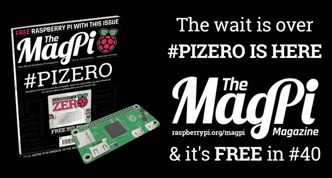

# 神圣的烟雾！新的树莓派零成本仅 5 美元...

> 原文：<https://web.archive.org/web/https://techcrunch.com/2015/11/26/raspberry-pi-zero/>

在谈到低成本单板计算机时，树莓派基金会加大了赌注，宣布其微处理器家族今天增加了一个新成员，称为 T2 派零 T3。而且它的价格……只有 5 美元。(英国有 4 个)

或者它*应该*售价 5 美元，尽管你可能不得不货比三家不同的 Pi 经销商才能以基线价格买到它。某些地区的国际买家可能会发现他们仍在支付溢价。但该基金会的意图是让圆周率零点的零售价仅为 5 美元。

Pi 联合创始人 Eben Upton 在宣布 Pi Zero 的视频中说:“我们真的希望这能让最后几个人进来并参与计算机编程。”

那么圆周率零点是给谁的呢？制造联网设备和机器人项目的制造商可能会排在队伍的第一位。虽然，5 美元的价格很容易让人冲动购买……(事实上，圆周率零点在基金会 MagPi 杂志的封面上是免费赠送的。)

厄普顿告诉 TechCrunch:“我们相信它对希望从事机器人或物联网项目的人特别有用——非常小，功耗低，但当你想进行调试时，可以驱动显示器和键盘。”

家庭中第二便宜的 Pi 是型号 A+,价格为 20 美元。而今年秋天，一款名为 [Orange Pi](https://web.archive.org/web/20230128092558/https://techcrunch.com/2015/09/07/raspberry-shmazberry-theres-a-15-single-board-computer-called-the-orange-pi/) 的 Raspberry Pi 竞争对手/克隆产品也出现了，零售价为 15 美元，因此毫无疑问，低价电脑越来越实惠。

5 美元是否是单板计算机的最低价格仍有待观察——厄普顿认为，至少在可预见的未来，这是最低价格。毫无疑问，对于一台能够运行《我的世界》圆周率和 Scratch 可视化编程语言的成熟电脑来说，5 美元是一个难以置信的价格。

那么，就硬件而言，5 美元的 Pi 能给你带来什么呢？一个 1Ghz 的核心芯片——事实上与最初的 Raspberry Pi 中使用的芯片相同，但运行速度更快——和 512MB 的 RAM，以及前面的端口:一个微型 SD 卡插槽，一个迷你 HDMI 和两个微型 USB 端口。

详细规格如下:

*   Broadcom BCM2835 应用处理器
    *   1GHz ARM11 内核(比 Raspberry Pi 1 快 40%)
*   512 MB lpddr 2 SDRAM
*   一个微型 SD 卡插槽
*   用于 1080p60 视频输出的迷你 HDMI 插座
*   用于数据和电源的微型 USB 插座
*   一个未安装的 40 针 GPIO 接头
    *   与 A+/B+/2B 型号相同的引脚排列
*   未填充的复合视频头

你不明白什么？没有以太网或车载 Wi-Fi，但显然需要以某种方式降低成本。micro-USB 端口可用于插入 Wi-Fi 加密狗进行连接。

使用更小的插座，将元件放在电路板的一侧，并具有非常小的外形尺寸(电路板只有 65 毫米 x 30mm 毫米 x 5 毫米)是电路板设计人员节省成本的其他方法。还有规模经济——在过去几年里已经制造了[数百万张 Pi](https://web.archive.org/web/20230128092558/https://techcrunch.com/2015/02/17/raspberry-pi-sales-pass-5-million/) 。当然，圆周率基金会是一个非营利组织。

“规模经济、持续降低元件成本以及对设计细节的狂热关注(这是今年年初加入我们的 Mike Stimson 设计的第一块主板，这是一个很好的开始)”是 Upton 对 Pi Zero 低价标签的解释。

“董事会的每一个组成部分都是为了证明其存在的合理性，”他补充道。

基金会[最近将](https://web.archive.org/web/20230128092558/https://techcrunch.com/2015/11/03/pi-club/)与课后儿童编码组织 Code Club 合并，目的是在“世界上的每个社区”建立一个代码俱乐部。本月早些时候，当我与他们交谈时，这个目标听起来雄心勃勃。但是现在，有了一台 5 美元的电脑来支持他们的教育任务，这似乎更容易实现。

当被问及他是否认为 Pi Zero 在新兴市场越来越受欢迎时，厄普顿指出，它有一个复合电视输出，并补充说:“因此，发展中国家刚买了一台旧电视的人有可能使用 Zero 将其升级为电脑。”