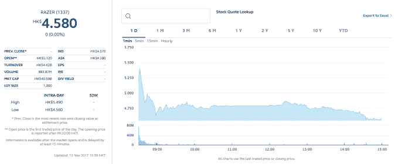

# 游戏公司 Razer 在香港上市后股价上涨 18%

> 原文：<https://web.archive.org/web/https://techcrunch.com/2017/11/13/razer-41-hong-kong-debut/>

Razer 在香港证券交易所上市首日股价飙升 41%后，继续保持了亚洲公司 IPO 的连胜势头。

该公司为 PC 游戏玩家和笔记本电脑制造配件，并准备出售其首款智能手机，通过出售 10.636 亿股股票筹集了 5.29 亿美元。扣除费用后，Razer 估计其税后收入约为 5.04 亿美元。

股价当天收于 4.58 港元(T1)，比 3.88 港元的发行价上涨了 18%——在中国文化中，这是一个吉祥的数字，[达到了雷蛇价格区间的上限](https://web.archive.org/web/20230404211220/https://techcrunch.com/2017/10/31/razer-looks-to-raise-up-to-550m/)。

此次发行被大量超额认购，以至于 Razer 重组了上市计划，向香港当地散户投资者发行更多股票。当地股票和全球股票的最终比例是 50:50。

在上市之前，腾讯支持的中国文学在香港的首次公开募股取得了巨大成功，上周，筹集了超过 10 亿美元，首日交易后股价上涨了 86%，中国搜索引擎搜狗，在纽交所上市。

Razer 在其最初的招股说明书中表示，它计划将筹集的资金投资于研发和新产品。它已经通过收购扩展到智能手机、音频设备和支付领域。该公司在最近几周发布了其首款手机的细节，该手机将于 11 月 17 日开始发货。

这家美国-新加坡公司四分之三的收入来自为游戏玩家销售鼠标、耳机和键盘等配件，但它计划推出软件服务并推广其他硬件产品。

自 2014 年以来，Razer 一直没有盈利，2015 年和 2016 年分别亏损 2000 万美元和 5960 万美元。该公司表示，前者在很大程度上归因于美国上市流产的成本，而其最近一个财年的股票期权和研发活动都有所增加。剔除这笔薪酬，Razer 2016 年的亏损更为温和，为 2060 万美元。

我们将于 11 月 21 日在即将到来的 TechCrunch Meetup 上与 Razer 首席执行官陈民亮讨论 IPO 的更多细节。Sea 董事长 Nick Nash 刚刚从[的 8.8 亿美元的美国 IPO](https://web.archive.org/web/20230404211220/https://techcrunch.com/2017/10/20/sea-to-raise-upwards-of-884m-from-u-s-ipo/) 中走出来，他也将加入讨论他的公司从创业到上市的过程。这肯定是一个伟大的事件——请继续关注本周的门票信息。

*注:文章更新更正，Razer 的股价收盘上涨 18 %,但在交易日中的定价高达 41%。*