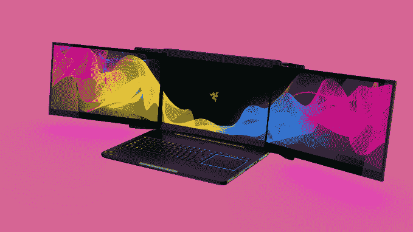

# 新的室内游戏投影和 3 屏笔记本电脑让 Razer 身临其境 

> 原文：<https://web.archive.org/web/https://techcrunch.com/2017/01/05/razer-goes-immersive-with-new-in-room-gaming-projection-and-new-3-screen-laptop/>

为铁杆游戏爱好者打造硬件和软件的[十亿美元创业公司](https://web.archive.org/web/20221025223605/https://beta.techcrunch.com/2016/02/22/razer-raises-at-a-1-5b-valuation-with-75m-from-chinas-digital-grid-for-immersive-gaming/)Razer 今天发布了两款旨在提升沉浸式游戏体验的最新产品。而且——令人惊讶的是，鉴于[我们已经在 CES 上看到了](https://web.archive.org/web/20221025223605/https://beta.techcrunch.com/2017/01/04/intel-unveils-new-project-alloy-headset-for-merged-reality-to-ship-in-q4/)[这一领域的](https://web.archive.org/web/20221025223605/https://beta.techcrunch.com/2017/01/04/htc-teases-netflix-style-subscription-service-for-viveport-vr-app-store/)本周[已经有](https://web.archive.org/web/20221025223605/https://beta.techcrunch.com/2017/01/03/odg-unveils-its-first-consumer-ar-glasses-built-on-qualcomms-snapdragon-835-chip/)了——Razer 并没有推出另一款虚拟现实工具。

Project Ariana 是一款新的室内投影仪，它通过大量的灯光、颜色和高清声音来扩展您的游戏性。Project Valerie 是 Razer 的最新笔记本电脑，它赋予了宽屏概念新的含义:它的显示屏呈三联式，让便携式电脑用户可以使用三个屏幕，而不是一个。

Razer 还开放了其 Chroma 16.8 万调色板——Razer 内置于其计算机和外设中的彩色闪光灯，可响应游戏性——以便第三方可以使用。Razer 表示，早期采用者包括联想、NZXT、Antec、联立、Wicked Lasers 和 Nanoleaf。

这两款硬件产品今天在拉斯维加斯的 CES 上发布，但 Valerie 笔记本电脑要到今年晚些时候才会发货，并且仍然缺少几个规格的细节(包括电池寿命)。

与此同时，阿丽亚娜被称为“概念设计”，没有一个粗略的交付日期。事实上，甚至在 CES 上的展示也已经到了最后阶段，我们无法在新闻发布之前获得我们自己的视频和照片。我们会这样做，并在周四展会开幕后与 Razer 的创始人兼首席执行官陈民亮进行对话，届时会进行更新。

就目前而言，Ariana(此处展示的投影仪模型)最引人注目的一个方面是，它展示了 Razer 如何扩展一直是该公司标志的一些概念，以及它如何使用它通过收购获得的一些技术。

Razer 的色度照明技术构成了 Ariana 投影仪发出的光线和颜色的基础，使房间充满了 Razer 键盘和其他硬件上出现的相同类型的闪光。迄今为止，Chroma 一直是一个受欢迎的功能:Razer 表示，已经售出约 500 万台内置该功能的设备。

虽然 Razer 并没有对这个细节大肆渲染，但事实证明 Ariana 是用 THX 声音技术制造的。你可能还记得[雷蛇去年年底收购了标志性的音频公司和品牌](https://web.archive.org/web/20221025223605/https://beta.techcrunch.com/2016/10/17/razer-acquires-audiovisual-icon-thx-as-it-explores-growth-beyond-the-games-industry/)，意图将其业务扩展到传统外设和传统游戏用户范围之外。阿丽亚娜是如何实现这一目标的一个例子，理想的情况是与其他硬件和软件制造商组成一个网络，使其得到更广泛的采用。

“Project Ariana 是一个概念设计，展示了 Razer Chroma 平台在前虚拟现实世界中弥合玩家和游戏之间差距的能力和潜力，”Razer 联合创始人兼首席执行官陈民亮说。“视频投影、多色照明和 Razer Chroma 引擎的智能响应正在改变我们今天的游戏方式。我们和我们的出版和技术合作伙伴正在努力开发新的视觉解决方案，以创造更加不可思议和视觉丰富的明天。”

如果 Ariana 是要将游戏体验带到屏幕之外，那么上图的 Project Valerie 解决了许多游戏玩家无论如何都会继续关注屏幕的事实。

Razer 表示，这款新笔记本电脑是世界上第一款内置三个显示器的便携式笔记本电脑。它的每一个 17.3 英寸 4K IGZO 显示器都包括 NVIDIA G-SYNC 技术，用于平滑的帧速率，以及 180 度 NVIDIA 环绕视图游戏。Razer 表示，虽然 Valerie 有可能成为虚拟现实体验的替代设备，但它也是为虚拟现实准备的，无缝集成并支持 HTC 的 Vive 和 Oculus Rift 等设备。

屏幕在铰链上展开，由用户操作，可以选择使用(当您更改屏幕设置时，支持的游戏会改变它们的视图)。

虽然 Valerie 笔记本电脑的最初目标是为游戏玩家提供更宽的屏幕，但 Razer 也在继续其更广泛的战略，即不仅为硬核游戏世界打造产品和体验。在这种情况下，该公司将这款电脑定位为那些可能需要大屏幕用于其他用途的人的有力竞争者，如设计或商业专业人士。

“对于专业人士、创作者和游戏玩家来说，多显示器桌面设置正变得越来越必要，”Min 说。“我们第一次设计了一个用户可以随身携带的解决方案。”

尽管如此，有一种明确无误的感觉是，三屏瓦莱丽笔记本电脑可能会步渡渡鸟的后尘——一种过于笨拙的超大标本，无法进入计算世界发展的下一步。只有时间才能证明是否有足够多的用户真正想要超宽屏幕和便携性的双重功能。

令人鼓舞的是，Razer 和 Ariana 和 Valerie 一起，推动硬件公司能够和应该做的事情，而不一定要和其他公司一起前进。