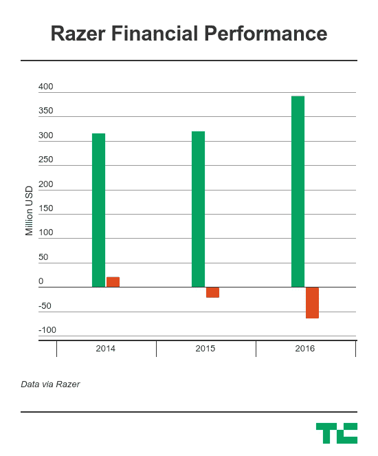

# 游戏配件公司 Razer 将在香港 IPO 筹资 5.5 亿美元 

> 原文：<https://web.archive.org/web/https://techcrunch.com/2017/10/31/razer-looks-to-raise-up-to-550m/>

为游戏玩家生产个人电脑和外设的美国-新加坡公司 Razer 在披露其价格区间后，将从其香港 IPO 中筹集高达 5.5 亿美元的资金。

该公司于 7 月份首次提交上市申请，今天它证实计划以 2.93-4.00 港元的价格区间发行 10.636 亿股股票，约合 0.38-0.51 美元。如果全部配股以最高价格出售，那么上市将筹集 5.5 亿美元，按中等价格计算，即 35 亿港元或 4.5 亿美元。

12 岁的 Razer 计划将收益用于开发新产品垂直市场——预计将在今年年底前发布其首款移动设备——为收购和 R&D 提供资金，并通过增加营销活动来发展其品牌。

它已经有了一批令人印象深刻的追随者——它最忠实的粉丝身上纹着雷蛇的标志——这要归功于销售“为游戏玩家、由游戏玩家制造”的产品的口号。

四分之三的收入来自游戏鼠标、增强键盘、专业耳机等个人电脑配件的销售，但该公司通过[Razer Blade](https://web.archive.org/web/20221205195658/https://beta.techcrunch.com/2015/02/25/the-new-razer-blade-is-the-gaming-laptop-to-beat/)进军个人电脑设备，这是一款专门用于便携式游戏的高性能笔记本电脑，价格超过 2000 美元，[在 2016 年收购了视听品牌 THX](https://web.archive.org/web/20221205195658/https://beta.techcrunch.com/2016/10/17/razer-acquires-audiovisual-icon-thx-as-it-explores-growth-beyond-the-games-industry/) 。尽管价格不菲，但这款刀片的利润率还不到 3%。

Razer 在招股说明书中说，由于专注于拓展业务，它在一段时间内不太可能盈利。除了硬件，它还押注一家数字服务公司可以利用其品牌来支付股息，其支付平台[由另一项收购](https://web.archive.org/web/20221205195658/https://beta.techcrunch.com/2017/06/23/razer-makes-virtual-currency-push/)提供资金，这是该战略的一个关键部分。它的目标是扩大在中国和北美等关键市场的份额，在中国，它自称是顶级游戏配件品牌，而在北美，它已经占据了 50%的销售额。

这还没有到来，Razer 可以指出，在 2015 年和 2016 年分别亏损 2000 万美元和 5960 万美元之前，2014 年盈利 2030 万美元。该公司表示，前者在很大程度上归因于美国上市流产的成本，而其最近一个财年的股票期权和研发活动都有所增加。剔除这一补偿，Razer 2016 年的亏损更为温和，为 2060 万美元。

就收入而言，Razer 处境艰难。总销售额的增长并不惊人，相反，该公司真正的机会是全球游戏产业本身将扩大，给它更多的客户。

很少有关于外设领域的分析，但 Razer 自己委托的一份报告得出结论，游戏外设在 2016 年是一个 20 亿美元的市场。随着全球游戏玩家人数预计从 2016 年的 20 亿跃升至 2021 年的 27 亿，Razer 正在向投资者推介这一机会，同时进军移动、AV、服务和支付领域。

已经买入这一愿景的现有支持者包括富士康(Foxconn)、英特尔(Intel)、IDC-Accel 和香港首富李嘉诚(Li Ka-shing)，李嘉诚通过他的 Redmount Ventures 基金进行投资。

[SCMP 报道](https://web.archive.org/web/20221205195658/http://www.scmp.com/business/companies/article/2117662/razer-seeks-us550-million-hong-kong-ipo-eye-worlds-largest-game)他们将与致力于 IPO 的投资者新加坡基金 GIC、房地产公司京基(中国)和新海宜(新加坡)、来自印尼的卷烟集团 Djarum 和澳门赌场老板 Loi Keong Kuong 一起。本周将向公众发售一部分股票。

除了 Razer，腾讯的中国出版集团(类似亚马逊 Kindle 的电子书业务)也将在香港上市。在[自拍应用 make Meitu 在去年 12 月的上市中筹集了 6.29 亿美元后，HKSE 增加了对科技公司的兴趣。](https://web.archive.org/web/20221205195658/https://beta.techcrunch.com/2016/12/15/meitu-hong-kong-ipo/)