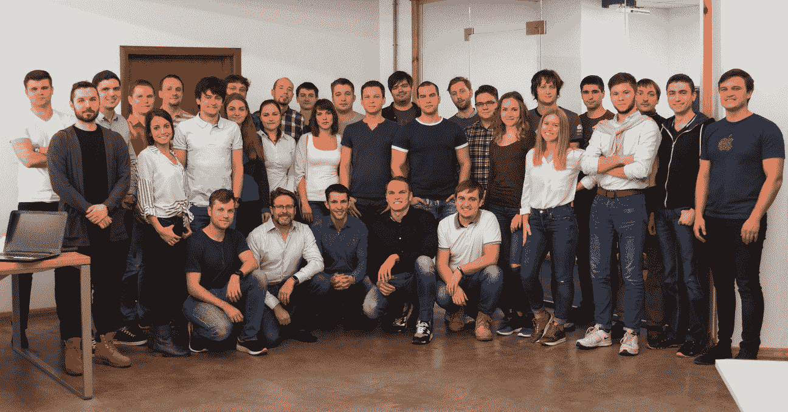

# Readdle 雇佣苹果邮件工程经理来开发 Spark 

> 原文：<https://web.archive.org/web/https://techcrunch.com/2017/03/29/readdle-hires-apple-mail-engineering-manager-to-work-on-spark/>

第三方应用开发者 Readdle 已经在 iOS 和 macOS 上开发了一些最成功的生产力应用。特别是电子邮件客户端 [Spark](https://web.archive.org/web/20230225054624/https://sparkmailapp.com/) 将成为 Readdle 的下一个大赌注。Readdle 刚刚聘请了特里·布兰查德(Terry Blanchard)，他是苹果邮件的一名工程经理，已经工作了六年。他将在硅谷建立一个新团队。

Readdle 通过销售生产力应用程序，如 Scanner Pro、PDF Expert 和 Calendars 5，在 App Store 上建立了一整个公司。对于今天为 Readdle 工作的一百多人的团队来说，这是一个伟大的创业故事。但电子邮件应用是一个竞争非常激烈的领域，仅在 iOS 上就有许多流行的免费电子邮件客户端，如 Outlook、Gmail 和 EasilyDo Mail。

所以 Readdle 决定免费发布 Spark。Spark 现在[可以在 iPhone、iPad、Mac 和 Apple Watch 上使用](https://web.archive.org/web/20230225054624/https://techcrunch.com/tag/spark/)。三个关键功能是智能收件箱、搜索功能和所有可用的个性化功能。

在 Spark 中，你可以选择用传统的时间顺序列表来查看你的邮件。但是你也可以选择自动分类你收到的邮件。Spark 根据对您重要的类别将电子邮件分组到不同的小部件中。例如，你可以把新邮件放在顶部，然后是固定邮件，然后是时事通讯，等等。

在许多方面，这个功能让人想起 Gmail 的分类。但 Spark 与所有电子邮件提供商合作，可以将不同账户的电子邮件放在一个统一的收件箱中。

说到搜索功能，你可以使用自然语言来搜索特定的东西。例如，你可以搜索“Elon Musk 发送的 PDF 附件”,找到关于火星殖民的秘密文件。您可以存储搜索查询并创建智能文件夹。

总部位于乌克兰敖德萨的 Readdle 希望更有雄心，为电子邮件应用程序吸引最优秀的工程人才。这就是为什么该公司将在硅谷开设第二个办事处，由布兰查德领导团队。Readdle 也在考虑第一次融资。

你可以期待未来的 Android 应用程序以及更强大的日历功能。您还将能够自动化更多的任务，并与您的团队协作。

我认为电子邮件是一件非常私人的事情。你必须尝试许多不同的应用程序，找出适合你的。但是每个人都需要一个电子邮件客户端。如果 Readdle 能够满足这一市场的大部分需求，该公司最终可能会成为一家关键的生产力公司。

