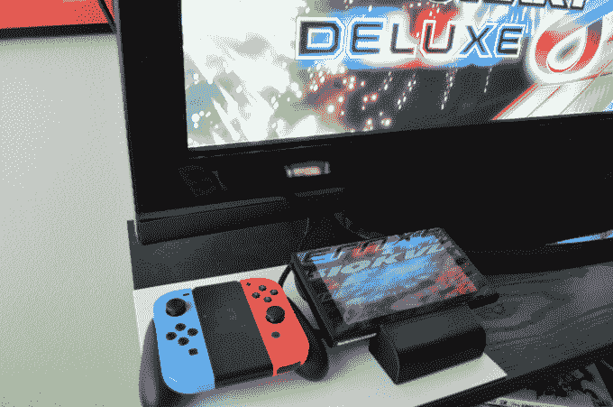
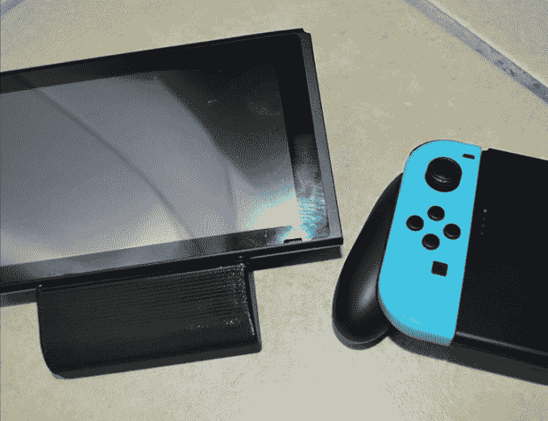
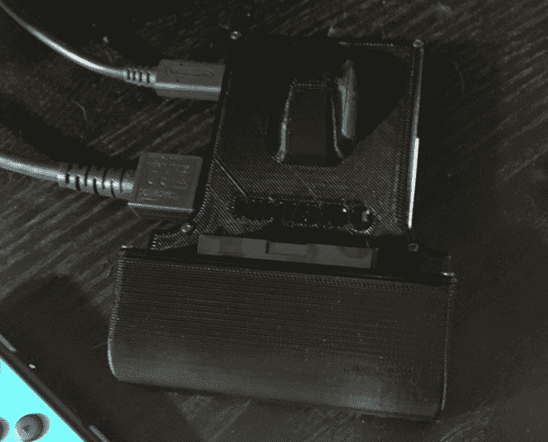
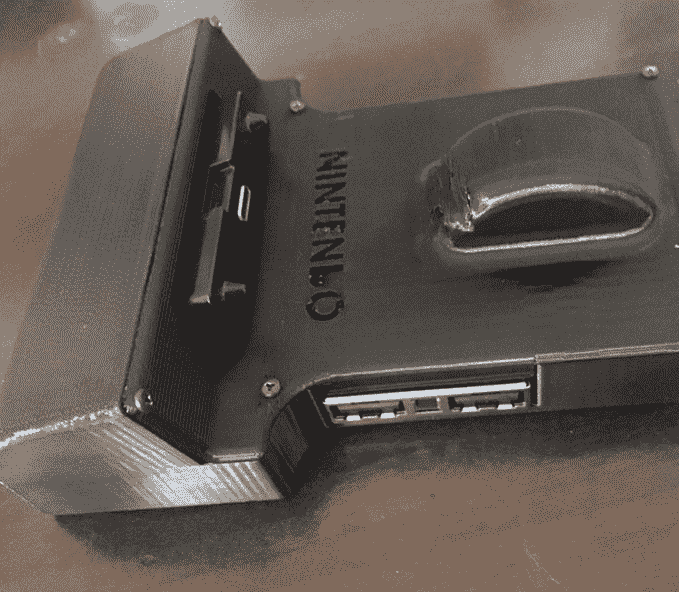
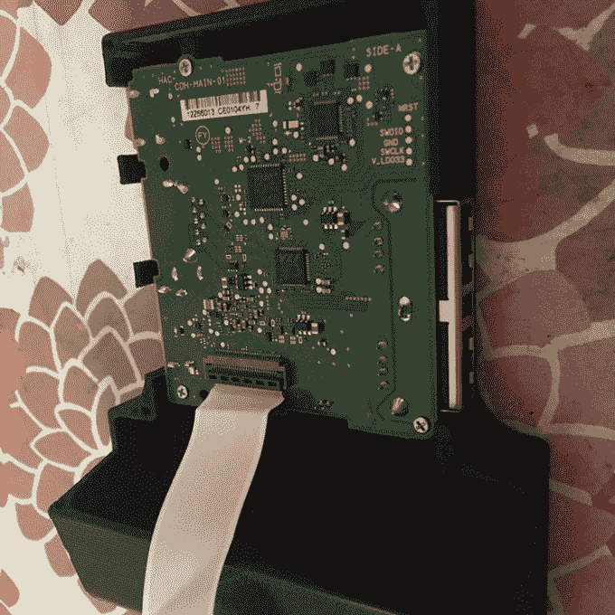

# 真的，任天堂，人们想要一个更小的，便于旅行的转换坞 

> 原文：<https://web.archive.org/web/https://techcrunch.com/2017/05/07/really-nintendo-people-want-a-smaller-travel-friendly-dock-for-the-switch/>

# 真的，任天堂，人们想要一个更小的，便于旅行的转换坞

人们似乎真的想要一个更小、更轻的任天堂 Switch 船坞。它可以让你在旅途中将开关连接到电视上，而不会浪费盒子里砖头大小、大部分在空气中的基座的手提箱空间。

上周，我写了一篇关于一位 DIYer 通过拆除和重建原来的码头为自己建造的旅行码头的文章，写信询问更多细节的人多得惊人。所以这种兴趣肯定是存在的。

但是仍然没有现成的好的解决方案，所以在家的人们继续为自己迭代这个想法。

在我的上一篇文章发表几天后，读者 [billyjo182](https://web.archive.org/web/20221006165311/https://www.instagram.com/billyjo182/) 发来了他对 porta-dock 概念的看法。

像另一个版本一样，这个迷你 dock 借用了任天堂 dock 的内脏作为其核心，有效地将它的各个部分在 3D 打印的外壳中进行了新的排列，减少了许多额外的空间。事实上，这一款比原来的 Dock 多了一点点*,包括使用 Dock 自己的弹出式 USB-C 连接器(而不是使用额外的可拆卸 USB-C 电缆),这样人们就可以放下开关走了。基座顶部的一个小隆起将开关支撑在正确的角度，以避免对连接施加太大的压力。*

 *每种方法都有自己的优势，但总的信息是相同的:有一种方法可以做到这一点，交换机所有者似乎想要它。

这是他们发过来的几张码头的照片:

*