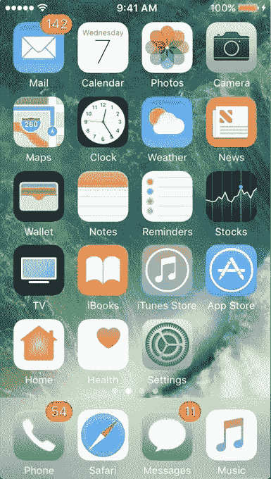

# Rebelmail 更名为 Rebel，并在其交互式电子邮件平台 TechCrunch 中增加了一键结账功能

> 原文：<https://web.archive.org/web/https://techcrunch.com/2017/06/07/rebelmail-rebrands-as-rebel-and-adds-one-click-checkout-to-its-interactive-email-platform/>

# Rebelmail 更名为 Rebel，并在其交互式电子邮件平台上增加了一键结账功能

Rebel 一直在帮助营销人员利用他们的电子邮件做更多的事情——以便这些电子邮件成为他们自己的互动体验(具有画廊和测验等功能)。现在，这家初创公司[正在为消费者增加通过电子邮件完成购买的功能](https://web.archive.org/web/20230121232519/http://blog.gorebel.com/shop/)。

该公司以前被称为 Rebel mail(T4)，但作为今天发布的一部分，它更名为 Rebel。联合创始人乔·特普洛告诉我，虽然 Rebel 目前的能力以电子邮件为中心，但它的野心更大——他希望为企业用来联系客户的一系列渠道带来“身临其境的互动体验”。

至于[新的 Rebel 商店产品](https://web.archive.org/web/20230121232519/https://gorebel.com/shop.html)，它似乎实现了 Rebel 将电子邮件变成移动店面的承诺。在此之前，用户可以通过智能手机上的电子邮件浏览和定制零售商的不同产品，然后将它们添加到购物车中，但他们必须点击网站才能实际购买。有了这些新功能，消费者只需点击“立即购买”按钮，整个交易就可以通过电子邮件完成。

例如，零售商可以向购物者发送消息，询问他们是否打算放弃他们的在线购物车，然后购物者可以通过该电子邮件完成购买，不需要网站。

为了访问一键式结账，客户需要事先向零售商或 Rebel 网络中的另一家零售商提供他们的支付信息。(尚未分享此信息的客户将被引导至移动结账页面，他们可以在此保存信息以供将来使用。)这意味着消费者永远不会被要求在电子邮件中分享信用卡信息。该公司还表示，其支付系统“完全符合 PCI 标准”

泰普罗认为，电子邮件已经成为零售商“最后拥有的渠道”，他们可以直接接触到客户，而不必担心新闻馈送算法或通过广告宣传自己。通过在这个过程中增加一键支付，他希望提供“最无摩擦的体验”。