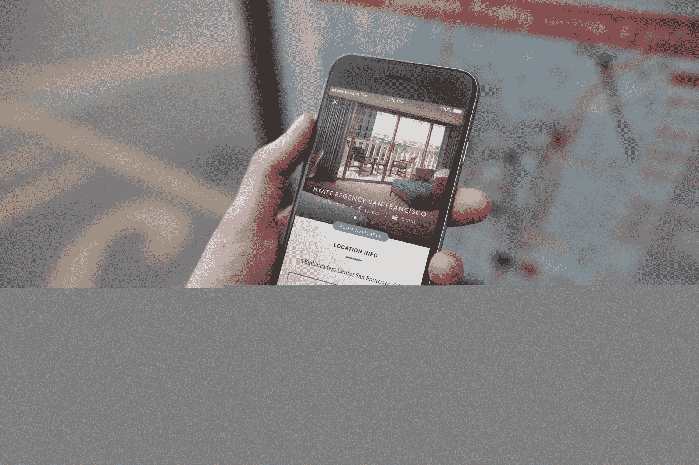

# 充值让您可以预订酒店房间-每次几分钟 

> 原文：<https://web.archive.org/web/https://techcrunch.com/2016/03/24/recharge-lets-you-book-a-hotel-room-for-minutes-at-a-time/>

称之为类固醇点播。一家成立 10 个月的旧金山名为 [Recharge](https://web.archive.org/web/20221208035751/https://recharge.co/) 的公司开发了一款应用程序，使用户可以以每分钟 67 美分或每小时 40 美元的价格预订酒店。

这一提议听起来既聪明又荒谬，但它已经吸引了一些聪明的投资者，包括斯科特和塞恩·班尼斯特以及早期谷歌工程师哈里·张，他们为该公司提供了 65 万美元的种子资金。总共筹集了 250 万美元。

为了更多地了解这家公司，我们最近与首席执行官伊曼纽尔·巴福(Emmanuel Bamfo)进行了交谈，他曾在初创公司短暂工作过，包括在拼车公司 Hitch ( [被 Lyft](https://web.archive.org/web/20221208035751/http://www.businessinsider.com/lyft-buys-hitch-2014-9) 收购)，之后与圣路易斯华盛顿大学的两名前同学合作创建了 Recharge。

好吧，给我们讲讲这个看似疯狂但可能行得通的想法。你的目标受众是谁？

海尔哥哥:今天早些时候，一个从洛杉矶来旧金山一日游的人预定了充值。我们看到人们只想换尿布或给孩子喂奶。我们有住在门洛帕克但在旧金山工作的人，他们想在去参加一个晚上的约会之前洗个澡，给自己一点时间。

这是我们正在解决的真正需求。(顾客)在城市里有了隐私，可以小憩、淋浴或做一些准备。你不能在星巴克这样做。

这个概念很像[呼吸者](https://web.archive.org/web/20221208035751/http://www.strictlyvc.com/2015/04/24/need-a-breather-this-vc-is-hoping-so/)的概念，它在城市中提供按需房间，这样游客可以和朋友一起放松，或者打一些安静的电话。我们还应该注意到，呼吸器已经从投资者那里筹集了近 2800 万美元。为什么这样更好？

EB:类似于呼吸器，但是呼吸器是在一个办公空间里。周末不能用。这是朝九晚六的事情。我们为用户提供床，淋浴，浴室。其他地方的市场上目前没有这种产品，这就是为什么我们认为 Salesforce 的人、风险社区的人和律师事务所的人都在使用它。我们有客人停留了 12 分钟；我们已经有人呆了 25 个小时了。

25 小时听起来像是糟糕的计划，但你是说没有最短停留时间？

海尔哥哥:没有。我们与旧金山的 Hyatt 和 Starwood Properties 有关系，每次有人预订充值，那个人可以想住多久就住多久，之后酒店会打扫房间。有人可能一天在一个酒店呆 20 分钟，然后在晚上活动之前在另一个酒店呆两个小时。对酒店来说是值得的。

TC:你们分成了吗？

EB:我们与财产分享收入，这取决于日期和时间以及一个月的时间。

**TC:你是为了一定的库存而上钩的吗？**

海尔哥哥:不。我们不买这些房间然后再卖。如果有人来，我们赚钱，酒店也赚钱。如果没有，我们没有。但我们每天都有库存，而且我们有证据表明酒店可以从(我们)身上赚钱。我们正在为酒店创造新的收入来源，为他们带来本地顾客；我们还为客户创造了新的生产力来源。人们不必开车回帕洛阿尔托去准备晚上的事情。

**TC:你说过你的收入分成会根据日期和时间而变化。用户也要支付激增价格吗，或者你会给那些想停留 8 小时而不是 12 分钟的人提供折扣吗？**

EB:我们没有高峰定价，现在，当一个客户想要来八个小时，他们按分钟付费。我们确实计划包括一天的费用，但是我们现在没有。

去年夏天，你悄悄地在海湾地区的几家酒店里开展了业务。你能说一下到目前为止有多少人用过一次充值吗？

EB:我们没有公开谈论我们的数字，但是我们的月环比增长了 104 %, 25%的住宿来自回头客。

我们现在只在旧金山湾区运营，尽管我们正在扩大覆盖范围，从[旧金山]机场开始，我们计划接下来去洛杉矶、纽约和伦敦。

**TC:很多人会把充值看作是胡来的地方，因为，嗯，人类。这是你或你的酒店合作伙伴关心的事情吗？**

海尔哥哥:我们没见过摇滚客户。我们在旧金山的黄金时段。这些是商务酒店。酒店会对你进行评级，所以对用户的行为有一定的期待。有充分的证据表明，除了考虑性之外，人们还想把这些(酒店房间)用作短期生活空间。

你应该去看看。

*TechCrunch 的读者们，你们也可以看看这项服务。现在，如果你[访问网站](https://web.archive.org/web/20221208035751/http://recharge.co/)并输入代码 TECHCRUNCH，该公司会给你最多 30 分钟的免费时间。*