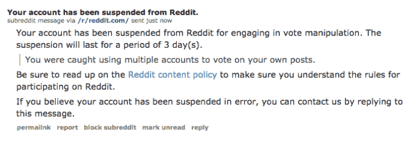

# Reddit 用账户暂停取代了令人困惑的 Shadowban 系统

> 原文：<https://web.archive.org/web/https://techcrunch.com/2015/11/11/reddit-account-suspensions/>

Reddit 已经取代了[的 shadowbans](https://web.archive.org/web/20230329233118/https://www.reddit.com/r/self/comments/3ey0fv/on_shadowbans/) ，后者使得违反[网站规则](https://web.archive.org/web/20230329233118/https://www.reddit.com/help/contentpolicy)的用户的帖子不可见，并被暂停账号。该社区上个月拥有 2 . 02 亿独立访客，实施了影子禁令来快速隐藏垃圾邮件，但该系统让个人感到沮丧，因为他们通常不知道自己是否被影子禁令了。

“我们目前的账户限制形式——影子禁令——对于对付机器人/垃圾邮件团伙非常有效，但对于真正的人来说却远远不够。我们认为暂停是一个巨大的进步，”Reddit 在一份声明中说。

Reddit 创建并使用的第一种禁令 Shadowbans 是阻止垃圾邮件发送者涌入网站的有效方法，但正如 Reddit [在三个月前的一篇帖子中承认的那样](https://web.archive.org/web/20230329233118/https://www.reddit.com/r/self/comments/3ey0fv/on_shadowbans/)。用户[通常不会被告知](//web.archive.org/web/20230329233118/https://blog.jixee.me/am-i-shadowbanned-on-reddit/%E2%80%9C)他们是否已经被屏蔽，这意味着他们可能会在子博客上发布一段时间，然后才最终弄清楚为什么每个人都似乎忽略了他们。

该系统还使得 shadowbanned 用户很难求助于版主来挽救他们的账户。甚至还创建了一个子编辑， [r/shadowban](https://web.archive.org/web/20230329233118/https://www.reddit.com/r/shadowban) ，让用户知道他们是否被屏蔽了。

帐户暂停目前只能由管理员(他们是 [Reddit 的员工](https://web.archive.org/web/20230329233118/https://www.reddit.com/about/team))申请，而不是 subreddit 版主。帐户暂停的最大变化是用户将通过私人信息和网站通知立即得到通知。他们可以通过回复首相来上诉，而不是必须花几天甚至几周的时间来弄清楚他们是否被屏蔽了。

暂停可以是永久的，也可以是暂时的，用户会被告知在多长时间内不能向 Reddit 发帖(大多数禁令会持续三到五天)。被暂停的用户不能发帖、投票、评论或发送私人消息。他们的帐户在只读模式下仍然可见，他们可以继续删除或编辑过去的帖子和评论。正如[用户 u/Viking83 指出的](https://web.archive.org/web/20230329233118/https://www.reddit.com/r/announcements/comments/3sbrro/account_suspensions_a_transparent_alternative_to/cwvv0hq)，这很重要，因为它防止管理员删除他们不同意的帖子。

帐户暂停是对影子禁令的巨大改进，但目前的系统仍然有几个缺点。例如，暂停版主不能修改邮件或管理他们的子编辑。这可能会(讽刺地)导致垃圾邮件的涌入，尽管 Reddit [可能会增加这个功能](https://web.archive.org/web/20230329233118/https://www.reddit.com/r/announcements/comments/3sbrro/account_suspensions_a_transparent_alternative_to/cwvu4vi)。

倪星影子银行和实施更透明的系统来处理违反网站内容政策的人可能有助于缓解长期用户的抱怨，他们抱怨 2005 年推出的 Reddit 忽视了其核心社区的需求，通过像新闻网站 Upvoted 这样的举措来寻求主流增长。

在过去的几个月里，该公司因解雇“问我任何事”协调员维多利亚·泰勒(Victoria Taylor)等举措而受到抨击，这导致了 Reddit 一些访问量最大的子网站的反抗。在[于 6 月](https://web.archive.org/web/20230329233118/https://www.reddit.com/comments/3cucye/)辞职之前，前首席执行官 Ellen Pao [承认公司](https://web.archive.org/web/20230329233118/https://techcrunch.com/2015/07/06/reddit-we-screwed-up/)由于没有兑现对用户的承诺而“搞砸了”,并承诺网站将会改进。