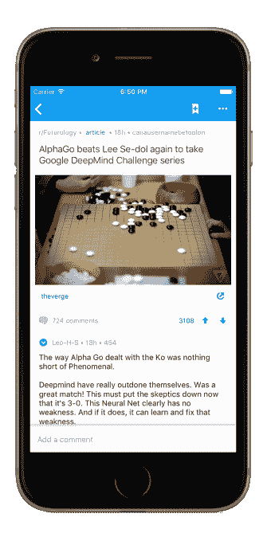

# Reddit 发布首个 iOS 和 Android 官方应用

> 原文：<https://web.archive.org/web/https://techcrunch.com/2016/04/07/reddit-launches-its-first-official-apps-for-ios-and-android/>

Reddit 期待已久的原生移动应用——该公司首次内部开发——现已推出。正如[之前宣布的那样，新的 Reddit 应用程序今天同时适用于 iOS 和 Android 系统](https://web.archive.org/web/20230228052111/https://www.reddit.com/r/AlienBlue/comments/46gg1f/a_new_chapter_reddit_for_ios/)，它不仅将成为在众多第三方客户端中访问移动 Reddit 的官方手段，还将取代[于 2014 年秋季收购的流行第三方应用程序 Alien Blue](https://web.archive.org/web/20230228052111/https://techcrunch.com/2014/10/15/reddit-acquires-alien-blue-the-most-popular-unofficial-reddit-app/)。

Alien Blue 将不再能够在 App Store 和 Google Play 中使用，这意味着尚未在手机上安装它的新用户将无法使用它。

Reddit 负责消费产品的副总裁亚历克斯·勒(Alex Le)称，减少 Alien Blue 业务的决定是一个“艰难”的决定。当他在 11 月到达时，他说他的目标之一是改进和稳定 Alien Blue，但开始时只是一个简单的改进项目，最终变成了一个更大的努力。

他解释说，工程团队很快意识到，最好从头开始重建其 iOS 应用程序，以使其“更快、更现代、更可用”。

此外，由于新的代码库，现在的计划是以比以前的 Alien Blue 应用程序更快的速度提供新功能。事实上，我们被告知，计划是每月至少发布一次更新，如果不是更多的话。

然而，不仅仅是因为需要加快应用程序改进的速度，才促使 Reddit 在移动领域提出自己的主张。该公司还表示，目前有 50%的用户在移动设备上浏览 Reddit，包括移动网络和通过第三方应用程序。当你的受众有一半是通过手机到达时，你必须更仔细地考虑你想要传递的体验。

尽管 Alien Blue 正在被关闭，但 Reddit 希望通过应用其在收购后的几个月里学到的东西，将这些用户转移到新的移动应用程序。

[gallery ids="1303473，1303474，1303472，1303471，1303470，1303469，1303468，1303467"]

“我们从热情的 Alien Blue 社区学到了很多关于如何制作一个优秀的 iOS 应用程序的知识，我们在为 iOS 构建 Reddit 时应用了这些知识，”Le 解释道。“由于资源有限，我们决定将我们的努力集中在使 Reddit for iOS 成为我们主要和官方的 Reddit 客户端上。”

我们应该注意到，Alien Blue 的开发者作为工程师也参与了新应用的开发。

新的 Reddit 移动应用程序提供了许多关键功能，旨在将其与目前市场上广泛的客户端区分开来。例如，它包括一个“卡片视图”选项，以更好地展示丰富的媒体内容，有时它会提供特定于平台的功能，如 iOS 的可拖动“快速阅读”按钮。

一些功能旨在迎合更多常规 Redditors 的需求——包括其他第三方客户端甚至 Alien Blue 中没有的功能。其中之一是支持可定制的子编辑。在新的 Reddit 应用程序中，版主现在可以自定义他们的子编辑的外观和感觉。

与此同时，其他改进更多的是幕后调整，如应用程序的大小。该公司指出，iOS 下载只有 4.8 兆字节——这意味着该应用程序在 LTE 连接下只需几秒钟即可下载。

[gallery ids="1303475，1303476，1303478，1303479，1303480"]

虽然 Alien Blue 可能会被关闭，为 Reddit 的官方新应用程序腾出空间，但 Reddit 没有任何计划限制其第三方应用程序开发者社区，因为它正在移动领域做出更大的努力。相反，重点只是为自己的观众提供一个很好的体验。

“在 Android 和 iOS 上拥有一个原生的 Reddit 应用程序——尤其是这么快——将会破坏很多人的生产力。我对此没意见，”Reddit 联合创始人亚历克西斯·奥哈尼安说。“该团队在如此短的时间内发布了如此完美的应用程序，这是一项了不起的工作，而且只会越来越好！能够为这样一个拥有数亿忠实用户的群体创作是一种荣幸。”

一段时间以来，Reddit 一直在戏弄其本地移动应用程序(包括昨天，通过脸书)。另外，今年早些时候，[Android beta 测试](https://web.archive.org/web/20230228052111/http://www.theverge.com/2016/1/28/10861764/reddit-android-app-2016-beta)上线，但那些注册很快就被关闭了。该公司告诉我们，在今天发布之前，共有 4000 名内部和外部用户访问了这些应用程序。

新的 Reddit 应用在 [iTunes 应用商店](https://web.archive.org/web/20230228052111/https://itunes.apple.com/us/app/reddit-the-official-app/id1064216828)和 [Google Play 上直播。](https://web.archive.org/web/20230228052111/https://play.google.com/store/apps/details?id=com.reddit.frontpage)

[YouTube https://www.youtube.com/watch?v=6IWMbdAuy1M&w=854&h=480]