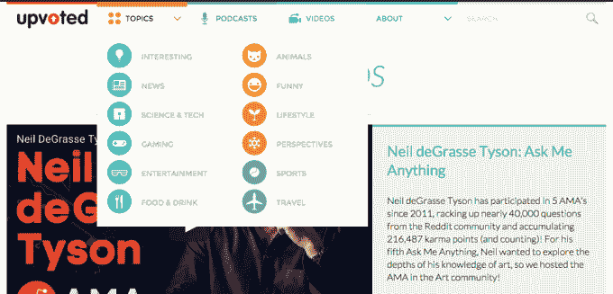

# Reddit 推出 Upvoted，这是一份关于 Reddit TechCrunch 所有内容的“数字杂志”

> 原文：<https://web.archive.org/web/https://techcrunch.com/2015/10/06/reddit-launches-upvoted-its-digital-magazine-for-all-things-reddit/>

# Reddit 推出 Upvoted，它的“数字杂志”涵盖了 Reddit 的所有内容

Reddit 是一个古怪的网站，它的内容链接多得让你目不暇接，[推出了一个有新内容的新网站](https://web.archive.org/web/20221205121315/https://www.reddit.com/r/blog/comments/3npxm4/introducing_upvoted_a_redditorial_publication/)。它叫做 [Upvoted](https://web.archive.org/web/20221205121315/http://www.upvoted.com/) ，它是一种数字杂志，从社区中获得灵感，但直接来自母舰。

该网站上的一些故事似乎得到了赞助，这对 Reddit 的资产来说并不新鲜；他们在现有网站上注入“本土”广告已经有一段时间了。也许这是一种卸下部分负担的方式，以安抚广告商和用户。网站上的内容将从 AMAs 到视频再到播客 Reddit 已经在做的事情，他们只是有了一个新的单独的家。

不过，如果不考虑 Digg，很难看到 Upvoted。是的… [新的 Digg](https://web.archive.org/web/20221205121315/https://beta.techcrunch.com/2014/01/16/digg-is-experimenting-with-original-content/) 。社区参与，投票，公司在网站上展示。

投票通过:

Digg:

关于 Upvoted 如何在编辑上发挥作用，Reddit 的产品负责人希斯·布莱克(Heath Black)说:

> 我们有一个编辑团队，只对上传的内容负责。他们对我们写的东西有编辑监督权。他们会每天搜索 Reddit 上的每个角落，寻找最酷的东西，采访创作者，甚至在某些情况下编排视频 ama 或播客。

我注意到的一件事是，网站本身没有评论，这是 Reddit 的一个标志(不管是好是坏)，但你可以点击原始帖子和评论。有点讨厌。此外，没有移动应用程序。奇怪。

每天留意 10-20 条原创内容，增加到 40 条左右。我想知道如果 Upvoted 上的一篇文章出现在 Reddit 的主页上会发生什么。星系会吞噬自己吗？

