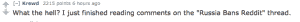

# Reddit 在被俄罗斯政府威胁、禁止和解禁后做出回应 

> 原文：<https://web.archive.org/web/https://techcrunch.com/2015/08/13/reddit-responds-after-being-threatened-banned-and-unbanned-by-the-russian-government/>

Reddit 在俄罗斯度过了非常奇怪的最后几天。

在俄罗斯联邦通信委员会 Roskomnadzor 发出明确威胁，要删除网站上发布的一条关于种植迷幻蘑菇的帖子后，整个网站昨天被列入黑名单，并被俄罗斯的一些用户禁止访问。

Roskomnadzor 在 [Vkontakte](https://web.archive.org/web/20221205111218/https://vk.com/wall-76229642_54727) (基本上是俄罗斯的脸书)上的帖子写道:

> 那些与[Reddit]管理部门有联系的人——请他们检查电子邮件，看是否有来自 Roskomnadzor 的消息，否则……一些运营商可能会屏蔽整个网站。

昨天晚些时候，据报道，在被列入政府黑名单后，该网站已被许多依赖其 ISP 的用户完全封锁。然而，几个小时后，该网站[神秘地被解禁](https://web.archive.org/web/20221205111218/https://meduza.io/en/news/2015/08/13/russia-unblocks-reddit)，导致许多用户质疑到底发生了什么。

显然，在被列入黑名单后，Reddit 检查了他们的电子邮件，并迅速采取行动，删除了对违规帖子的访问。

根据 Roskomnadzor 今天发布的另一份 [Vkontakte](https://web.archive.org/web/20221205111218/https://vk.com/wall-76229642_55569) 公告:

> 8 月 13 日，联邦官员在他们的“热线”上收到了一条来自网站管理员的消息，称俄罗斯的互联网用户不再能够访问非法内容。Roskomnadzor 已经确认(Reddit 的)完全合规，并相应地将该网站从非法在线材料的注册表中删除。

这一举动引起了 Reddit 用户的一些争议，他们认为 Reddit 应该继续发布帖子，作为对言论自由的声明，该公司已经表示[这几天并不是它的首要任务](https://web.archive.org/web/20221205111218/https://www.reddit.com/r/announcements/comments/3dautm/content_policy_update_ama_thursday_july_16th_1pm/)。

当 [u/rsocfan](https://web.archive.org/web/20221205111218/https://www.reddit.com/user/rsocfan) ，实际上发布蘑菇种植帖子的用户，突然出现，[开始回答关于他如何单枪匹马让 Reddit 在俄罗斯被禁的问题](https://web.archive.org/web/20221205111218/https://www.reddit.com/r/tifu/comments/3grpdf/tifu_by_getting_reddit_banned_in_russia/)时，事情变得有趣了。

在网站解禁的消息传出之前，他谈到了他认为 Reddit 应该采取的措施:

> 我会删除这个帖子吗？不。我也认为 Reddit 管理层什么都不需要做。这是关于言论自由的重要问题，只有 RKN 想违反它。

在保持了一段时间的沉默后，Reddit 的一位发言人今天对 TechCrunch 做出了回应，谈到了正在发生的奇怪情况:

> Reddit 是一家美国公司，运营着一个拥有数百万用户、帖子和评论的网站。我们定期收到世界各地政府要求从 Reddit 删除内容的请求，并根据适用的当地法律仔细审查这些请求。
> 
> 我们希望确保我们的服务对任何地方的用户都可用，但如果我们收到授权实体的有效请求，我们保留在特定国家限制内容的权利。

这相当于 Reddit 承认，是的，他们最近一直很忙，他们的小团队没有关注所有涌入的政府请求。虽然有点奇怪，但他们在谈论政府命令下的内容删除时如此就事论事，特别是非仇恨言论，非暴力内容，如关于种植毒品的帖子。

有一件事是清楚的，那就是俄罗斯不会在鼓励网上吸毒的言论上耍花招。2013 年，Roskomnadzor 因为一篇关于“吸食大麻”的文章而将维基百科全部列入黑名单。

Reddit 在这份声明中没有解决对俄罗斯政府限制言论自由的担忧，而是似乎在说，无论情况如何，无论在哪里发布，只有 Reddit 和 Reddit 有最终决定权。

听起来，很多 Reddit 用户对 Reddit“限制内容”的权利感到困惑，但目前看来，稳定，而不是言论自由，是 Reddit 的首要任务。