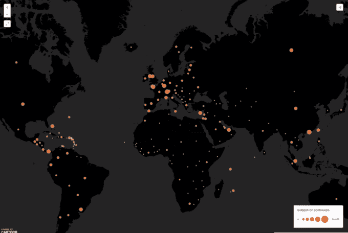

# 更新:Reddit 在巴拿马文件泄露事件上发帖

> 原文：<https://web.archive.org/web/http://techcrunch.com/2016/04/03/reddits-firing-up-a-thread-on-the-panama-papers-leak/>

# 更新:Reddit 在巴拿马文件泄露事件上发帖

更新:这篇报道的早期版本与国际调查记者联盟对海外公司进行的早期揭露有关。帖子已经编辑过了。

Reddit 上的好人们已经开始让他们的 Redditors 为我们今晚早些时候报道的大规模[文件转储](https://web.archive.org/web/20230328221015/https://techcrunch.com/2016/04/03/documents-leaked-from-a-panamanian-law-firm-reveal-a-global-web-of-corruption/)而兴奋起来。

与此同时，世界各地的新闻媒体仍在不断报道此事。

Fusion [有一份政治参与者的概要](https://web.archive.org/web/20230328221015/http://fusion.net/story/287227/famous-presidents-shell-companies-trove/)和一份关于律师事务所的长篇[；当它进入兔子洞追逐公司建立的公司之一时。](https://web.archive.org/web/20230328221015/http://interactive.fusion.net/dirty-little-secrets/)

全球各地的人们都开始使用 Twitter，并开始分享自己的故事和对新闻的评论。

甚至 [ProductHunt](https://web.archive.org/web/20230328221015/https://www.producthunt.com/) 也加入了这一行动，推出了一份包含相关国家的[巴拿马文件地图](https://web.archive.org/web/20230328221015/https://www.producthunt.com/tech/panama-papers-map)。

