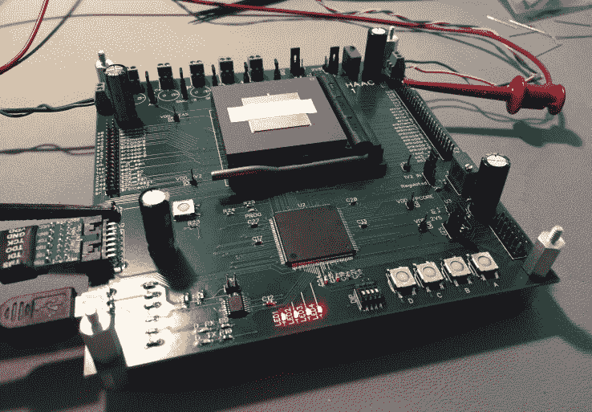
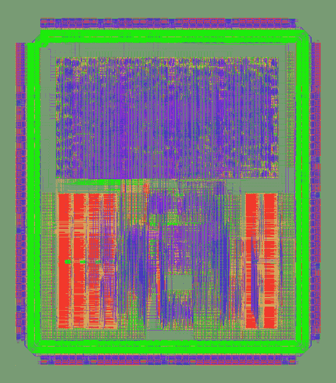

# 节能微系统公司让初创公司的芯片与行业巨头竞争 

> 原文：<https://web.archive.org/web/https://techcrunch.com/2017/03/16/reduced-energy-microsystems-pits-startup-chip-chops-against-industry-giants/>

不管你是否喜欢所谓的物联网，事实是我们确实生活在一个物联网中，每样东西里面都有一个芯片。当然，这些芯片非常先进，但在许多方面也非常传统。[Reduced Energy Microsystems](https://web.archive.org/web/20230130100805/http://remicro.com/)希望用一种芯片技术来颠覆现状，这种技术可以大大提高日常设备的人工智能和计算机视觉能力——但竞争太激烈了，他们无法采用。

REM 是 Y Combinator 的最新选择之一，加速器帮助他们与 Draper Associates 建立了联系，后者对此印象深刻，足以资助 200 万美元的种子轮。

有很多方法可以提高我们设备的性能，无论是相机还是手机。你可以改进软件:例如，从 Windows 8 迁移到 Windows 10。您可以改进架构:从 32 位迁移到 64 位。你可以在芯片本身的水平上提高，这是雷姆希望取得成功的地方。

当然，芯片在不断改进——每年都有新的。但是 Intel 或者 ARM，x64 或者 x86，Core 或者锐龙，他们都是所谓的*同步*。这意味着某个地方有一个每秒前进数百万次的时钟，它将所有的小操作单元同步在一起，并产生我们熟悉的“千兆赫”速度度量。

但是在这些 CPU 中，整体速度受到时钟速度的限制。如果某个操作，比如一个简单的逻辑步骤，在比时钟持续时间更短的几分之一秒内完成，会怎么样？CPU 的一部分只是坐在那里，等待。虽然几分之一秒听起来不算多，但如果它发生在数千个地方，数百万次，它就会很快累加起来。多个内核和线程在一定程度上解决了这个问题，但也增加了问题的严重性。

如果有一种方法可以将这些操作从时间的暴政中解放出来就好了…事实上，是有的！异步处理让计算按照自己的速度进行，节省了时间和能量。芯片制造商很早就知道这一点，但他们在 synchronous 上投入了如此多的资源，以至于没有机会看到它上市。雷姆计划改变这种状况。

我和 Eleazar Vega-Gonzalez 和 William Koven(REM 的三位联合创始人中的两位)就公司的希望和主张进行了交谈。

“当你看嵌入式移动领域时，你会有这种大/小的说法，对吗？”该公司软件主管维加-冈萨雷斯说。“你有一个弱不禁风的 ARM 内核来处理简单的事情，然后当用户开始做更复杂的事情时，它会切换到更大、更强大的内核。这很好，目前是一个很好的解决方案……但我们能够做的是采用一个单核，并动态地降低或提高它的速度。”

这种调节比现有芯片更极端，也是由于异步的性质；同一个芯片可以在几分之一伏特的电压下工作，然后根据需要平稳地增加功率。

测试板上的原型芯片——当然，生产芯片更小。

但它不是某种奇特的制造过程——其成本多年来一直抑制着这个领域的初创公司——也不是程序员需要学习的另一种深奥的新学科或架构。

“我们想出了如何使用所有与行业其他人相同的设计工具，当我们实现一个 ARM 内核时，它对程序员来说仍然看起来像一个 ARM 内核，”首席执行官 Koven 说。“用户看不到区别，他们只会看到运行得更好的部分。我们所做的一切都在这两者之间。”

其结果是一个标准的芯片，可以在超低电压下运行，因此它可以运行所需的最基本的必需品，比如说，一个家庭安全摄像头。但在必要时，它可以比同等功率的传统芯片更有效地旋转和执行面部识别算法。因此，您可以在增加功能的同时提高能效——提高 3 或 4 倍甚至更多，具体取决于应用。

 也许这听起来有点异想天开。如果异步芯片如此酷，为什么现有的芯片巨头没有加入这个游戏？在英特尔工作多年的科文说，他们已经把它从自己的 DNA 中清除了。

“我花了很多时间在英特尔为它找一个家，”Koven 说。“异步在英特尔是一个贬义词。这与他们作为一个组织所做的太不一样了。他们已经抛弃了很多这样的技术，因为它们与众不同，令人恐惧。”

Vega-Gonzales 说:“已经尝试了几次，从历史上看，你会看到这些好处，但它需要更长的时间才能上市。”“我们一直强调的是我们的内部工具，这样我们可以比行业中的其他公司走得更快——这正是软件初创公司击败或超过大公司的原因。”

该公司正在研究警用人体摄像机、DVR、无人机和安全摄像机等产品，制造商和开发商正在寻找一种方法，在不耗尽银行或电池的情况下，通过最先进的功能来改善他们的产品。制造芯片的工作大部分已经完成，与产品的整合是公司现在正在测试的；他们预计今年年底会有原型。

REM 是 Y Combinator 的第一个芯片初创公司，但这个项目似乎很有帮助，即使它通常更关注软件。

Vega-Gonzales 说:“有一种持续的推动力，要求迅速行动，并把重点放在业务和客户关系之类的事情上。”毫不奇怪，技术硬件初创公司很可能会忽略产品方面，也就是赚钱的部分。

“对于德雷珀来说…他们真的相信我们正在努力实现的未来，”科文说。“他们认为，要做到这一点，光靠软件是不够的。半导体行业在很多方面都停滞不前。”

由于技术、市场和资金方面的原因，这不是一个容易进入的领域；创业公司设计和制造自己完全不同的芯片的想法并不容易让人接受。因此，人们不得不佩服雷兴高采烈地走向战场的勇气。他们相信他们的产品，它似乎真的不同于现在市场上的任何东西；凭借运气和聪明才智(以及几百万美元)，他们或许能够在一个可预测的市场中，与一些渴望变革的客户展开合作。