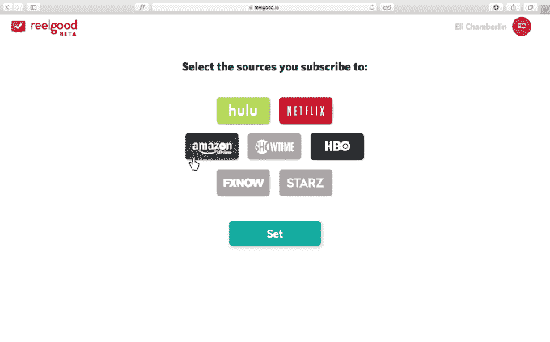
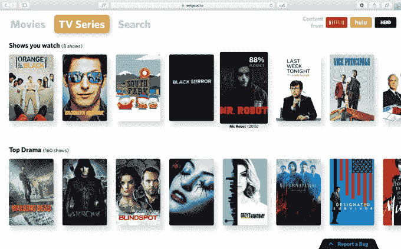
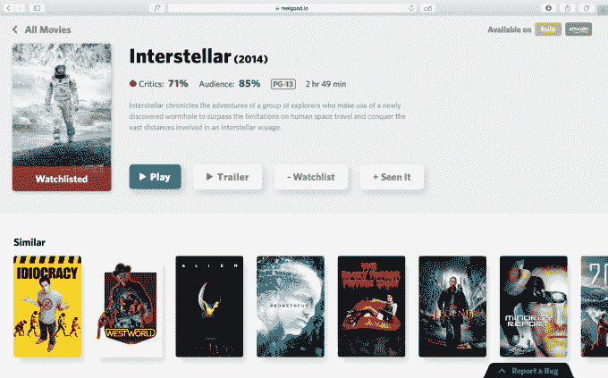
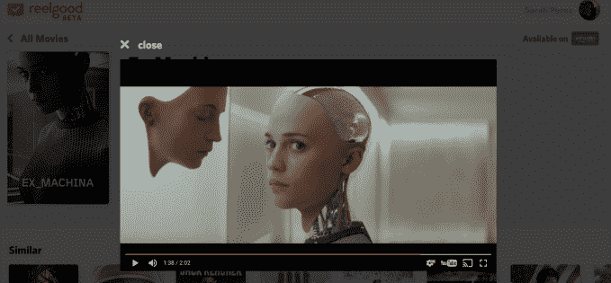

# Reelgood 推出跨流媒体服务查找电视节目和电影的中心 

> 原文：<https://web.archive.org/web/https://techcrunch.com/2016/11/21/reelgood-debuts-a-hub-for-finding-tv-and-movies-across-streaming-services/>

越来越多的人放弃了付费电视，转而选择流媒体服务，但寻找观看内容变得越来越困难——这不仅是因为内容来来去去的版权交易，还因为现在有更多的服务可供选择。一家名为 [Reelgood](https://web.archive.org/web/20230103095829/https://reelgood.io/) 的初创公司想要提供帮助，它今天为网络用户推出了一个集中平台，用户可以从一个目的地找到并观看来自多个服务的内容。

一年前，[公司推出了](https://web.archive.org/web/20230103095829/http://thenextweb.com/apps/2015/12/14/chill-even-more-with-reelgoods-film-recommendation-app/)一个 [iPhone 应用程序](https://web.archive.org/web/20230103095829/http://www.macworld.com/article/3135226/software/reelgood-review-one-app-so-many-streaming-or-theatrical-movies-to-discover.html)，提供一个专注于电影的社交网络。然而，新的网络服务正在解决跨平台内容发现的更广泛问题，包括电影和电视，以及提供跟踪你想看的节目和电影的工具。

Reelgood 最近也发布了一个苹果电视应用程序，其功能类似于网站，在功能集方面甚至领先一点。

在发布时，新网站聚合了一些顶级流媒体服务的内容:网飞、Hulu、HBO (HBO GO 和 HBO NOW)、亚马逊 Prime Video、Showtime、Starz 和 FXNow。但是 Reelgood 的创始人 David Sanderson 告诉我们，他们在后台准备了 28 个不同的来源，并将听取消费者的反馈，以确定下一步推出哪些来源。

网站本身很好用。内容被分成“电影”或“电视”部分，如果你想寻找更具体的东西，还有一个搜索框。在这里，你可以按标题搜索，但苹果电视也支持按演员和导演搜索，这正在向网络发展。

在每个高级类别中，可用的电影或节目按类型细分，如喜剧、戏剧、纪录片、推理片、恐怖片等。但是 Reelgood 的网页版还缺少一点润色。例如，较长的内容描述目前被删除——另一件事将在以后的版本中解决。

在每个项目上，你可以看到来自烂番茄的评论家和观众的评分，以及其他信息，如描述、长度和评分。Apple TV 应用程序在这里显示更多信息，如导演和演员。

在每一件物品上，你可以将物品标记为“看过”，或者将它们添加到你的通用观察列表中。单独做这件事会很无聊——从主页上做这件事会很有用。桑德森说，这也是建造的，但在发射时还没有准备好。

此外，在每一项下面都有一个“相似”内容建议的列表，但这些建议似乎有点偏离。例如，恐怖电影“七”与像“纸城”这样的电影有什么关系，后者更像是一个关于孩子寻找失踪朋友的成长故事？《油脂》和《冲出康普顿》之间的联系在于它们是关于音乐的电影。(显然，这需要一些工作)。

对于早期 iOS 应用程序的用户来说，你可以访问社交功能，因为他们将事情标记为“已查看”，所以你可以看到朋友们在看什么，但新的网络用户需要等待这个功能的到来。

随着时间的推移，iOS 应用程序将被修改以反映网络服务，尽管 Reelgood 更直接的关注点是人们在哪里观看:网络和电视。Roku 和亚马逊 Fire TV 的应用可能会在新的移动产品发布之前上市。

尽管还是一个测试产品，但作为一个基本的网络聚合器，Reelgood 是有效的。

当你找到你喜欢的东西时，你可以观看预告片或者简单地点击“播放”直接进入流媒体服务的页面开始观看。

随着时间的推移，该公司计划通过向第三方流媒体服务进行订阅销售的附属收入，以及长期来看，通过聚集和转售观看行为数据来实现收入。

桑德森解释说:“尼尔森只存在于 150，000 个家庭中……而我们希望在所有不同的平台上无处不在，并拥有更多的数据。“我们确切地知道人们在看什么，他们想看什么，他们喜欢什么，他们不喜欢什么，”他说。

Reelgood 的七人团队包括 torrents、Popcorn Time 流媒体应用的整个开发团队，以及创始人桑德森，他曾是脸书的一名项目经理。

这家初创公司早些时候从哈里森金属公司(Harrison Metal)筹集了 100 万美元，现在正努力完成来自哈里森金属公司、社会资本和华纳兄弟总裁的 150 万美元种子轮。

这项服务现在在网上直播，而它的 iOS 和 Apple TV 应用程序在各自的应用程序商店都有。