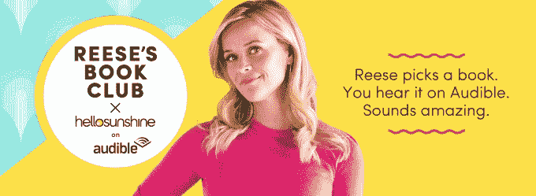

# 瑞茜·威瑟斯彭的《你好，阳光》与亚马逊的 Audible 在有声读物和原版上合作 

> 原文：<https://web.archive.org/web/https://techcrunch.com/2018/05/22/reese-witherspoons-hello-sunshine-teams-with-amazons-audible-on-audiobooks-and-originals/>

# 瑞茜·威瑟斯彭的《你好，阳光》与亚马逊的有声读物和原版书合作

瑞茜·威瑟斯彭(Reese Witherspoon)的媒体帝国“你好，阳光”(Hello Sunshine)已经与 Audible 合作开展有声读物项目。这项合作最初将推出由[里斯读书俱乐部](https://web.archive.org/web/20221207081517/https://hello-sunshine.com/book-club)挑选的有声读物，主要讲述坚强而复杂的女性角色。然而，两家公司表示，未来 Hello Sunshine Witherspoon 和亚马逊旗下的 Audible 将合作制作原创音频产品，具体细节将于今年晚些时候公布。

你可能已经听说过你好阳光品牌。

威瑟斯彭的公司正在制作一系列内容，包括故事片、电视节目、社交系列等，包括[即将上映的 Hulu 原创系列，由威瑟斯彭和凯丽·华盛顿主演，根据 Celeste Ng 2017 年的畅销书改编而成。它还为苹果即将推出的流媒体服务制作了许多系列，包括与克里斯汀·韦格合作的喜剧系列](https://web.archive.org/web/20221207081517/https://techcrunch.com/2018/03/13/hulu-outbids-rivals-for-little-fires-everywhere-from-reese-witherspoon-and-kerry-washington/)[、与奥塔维亚·斯班瑟合作的真实犯罪惊悚片](https://web.archive.org/web/20221207081517/https://techcrunch.com/2018/01/17/apple-greenlights-new-reese-witherspoon-backed-comedy-series-starring-kristen-wiig/)[、与威瑟斯彭和詹妮弗·安妮斯顿合作的两季剧集](https://web.archive.org/web/20221207081517/https://techcrunch.com/2018/01/03/apple-picks-up-reese-witherspoon-thriller-starring-octavia-spencer/)和[。与此同时，亚马逊直到现在还没有通过其子公司 Audible 开发 Hello Sunshine 品牌。](https://web.archive.org/web/20221207081517/https://techcrunch.com/2017/11/08/apple-orders-two-seasons-of-jennifer-aniston-reese-witherspoon-tv-drama/)

“当我创办里斯读书俱乐部时，我想突出女性故事讲述者的声音，我很高兴能与 Audible 合作，真正实现我们的使命！”阅读威瑟斯彭关于新项目的声明。“很难找到时间来阅读一本被高度推荐的书，我很高兴通过这种合作关系，我们提供了一种以音频形式体验这些美丽故事的方式。”

这笔交易在将《阳光你好》和《涂油书》发展成“必读”书籍方面是有意义的，这些书籍后来被转化为视频项目，就像今天经常发生的情况一样。

例如，苹果/克里斯汀·韦格剧是根据柯蒂斯·西滕菲尔德的短篇小说集《你想的，我会说；阳光你好为福克斯 2000 拍摄的一部电影是根据凯瑟琳·斯戴曼的小说《水中的东西》改编的你好阳光为三星影业拍摄的心理惊悚片《善意的谎言》是根据卡琳·田边的小说《镀金岁月》改编的。

对于亚马逊来说，其有声读物业务 Audible 和 Hello Sunshine 之间的合作可以让它在即将到来的 Hello Sunshine 视频项目的谈判中获得洞察力(并可能发挥杠杆作用)。

这些公司表示，新的有声读物系列将于 6 月推出。

[https://web.archive.org/web/20221207081517if_/https://www.youtube.com/embed/hG9DkBCvMm4?feature=oembed](https://web.archive.org/web/20221207081517if_/https://www.youtube.com/embed/hG9DkBCvMm4?feature=oembed)

视频