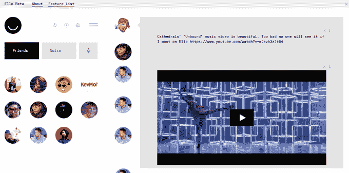
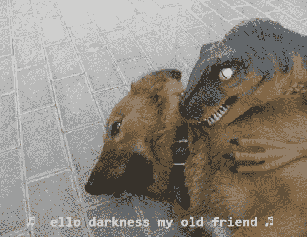

# Ello 假装视频和音乐发布会还没结束

> 原文：<https://web.archive.org/web/https://techcrunch.com/2015/01/22/remember-ello-no-i-dont-either/>

# Ello 假装视频和音乐的发布还没有结束

已经被遗忘的反脸书社交网络 Ello 今天推出了在其 feed 中分享音乐和视频剪辑的功能，但这无关紧要。

九月已经过去了，Ello 希望通过没有广告来废黜脸书。但是，虽然潮人有几天对扎克的创造感到厌恶，但他们都回去了，并迅速抛弃了 Ello。现在它只剩下从一些轻信的投资者那里榨取的[550 万美元](https://web.archive.org/web/20230322232902/https://techcrunch.com/2014/10/23/ello-raises-5-5-million-legally-files-as-public-benefit-corp-meaning-no-ads-ever/)，并且没有存在的理由。

问题来了。在脸书的游戏中击败它就像在一堵 13.5 亿砖厚的墙上打孔。它的临界质量的网络效应意味着你不能通过稍微好一点来篡夺它。自推出以来，唯一真正成功的社交应用试图通过与众不同来绕过脸书的围墙。

*   Twitter——关注公共内容，而不是隐私
*   insta gram——去除了除照片之外的所有内容，打造了一个以移动为先的轻松、轻松、美丽的浏览体验
*   snapchat——让它的内容消失，这是对脸书和它的时间线的一个令人耳目一新的替代，你所说的一切都将永远存在

与此同时，那些失败的人没有区分*咳*谷歌+*咳*

没有广告并不意味着 Ello 在功能上有所不同。因此，当人们意识到他们可以向加入 Ello 的几个沾沾自喜的朋友或他们在脸书认识的每个人发帖时，他们就放弃了 Ello。

我关注的人中没有人在三个月内发帖，所以我怀疑他们也在检查网站。这意味着粘贴链接并获得内嵌视频或音乐播放器的能力对公司没有帮助。虽然你可以完全关闭嵌入广告，以防它们像预卷一样附带广告，这很可爱。

预计一两年后会出现另一个反脸书者。这些事情利用了对脸书使用个人数据向广告商出售你的合理抱怨，但很少有值得转向的解决方案。

作为一个通用的、半私有的、永久内容的社交网络和身份提供者，脸书要想在自己的游戏中被打败，就必须有人建立更好的东西。脸书可能会在它接近之前买下它。对$FB 来说，另一个可预见的厄运将来自大规模的平台转换，比如虚拟现实……除了它收购了 Oculus。所以不管你喜不喜欢，脸书可能还会在这里呆一段时间。

