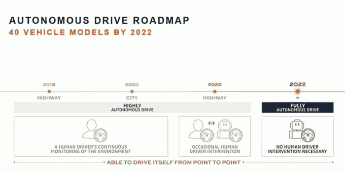

# 雷诺-日产计划推出 12 款新电动汽车和“机器人”全球叫车服务

> 原文：<https://web.archive.org/web/https://techcrunch.com/2017/09/15/renault-nissan-lays-out-plans-for-12-new-evs-and-robo-global-ride-hailing-service/>

汽车的未来是电动的，今天包括雷诺、日产和三菱在内的联盟制定了计划，计划如何成为该领域以及自动驾驶汽车的领导者之一。该组织自称为 Alliance 2022，[表示](https://web.archive.org/web/20230223232309/https://alliance-2022.com/news/alliance-2022-announcement/)计划到 2022 年推出 12 款电动汽车和 40 款采用自动驾驶技术的汽车。它还希望成为由自主“机器人”技术运营的“打车服务的全球领导者”。

这些计划是今天上午在巴黎的一次活动中宣布的，这些公司表示，这些计划不仅表明汽车公司如何加倍实施其新车和新商业模式计划，还表明它们如何依靠规模经济来实现将预计成本削减 100 亿€的目标。

此外，似乎还有来自监管机构的压力，如果不是消费者需求的话。

“消费者仍然不在……他们想要更大的范围、更低的成本和更快的启动时间，”Alliance 2022 的首席执行官卡洛斯·戈恩(Carlos Ghosn)承认，“但随着排放规则的到来，这是天然气的末日。这与其说是由消费者需求驱动，不如说是由排放法规驱动……从现在到 2040 年，将不再有柴油和汽油。这绝对是一个场景。”

该集团表示，将使用四个通用平台开发超过 900 万辆汽车，占该公司产量的 70%。“所有组件都将共享，”戈恩说。

该公司几乎没有提供计划如何到达终点的细节:没有关于这些自动驾驶汽车将使用什么技术的信息，以及他们是否或如何与合作伙伴合作，或者他们是否计划从头开始建造一切。他们也没有提供任何关于这些用于制造电动汽车的通用平台的进展信息——尽管他们指出，迄今为止，他们已经在整个集团销售了约 50 万辆电动汽车——但这只是三家公司销售的数百万辆汽车以及整个行业销售的数千万辆汽车中的沧海一粟。

该集团还在考虑为他们车辆提供运输服务的具体计划。对于汽车制造商来说，这是一个新兴领域，他们担心优步等服务的兴起，以及越来越智能的汽车成本的上升，将使普通消费者拥有汽车成为一个不太可行的选择。

可以说，他们的答案是滑向冰球要去的地方。但是，尽管汽车行业已经采取了一些措施投资打车服务(你可以说这可能是彻底收购它们的一条途径)——举几个例子，通用汽车有 Lyft，大众有 Gett，戴姆勒有 Via 和自己的打车服务 my taxi——联盟 2022 中的公司还没有在这一领域真正成名。

但是他们也没有完全出局。正如我们今年早些时候透露的那样，雷诺-日产[悄悄收购了](https://web.archive.org/web/20230223232309/https://techcrunch.com/2017/01/12/karhoo-rides-again-nissanrenault-buys-failed-on-demand-ride-startup/)一家名为 Karhoo 的公司的资产，这是打车市场的一次高调失败。

Alliance 2022 预计，到 2022 年底，他们合并后业务的年总销售额将超过 1400 万辆，预计产生的收入为2400 亿美元。