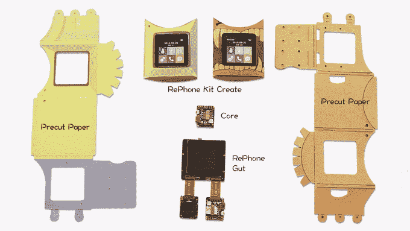

# RePhone 让你把任何东西都变成电话 

> 原文：<https://web.archive.org/web/https://techcrunch.com/2015/09/23/rephone-lets-you-turn-anything-into-a-phone/>

# RePhone 可以让你把任何东西变成电话

制造手机很容易。你进入一个矿场，开采一些矿石，提取各种金属，然后添加你从其他矿场生产的组件。然后你要获得 FCC 的许可，制造锂离子电池。最后，你需要写一个贪吃蛇游戏。如果你不能做到这一点，请尝试重新电话。

该项目实际上是一个带有 SIM 插槽和可选屏幕的微型电路板。它还支持蓝牙。你会想要 49 美元的 Kit Create，这是一个像手表一样的小系统，包括一个小盒子和所有的模块。这就像花不到 50 美元买到一部小小的解锁手机。

这显然是一个实验板，但我检查了一周前，它似乎工作得相当好。它包括 Arduino IDE、Lua 和 Javascript 中的编程库，允许你将手机连接到网络，甚至 IFTTT。

这是一个有趣的小项目，而且效果很好。虽然你不会获得为电线轨迹开采自己的黄金和学习芯片制造的经验，但这将让你快速轻松地制作一部手机，这对我们所有没有现成的采矿权的爱好者来说都是很好的。

