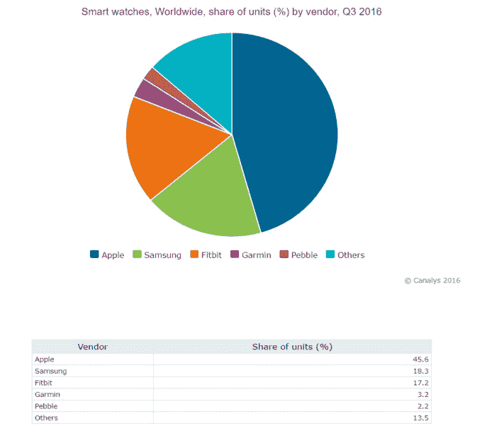

# 报告:智能手表销量没有下降——出货量同比增长 60% 

> 原文：<https://web.archive.org/web/https://techcrunch.com/2016/11/04/report-smartwatch-sales-arent-falling/>

# 报告:智能手表销量没有下降——出货量同比增长 60%

智能手表销量正在下滑吗？分析师意见不一。[IDC 最近的一份报告表明](https://web.archive.org/web/20221007032121/https://beta.techcrunch.com/2016/10/24/smartwatch-sales-are-tanking/)智能手表的出货量在过去一年中下降了 50 %,本周[驳斥了竞争对手分析公司科纳仕公司](https://web.archive.org/web/20221007032121/https://www.canalys.com/newsroom/media-alert-smart-watch-market-grows-60-q3-2016-apple-ships-28-million-units)的说法。

IDC 声称，总出货量(发送给零售商以销售给消费者的设备数量)从 2015 年第三季度的 560 万台下降到 2016 年第三季度的 270 万台，科纳仕公司辩称，同期实际上增长了 60%，达到 610 万台。

两家公司都认为苹果和 Apple Watch 是最畅销的产品——科纳仕公司说占出货量的 46 %, IDC 推测占 41%——但对下一个是谁以及市场份额有分歧。科纳仕公司的前五名依次是三星(18%)、Fitbit(17%)、Garmin(3%)和 Pebble(2%)；IDC 选择了 Garmin(21%)、三星(14%)、联想和 Pebble(各占 3%)。

IDC 利用其数据断言智能手表“并不适合所有人”，但科纳仕公司将在下一个季度做出判断。这是因为该公司认为，即将到来的假日季节和第二代苹果手表的影响是两个主要因素，可以表明智能手表目前的健康状况和近期的未来。两家公司都认为，Apple Watch 2 发布前的泄露和 iPhone 7 的迭代更新可能会影响人们对 Apple Watch 的兴趣和 2016 年第三季度的销售。

“iPhone 的放缓势头影响了消费者对苹果智能手表的兴趣，该公司需要提高美国以外主要市场的手表销售，特别是中国，”科纳仕公司的杰森·洛说。

有趣的是，Low 和他的同事发现，尽管谷歌的 Android Wear 2.0 平台和三星的 Gear S3 仍未推出，但中国的智能手表市场同比增长了 42%。较低成本的选择，包括小米合作伙伴华米提供的起价 120 美元的选择，被视为有助于让智能手表变得更加实惠的重要因素。

与此同时，科纳仕公司报告称，2016 年第三季度，基本健身手环的出货量环比增长 18%，达到 1150 万。

该公司补充说:“加上智能手表，可穿戴手环的总出货量达到 1760 万，标志着整个可穿戴市场的健康同比增长 31%。”