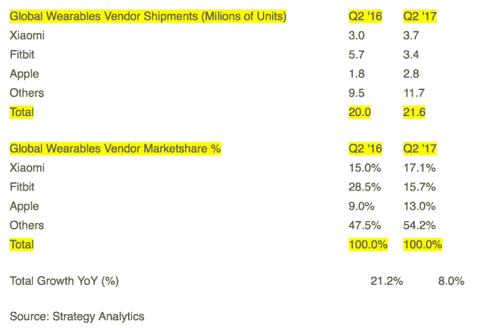

# 报告:随着 Fitbit 销量下滑，小米首次成为世界顶级可穿戴设备制造商 

> 原文：<https://web.archive.org/web/https://techcrunch.com/2017/08/03/report-xiaomi-is-worlds-top-wearable-maker-for-first-time-as-fitbit-sales-slide/>

# 报告:随着 Fitbit 销量下滑，小米首次成为世界顶级可穿戴设备制造商

一家研究公司发现，中国公司小米首次在全球可穿戴设备销售中排名第一，此后小米的良好势头继续保持。与此同时，Fitbit 设备的销量下降了 40%

继[小米重返全球五大智能手机销售商](https://web.archive.org/web/20221025232905/https://beta.techcrunch.com/2017/08/02/chinese-smartphone-makers-closing-the-gap-on-iphone-samsung/)、[之后，一份新的战略分析报告](https://web.archive.org/web/20221025232905/https://www.strategyanalytics.com/strategy-analytics/news/strategy-analytics-press-releases/strategy-analytics-press-release/2017/08/03/strategy-analytics-xiaomi-becomes-world's-no.1-wearables-vendor-in-q2-2017)发现，小米超越苹果和 Fitbit 成为 2017 年 Q2 可穿戴设备的最大销售商，出货量为 370 万台。Fitbit 在本季度的出货量为 340 万部，苹果为 280 万部——这家美国公司的销售增长实际上高于小米。该领域的其他公司又贡献了 1170 万台，占该季度所有可穿戴设备出货量的 54%。

小米和苹果的市场份额都同比增长(分别从 15%增长到 17%，从 9%增长到 13%)，但 Fitbit 的份额从 29%下降到 16%。

小米和苹果对可穿戴设备采取了非常不同的方法。小米有一系列价格具有竞争力的产品，并具有心率监测和警报功能——[Mi 手环在美国的价格低至 14.99 美元](https://web.archive.org/web/20221025232905/http://www.mi.com/en/miband/)——而 Apple Watch 的价格超过 269 美元，是一种更高端的方式，拥有更全面的功能。虽然它们都代表着市场的不同终端，但 Fitbit 的地位却不那么确定。

Strategy Analytics 的尼尔·莫斯顿(Neil Mawston)在一份声明中表示:“Fitbit 有可能被困在小米销售的低端健身手环和苹果销售的以健身为主导的高端智能手表之间。”

至于另外两个，Strategy Analytics 表示，关于下一代 Apple Watch 可能包括扩展健康跟踪功能的报道可能有助于苹果夺回头把交椅。但就目前而言，该公司认为，缺乏健康腕带选项是小米保持领先的原因。

到目前为止，小米在 2017 年迎来了复苏，[从两年](https://web.archive.org/web/20221025232905/https://beta.techcrunch.com/2017/01/11/xiaomi-2016-to-2017/) [令人失望的](https://web.archive.org/web/20221025232905/https://beta.techcrunch.com/2016/01/14/xiaomi-70-million-sales-in-2015/)中反弹，在这两年中，小米努力保持曾经的爆炸性增长，并未达到销售目标。中国对线下零售的推动以及该公司去年在印度实现 10 亿美元收入的进展，导致今年的前景更加乐观，[首席执行官雷军声称](https://web.archive.org/web/20221025232905/http://www.telegraph.co.uk/news/world/china-watch/business/xiaomi-phone-sales/)已经达到“增长的一个重要拐点”

该公司表示，其手机销量在 Q2 环比增长 70%，在 Q2 售出 2300 万部。由于上个月获得了 10 亿美元的贷款，现在它正在推进其线下零售战略，并进一步推进其全球扩张计划。