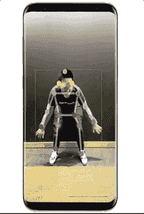

# 脸书对全身追踪的研究暗示了更广泛的 AR/VR 野心 

> 原文：<https://web.archive.org/web/https://techcrunch.com/2018/01/25/research-into-full-body-tracking-at-facebook-hints-at-broader-ar-vr-ambitions/>

# 脸书对全身跟踪的研究暗示了更广泛的 AR/VR 野心

众所周知，脸书在 AR 和 VR 方面都很大，无论是为了娱乐还是为了交流。新的研究表明，它正在致力于 AR 应用，不仅可以修改或取代你的脸，而是你的整个身体。

[今天的一篇博客文章](https://web.archive.org/web/20230102175041/https://research.fb.com/enabling-full-body-ar-with-mask-r-cnn2go/)展示了人工智能相机团队的一些工作，显然旨在在虚拟现实或增强现实环境中进行全身替换或跟踪。

 “我们最近开发了一种新技术，可以准确检测人体姿势，并从背景中分割出人。我们的模型目前仍处于研究阶段，但它只有几兆字节，可以在智能手机上实时运行，”研究人员写道。

当然，这种类型的研究远非史无前例；骨骼跟踪系统在许多行业都很常见。事实上，这篇博文更多的是关于这个特定系统及其组成神经网络是如何运作的，而不是宣称任何重大进展。

也就是说，脸书显然特别关注保持高效和易于在移动设备上部署。这意味着在传感器数据、图像分辨率和刷新率、可用处理能力等诸多硬性限制下工作。这项技术被称为 Mask R-CNN ，是朝着这个方向迈出的一大步。

我们可以肯定地期待脸书在未来会有更多这样的举动——该公司甚至正在寻找一名专门从事这方面研究的研究实习生。