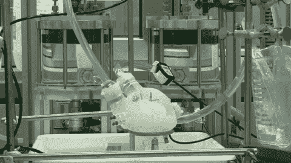

# 研究人员 3D 打印出一颗柔软的人造心脏，其工作原理与真心脏非常相似 

> 原文：<https://web.archive.org/web/https://techcrunch.com/2017/07/13/researchers-3d-print-a-soft-artificial-heart-that-works-a-lot-like-a-real-one/>

# 研究人员 3D 打印了一个柔软的人造心脏，其工作原理非常像真的心脏

在过去的几年里，修复科学突飞猛进，对软机器人的研究尤其具有互补性。正如瑞士研究人员展示的那样，用于制造像真人一样弯曲和转动的机器人手臂的技术可以用于制造更复杂、更精细的器官，如心脏。

人造心脏的一个问题是，金属和塑料机制很难与组织整合，或者因为它们不自然的运动方式而损害血液。

由博士生 Nicholas Cohrs 领导的 ETH 的一个小团队创造了他们所说的第一个完全柔软的人工心脏，其泵送机制是通过使硅胶心室像真正的心脏一样泵送来实现的。

嗯，不完全像一个真正的心脏——在心室之间不仅仅是一堵墙，而是一个充满和缩小以产生泵送作用的腔室。但是已经很接近了。

【T2

这颗心脏是使用 3D 打印方法制造的，这使得研究人员可以在使用柔软、灵活的材料作为其结构的同时，制作复杂的内部结构。整个事情基本上是一个单一的部分(一个“单体”)，所以没有必要担心不同的内部机制如何配合——除了在输入和输出端口，血液会在那里来来去去。

在测试中，心脏工作得很好，推动类似血液的液体对抗类似身体的压力。当然，这里有一个陷阱。

这颗心脏是一个概念证明，不是为实际植入而建造的——所以他们制造它的材料不会持续超过几千次心跳。这大约是半个小时，取决于你的心率(如果你正在尝试一个新的心率，可能会很高)。但是，很明显，我们的计划是让材料和设计能工作更长时间。

“作为一名机械工程师，我从来没有想过我会把一颗柔软的心握在手中，”领导这项测试的研究生 Anastasios Petrou 在苏黎世联邦理工学院的新闻发布会上说。“我现在对这项研究如此着迷，以至于我非常想继续致力于人工心脏的开发。”

研究人员的工作发表在本周的《人造器官》杂志上。