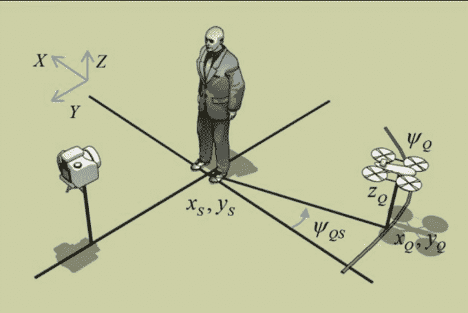

# 研究人员创造了一种会飞的无人机，可以照亮你的快照

> 原文：<https://web.archive.org/web/https://techcrunch.com/2014/07/14/researchers-create-a-flying-drone-that-can-light-your-snapshots/>

# 研究人员创造了一种可以照亮你的快照的飞行无人机

飞行四轴飞行器还有什么做不到的吗(除了生下人类婴儿……还没有？麻省理工学院(MIT)和 T2 康奈尔大学(Cornell)的研究人员创造了一个飞行闪光灯装置，它连接了测光表、摄影闪光灯和连续光源，这样摄影师可以从任何角度拍摄完美的照片。

该机器人考虑到了物体的位置和悬浮时射手的位置，可以在非常特定的照明下照亮对象，旨在让你获得完美的快照。

它使用“边缘宽度——从相机的角度来看，主体被照亮的边界的理想宽度”的概念来“实现动作镜头的精致边缘照明”根据[摄影指南](https://web.archive.org/web/20230301145210/http://photography.tutsplus.com/tutorials/make-your-subject-stand-out-with-a-rim-lighting-effect--photo-708)，这种灯光效果“通常被称为背景光或者甚至是发光管，仅仅是放在你的拍摄对象身上的光，给人一种光的轮廓的感觉。”

显然，你不会一直想要边缘照明，所以你可以训练这个机器人助手，通过一点点修补，给照片添加更丰富的种类。这也是一个概念的证明，并显示了机器人飞行器如何无缝地与人类主体合作。

研究人员弗雷多·杜兰德说:“挑战在于操纵无人机(无人机)非常困难的动力学以及来自照明估计的反馈。”“这就是我们投入大量努力的地方，以确保无人机的控制能够以非常高的速度工作，这是保持飞行和处理来自激光雷达(无人机的激光测距仪)和边缘照明估计的信息所需要的。”

就我而言，欢迎我们的机器人摄影霸主。