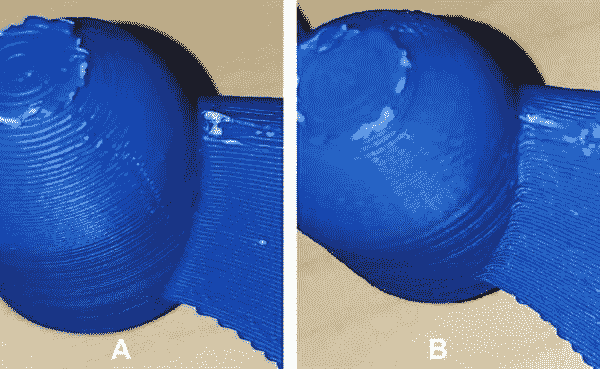

# 研究人员破坏 3D 打印机文件以摧毁无人机 

> 原文：<https://web.archive.org/web/https://techcrunch.com/2016/10/21/researchers-sabotage-3d-printer-files-to-destroy-a-drone/>

# 研究人员破坏 3D 打印机文件来摧毁一架无人机

内盖夫(BGU)本古里安大学、南阿拉巴马大学和新加坡技术与设计大学的研究人员成功地将恶意代码注入一台计算机，该计算机反过来向包含无人机螺旋桨 3D 模型的文件添加了隐形命令。当他们打印出模型并将其安装到无人机上时，螺旋桨在起飞时断裂了。这杀死了无人机。

简而言之，这个代号为 Dr0wned 的漏洞能够修改一个数字文件，进而破坏一个物理设备。

“想象一下，对手可以破坏飞机喷气发动机的功能部件。这种攻击可能会造成生命损失，造成经济损失，扰乱工业，并威胁一个国家的国家安全，”研究员、BGU 教授尤瓦尔·埃洛维奇说。“随着全球增材制造的发展，我们相信对这些系统进行恶意破坏的能力将吸引许多对手的注意，从犯罪团伙到国家行为者，他们的目标要么是利润，要么是地缘政治权力。”

这种攻击通过将指令隐藏在 STL 这样的模型文件中来实现。这些说明使打印机看起来打印了一个正常的，坚实的部分，但有一个致命的缺陷。当你在运转的机器上使用这个零件时，它很快就会失效，毁坏零件和机器。研究人员将恶意代码注入塑料螺旋桨，并在他们的测试中迅速摧毁了一架价值 1000 美元的无人机。

该漏洞需要控制受害者的计算机。它始于一封鼓励用户阅读 PDF 的网络钓鱼邮件，这实际上是一种远程访问恶意软件。然后，攻击者寻找所有的 STL 文件，并在其中注入削弱这些部分的代码。

由此产生的缺陷是无法检测的。例如，上面的螺旋桨是基于相同的文件，但标有 A 的已被修改为失败。几乎不可能把它们区分开来。

虽然没有多少人在他们的家用 3D 打印机上打印任务关键的物体，但我们可以想象未来飞机零件被传输到第三方进行重型打印。这一链条中的漏洞可能不仅仅是致命的。幸运的是，这仍然是一个概念的证明，唯一受伤的是一个无辜但昂贵的无人机。

【YouTube = https://www . YouTube . com/watch？v=zUnSpT6jSys]