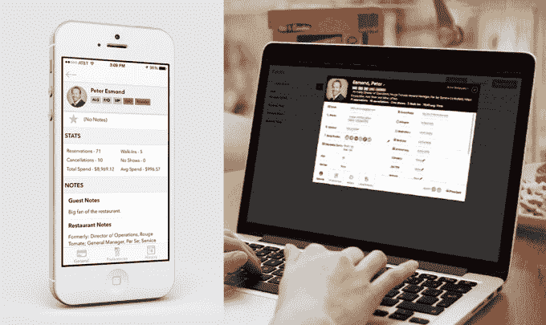

# Reserve 收购了一家为餐馆提供客人管理工具的初创公司 Set For Service 

> 原文：<https://web.archive.org/web/https://techcrunch.com/2015/08/21/reserve-acquires-set-for-service/>

# Reserve 收购了为餐馆提供客人管理工具的初创公司 Set For Service

Reserve 是一家帮助用户预订餐厅和付款的“餐饮礼宾”初创公司，它已经收购了 bootstrapped New York City company[Set for Service](https://web.archive.org/web/20221005162854/http://landing.setforservice.com/)。

Set for Service 提供了一个 web 和 iPhone 应用程序(如下图)，作为 Eleven Madison Park、Brooklyn Fare 和 dell'anima 等餐厅的 CRM 系统，允许他们跟踪客人的详细信息和反馈。Reserve 联合创始人兼首席执行官 Greg Hong 表示，最初的计划是继续为服务的客户提供产品，同时也决定将哪些功能纳入 Reserve 本身。

Set for Service 创始人兼首席执行官[彼得·埃斯蒙德](https://web.archive.org/web/20221005162854/https://www.linkedin.com/pub/peter-esmond/a/80b/32a)将成为 Reserve 餐厅产品的负责人及其纽约总经理。他来自餐饮业，曾担任托马斯·凯勒公司的总经理和 Rouge Tomate 的运营总监。

埃斯蒙德说，虽然他已经看到许多科技公司试图进入餐饮业，但他发现 Reserve“超级迷人”，因为它对这个行业有更广阔的视野。

“从我的角度来看，我喜欢他们创造的产品非常注重餐厅，”他说。“这是以他们的最佳利益为出发点的。”

洪补充说，虽然他向 Set for Service 的其他员工(团队成员不到 5 人)发出了邀请，但他们认为“让他们加入预备队没有任何意义。”

收购的财务条款没有披露。

去年秋天从创业工作室 Expa 推出的 Reserve [。通过该应用程序，用户可以浏览合作餐厅，请求预订(如果餐厅客满，还可以找到替代选择)，用餐后，该应用程序还可以处理支付—](https://web.archive.org/web/20221005162854/https://beta.techcrunch.com/2014/10/28/reserve-from-startup-studio-expa-makes-restaurant-reservations-easier-than-ever/) [，包括在必要时分摊支票](https://web.archive.org/web/20221005162854/https://beta.techcrunch.com/2015/07/16/reserve-splitting-the-check/)。

甚至在成立之初，Reserve 就已经收购了波士顿 Reserve 初创公司 SpoonSpoon 背后的团队。今年早些时候，它还宣布[收购预订服务公司 Zurvu 和支票分割服务公司 HAIL](https://web.archive.org/web/20221005162854/https://beta.techcrunch.com/2015/04/07/reserve-the-dining-reservation-app-from-startup-studio-expa-beefs-up-with-two-acquisitions/) 。

“不可避免的是，我们最终会与该领域许多不同的技术人员交谈，”洪说。“我们会继续与他们沟通，找出我们可以合作的方式，无论是通过收购、合作还是其他方式。这对我们来说是一个巨大的空间，因此能够…引进更多了解整个业务的人才是我们最高兴的事情。”