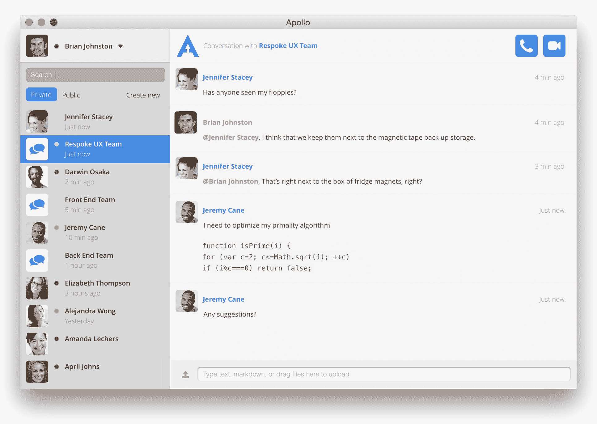

# Respoke 推出基于 WebRTC 的语音、视频和文本聊天应用平台 

> 原文：<https://web.archive.org/web/http://techcrunch.com/2015/02/23/respoke-launches-its-webrtc-based-platform-for-voice-video-and-text-chat-apps/>

# Respoke 推出了基于 WebRTC 的语音、视频和文本聊天应用平台

广受欢迎的开源软件[星号](https://web.archive.org/web/20230129214159/http://www.digium.com/en/products/asterisk) PBX 软件背后的公司 [Digium](https://web.archive.org/web/20230129214159/http://www.digium.com/en/) ，今天宣布正式推出面向开发者的 WebRTC 服务后端 [Respoke](https://web.archive.org/web/20230129214159/https://www.respoke.io/) 。Respoke 加入了许多类似的服务，如 [Bistri](https://web.archive.org/web/20230129214159/https://bistri.com/) 和 Telefonica 的 [TokBox](https://web.archive.org/web/20230129214159/https://tokbox.com/) ，它们也提供以 WebRTC 为中心的通信平台。

使用 Respoke，开发人员可以使用单个 API 为他们的应用程序添加视频通话、实时聊天或屏幕共享等功能。目前，这项服务主要集中在网络上，提供 JavaScript 库和 REST API，但 Respoke 计划在下个季度推出其 Android 和 iOS SDKs 的测试版。Internet Explorer 和 Safari 目前不支持 WebRTC，但 Respoke 也计划为它们发布一个插件。

虽然 WebRTC 是一项伟大的技术，但它目前的迭代侧重于一对一的点对点连接。然而，防火墙和网络配置常常会阻止这些直接连接。这就是 Respoke 等后端服务派上用场的地方。他们不仅通过使用媒体中继来支持这些连接，还添加了其他不属于 WebRTC 标准的功能，如管理登录凭据和身份、在线状态以及用户期望从他们的通信应用程序中获得的其他功能。

Respoke 还让开发者可以轻松地让用户拨打电话。不出所料——考虑到它的传统——这项服务也使得整合基于星号的电话系统变得容易。

在过去的几个月里，Digium 在公司内部孵化了 Respoke 这个创业项目。这项服务在几个月前试运行，从那以后，该团队增加了早期用户要求的许多功能，包括呼入和呼出呼叫、屏幕共享等。

Respoke 的定价方案基于您希望能够支持的并发连接数、您可以使用的媒体中继带宽以及您想要的电话号码和通话时间。支持 5 个并发连接和 5GB 媒体中继带宽的基本计划免费提供。付费计划每月 50 美元起(50 个连接、50GB 带宽、一个电话号码和 500 分钟通话时间)。