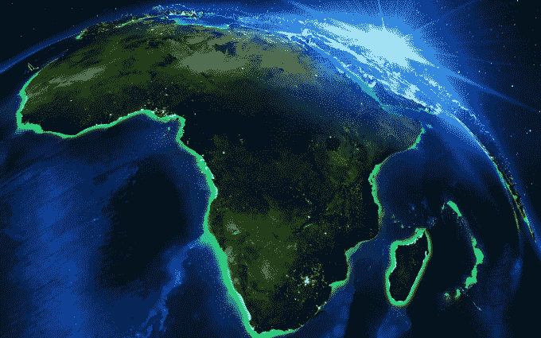

# 为了满足非洲对可靠数据收集的需求，mSurvey 筹集了种子资金 

> 原文：<https://web.archive.org/web/https://techcrunch.com/2016/08/26/responding-to-the-demand-for-reliable-data-collection-in-africa-msurvey-raises-seed-funding/>

专注于移动数据收集的肯尼亚初创公司 mSurvey 已经筹集了种子资金，因为它希望与撒哈拉以南非洲的零售商合作，扩大其调查业务。

Safaricom、 [Cross Culture Ventures](https://web.archive.org/web/20230217123337/https://www.crunchbase.com/organization/cross-culture-ventures#/entity) 和维珍集团的[阿尔法天使](https://web.archive.org/web/20230217123337/http://alphaangels.co/)加入了对这家成立四年的公司的投资。

“这是一轮种子赛。我不能透露金额，但其中一部分来自 100 万美元的星火风险基金 Safaricom，该基金是为了投资高增长初创公司而设立的，”mSurvey 首席执行官肯菲尔德·格里菲斯(Kenfield Griffith)表示。他补充说:“我们将利用这笔资金来推动使用 Safaricom 的 Lipa Na M-Pesa(账单支付和数字支付)服务的商家增值，并进一步推动非洲和其他新兴市场的增长。”。

mSurvey 的商业模式需要使用基于手机的调查来填补非洲关键市场的个人和消费者数据空白。

格里菲斯是麻省理工学院的毕业生，来自加勒比海国家蒙特塞拉特，他在肯尼亚完成论文时，看到了填补这一空白的机会。“我一直在寻找很难找到或收集的个人研究意见……与此同时，我注意到几乎每个走动的人都有一部手机。那时我意识到这是一种向人们提问并在新兴市场大规模收集数据的方式，”格里菲斯说。

他与肯尼亚软件开发人员 Louis Majana 合作充实代码，他们共同创建了 [mSurvey](https://web.archive.org/web/20230217123337/https://www.msurvey.co/blog/case-study-harvard) 专利应用程序，通过手机和短信搜索数字信息。

这家初创公司从 Abraaj Group 和 Salesforce CTO 史蒂文·塔姆等公司获得了第一笔天使投资。除了几个加勒比海国家，mSurvey 现在还在肯尼亚、坦桑尼亚和乌干达进行市场调查。客户遍及企业(Airtel、麦肯锡和肯尼亚的 Java House 咖啡连锁店)、政府和学术机构，如哈佛医学院。

格里菲斯不愿透露 mSurvey 的收入，但指出他们“几乎在推出后立即开始预订。”他还详细阐述了这家初创公司的商业模式。市场研究服务维护着一个注册(非垃圾)回答者的数据库，以及一个对他们进行数字细分和投票的算法手段。

例如，在肯尼亚，回答一项调查的个人可获得 50 先令(约 50 美分)。mSurvey 的主要收入来源是年度订阅结构，主要由公司使用，他们通过价格获得不同的研究能力。根据 Griffith 的说法，有基本包(每年大约 6K 美元)，中间层包和企业包(18K 美元)，。

![TechCrunch_Infographic_V003[2]](img/27bd8d789cd44c1e7f19cb1ad9582429.png)

在纽约的一次谈话中，Griffith 从他的笔记本电脑上提供了一个现场 mSurvey 演示。他发起了一项关于肯尼亚里约奥运会表现的调查。Griffith 通过 mSurvey 的界面创建了一个人口和调查问卷，不到 10 分钟，他就在手机上查看了从肯尼亚受访者那里收集的结果。

非洲作为商品增值数据的潜力已成为一种普遍的说法。

非洲大陆核心经济体十年的增长和改革以及由两位数外国直接投资增长推动的商业扩张暴露了可靠市场统计数据的缺乏。当最近几个非洲国家[的 GDP 修正](https://web.archive.org/web/20230217123337/http://www.bloomberg.com/news/articles/2014-10-09/african-countries-recalculate-gdp-find-much-higher-numbers)显示过时的统计方法在经济活动中遗漏了数十亿美元时，这一点变得很明显。

非洲发展银行估计，大约 55%的非洲经济活动发生在非正规部门，这给消费市场带来了很大的盲点。消费者支出的增长、电子商务、移动渗透率以及非洲不断改善的宽带格局正在改变这一状况，同时也为数据服务创造了机会。

“非洲的消费者研究正在成为一个正式的专业行业，这对企业和投资者来说是一件好事，”非洲消费品顾问、大西洋理事会(Atlantic Council)非洲高级研究员奥布里·赫鲁比(Aubrey Hruby)说。

Hruby 强调了全球企业在非洲的数据收集是多么初级，“长期以来，非洲市场一直是数据沙漠。当肯德基搬进来的时候，他们不得不使用混合的低技术**——**人用剪贴板估计客流量——和高水平的卫星图像来决定在哪里定位他们的餐厅和提供什么。”****

 ****虽然赫鲁比不知道非洲调查研究市场的可靠收入预测，但她指出，参与者正在进入消费者数据领域。像尼尔森和欧睿这样的全球大公司已经增加了他们的非洲消费者研究项目。一家美国公司 GeoPoll 也在 20 个非洲国家建立了数字调查服务和数据库。

在新投资的帮助下，mSurvey 计划在 2016 年底前将业务扩展到尼日利亚、加纳和赞比亚。Griffith 认为其与 Safaricom 的产品合作伙伴关系是新联盟的卖点，Safaricom 是肯尼亚最大的电信公司，提供一系列数字产品。“他们是移动支付(通过 M-Pesa)的领导者，我们将我们所说的对话式商务与此相结合。这应该会为其它市场提供杠杆作用，”他表示。****