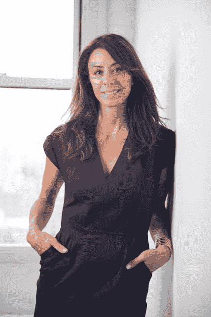

# 零售专家 Francine Della Badia 加入 Bonobos，成为新的首席执行官 

> 原文：<https://web.archive.org/web/https://techcrunch.com/2015/05/07/retail-expert-francine-della-badia-joins-bonobos-as-new-ceo/>

# 零售专家 Francine Della Badia 加入 Bonobos 成为新的首席执行官

Bonobos 前首席执行官 Andy Dunn 将“晋升”为公司执行主席，并将由零售专家 Francine Della Badia 取代。邓恩将成为公司的品牌大使和媒体代表，而德拉·巴迪亚将处理日常业务，管理公司的 Bonobos，AYR 和 Maide 系列。

“这是一个巨大的决定，”邓恩说。“我想找一个我们可以合作专注于零售的人。”

该举措将于 2015 年 6 月 1 日生效。

德拉·巴迪亚是蔻驰公司北美零售部的总裁，也是维多利亚的秘密的前副总裁。最近，她在纽约经营一家时尚加速器 [Fashion CampNYC](https://web.archive.org/web/20230129063857/http://fashioncampnyc.com/) 。邓恩明确表示，此举将使他有更多时间在全球品牌商店和活动中代表品牌。

“我很幸运继承了一个拥有非常引人注目的品牌和强劲势头的公司，并准备继续增长，”德拉巴迪亚在一次新闻发布会上说。

Bonobos 成立于 2007 年，在网上和实体店销售服装。我们[在 12 月访问了公司](https://web.archive.org/web/20230129063857/https://techcrunch.com/2014/12/15/techcrunch-makers-bonobos-headquarters-ramps-up-for-the-holidays/)，在那里我们与当时的首席执行官邓恩谈论了公司的发展。