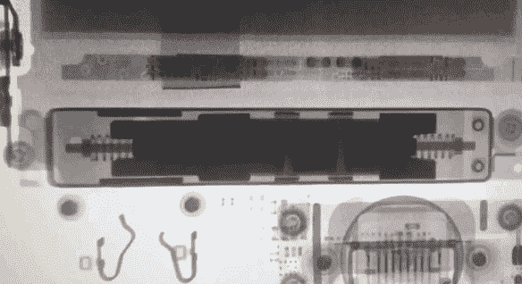
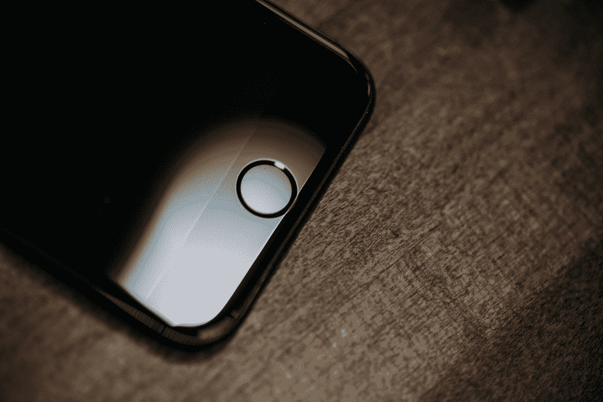
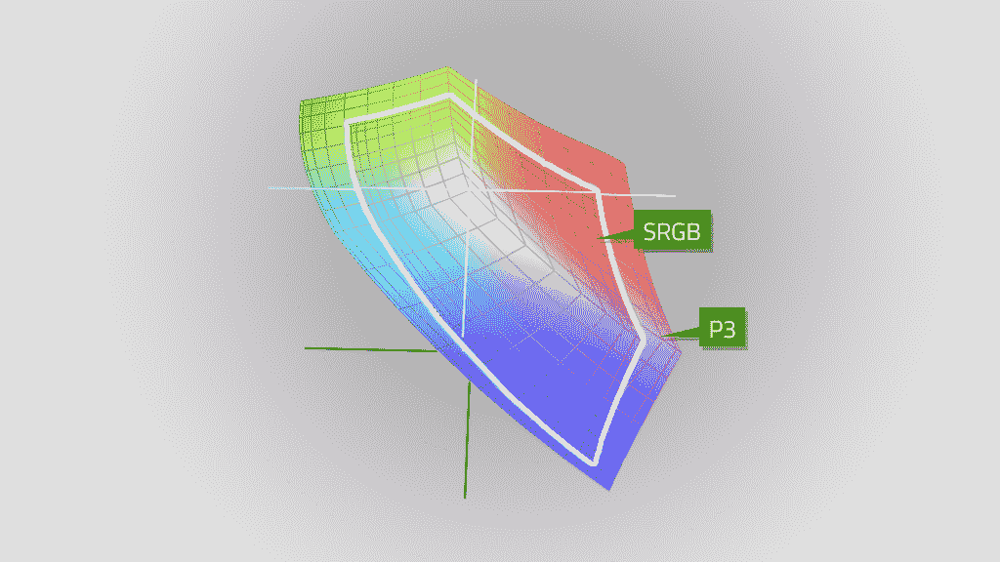
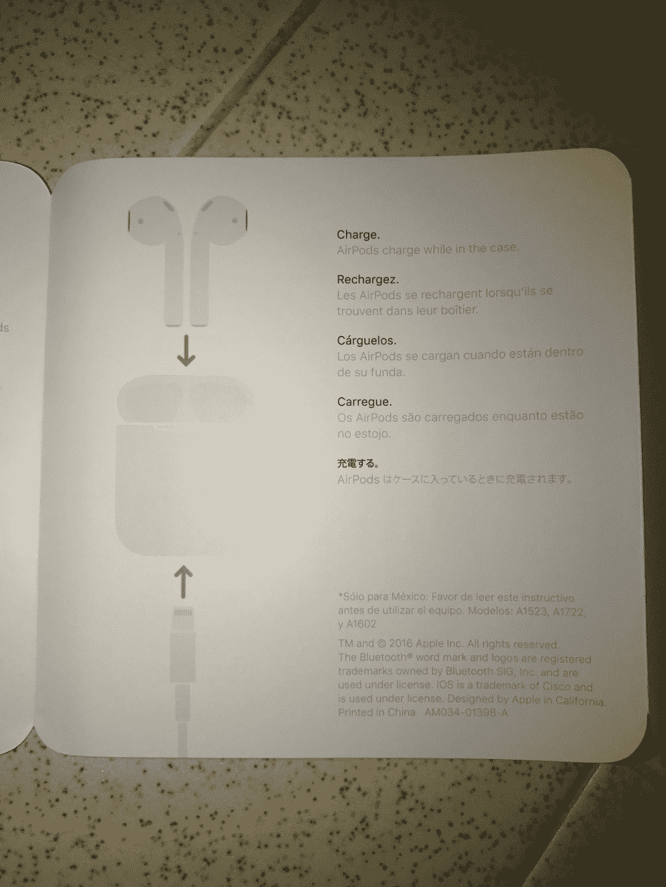
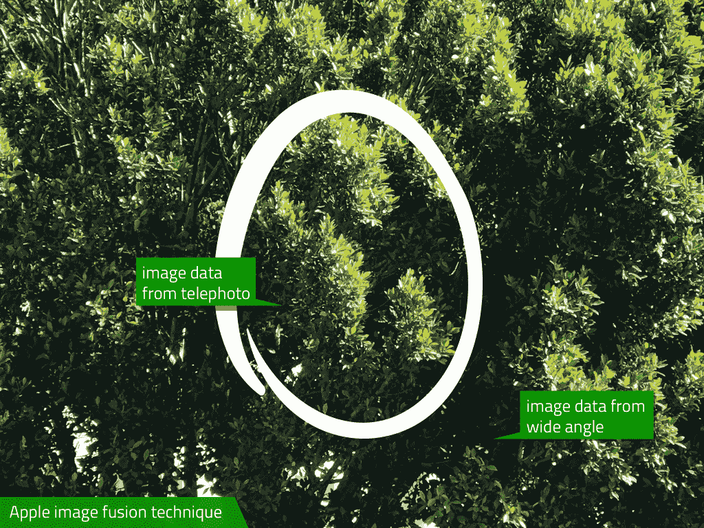
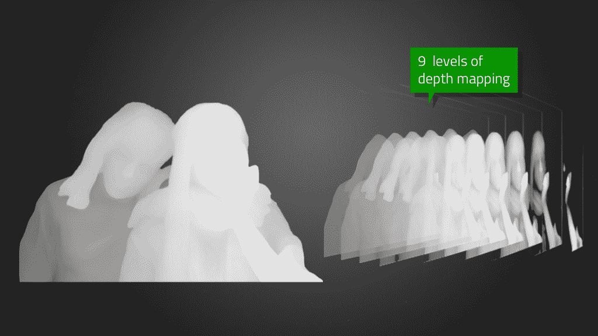
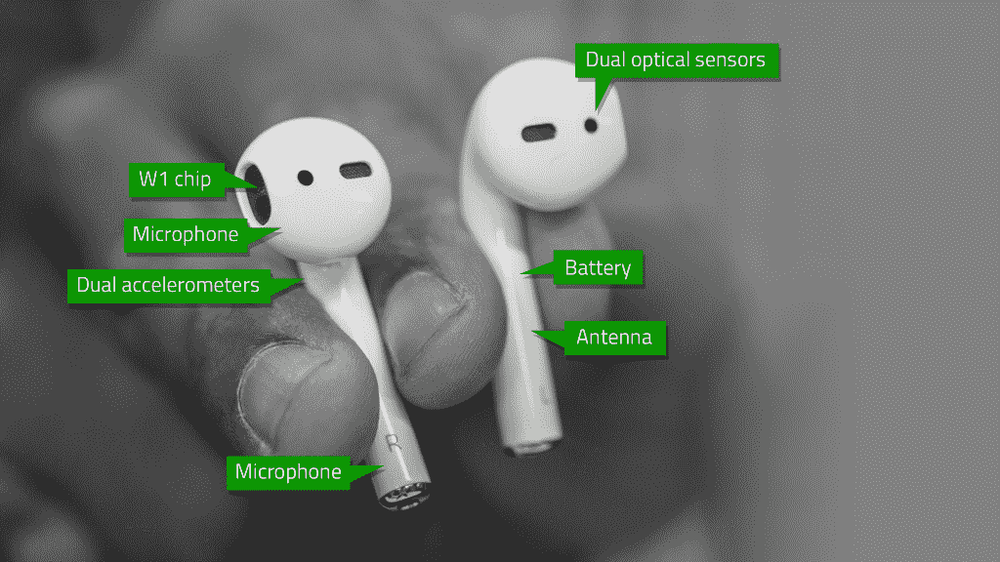

# 评论:苹果用苹果手机 7 引领未来

> 原文：<https://web.archive.org/web/https://techcrunch.com/2016/09/13/review-apple-tees-up-the-future-with-iphone-7/>

M

你的孩子经常放屁。事实上，放屁——和吃饭——几乎是他所做的一切，因为他才四周大。在这一点上，他的表现达到了预期，我们都很高兴在这里，尽管没有一个成年人在这个房子里连续几周的睡眠时间超过几个小时。

他正忙着分裂原子，接收世界，连接神经元，并弄清楚那些手和眼睛是如何一起工作的。放屁——很多。考虑到他在生活中的位置，我和他妈妈没有理由期待更多的公正。但是我们对未来抱有很高的希望。

苹果也正在经历一个与苹果手机原子分裂的阶段。苹果公司知道，未来是一台能够以 3D 方式观察世界的相机。它知道未来是一个没有电线的未来，因为电线是可怕的。它知道苹果手机可能是我们的主要电脑，但它的屏幕不会是我们与电脑互动的主要方式。这些变化是不可避免的，也是最终受欢迎的——但在我们走向未来之前，必须做出一些艰难的决定。

其中之一是取消耳机插孔，这一决定有非常有力的论据反对它，合理，合乎逻辑的人会很难反驳。另一个是在苹果 7 Plus 中增加第二个摄像头。另一个仍然是删除标准的物理主页按钮，取而代之的是触觉版本。

所有这些都被技术、材料、哲学选择和未来计划联系在一起。事实上，如果你喜欢阅读苹果的茶叶，看看它下一步会做什么，以及它会如何影响这个行业，那么苹果 7 和苹果 7+是有史以来最有趣的苹果手机。

## 故障

如果你以前读过我的评论《T4》中的一篇《T2》，你就会知道我做的事情和其他科技作家有点不同。首先，我像往常一样使用手机。我不会折磨测试他们或运行数十个人工基准，除非他们提供了一个有趣的窗口，让你了解将对你产生真正影响的性能提升。

坦率地说，在像 iOS 这样的平台上，硬件几乎是不变的，开发人员将会生产出利用苹果提供给他们的资源的软件——不多也不少。所以在一堆随机数上浪费时间(越高越好！越低越好！)并不能真正服务于大多数时间的观众，因为一切都应该运行良好。

当然，注意到新功能在哪里提供给开发人员是有帮助的，因为这将直接影响您将拥有的体验。而且，如果有任何设备的标准日常功能实际上比以前更差的情况，那也值得一提。

我通常还会备份我的个人手机，并将其恢复到演示设备上，而不是全新开始，因为这是大多数人在现实世界中开始使用新设备的方式。我不打算创造一些模糊的理想化的实验室环境。有很多人在这方面做得很好，我会让他们去做。我只对给出最清晰的观点感兴趣，那就是事情将会如何顺利地进行。

所以我就这么做了。我在弱光、好光和非常好的光线下给我的孩子拍照。我把闪亮的 iPhone 和钥匙之类的东西一起扔进口袋，想看看它会不会刮花。我玩 home 键，在电话、播客、音乐和有声书上使用苹果新的 AirPods。我用 Lightning 适配器插上普通耳机，嘲笑那些狂妄自大的人。我玩游戏，看了数百张照片，感受 Taptic 引擎和新的色彩丰富的屏幕。

苹果在主题演讲中重点介绍了 iPhone 功能的一些进步，并将它们归为几个“类别”。我认为围绕这些方面的声明来组织这篇评论会很有趣——用简单易懂的语言讲述它们在实际设备上的表现。

【YouTube https://www.youtube.com/watch?v=h5Jni-vy_5M?version=3&rel = 1&fs = 1&auto hide = 2&showsearch = 0&showinfo = 1&iv _ load _ policy = 1&wmode = transparent】

## 设计

很多人都在谈论苹果没有为 iPhone 7 推出全新的外观设计。这主要是由于苹果公司自己设定的预期。自 iPhone 3G 和 3Gs 以来，苹果每两年都会显著改变 iPhone 的外部外壳设计。每个人都有自己的最爱:我喜欢玻璃背的 4 和 4s；许多人更喜欢薄铝 iPhone 5。

iPhone 6 的粗略设计已经使用了几年，但如果说设计没有变化，那就是低估了设备组装方式的一系列重大变化，也误解了“设计”不仅指外观，还指工作方式。

当然，这并不能改变大众确实喜欢新东西的事实。而且 iPhone 7 的整体形态并没有喊新。

这就是为什么苹果发布了两种新的饰面。

哑光黑色是一种铝饰面，几乎复制了 iPhone 的其他颜色，对于那些已经期待了一段时间的人来说，这是一种非常耐用的黑色。另一种颜色是深黑色。

以下是苹果公司关于表面处理的说法:

> 黑色 iPhone 7 的高光表面是通过精密的九步阳极氧化和抛光工艺实现的。它的表面和其他阳极氧化的苹果产品一样坚硬；然而，它的高光泽可能会显示出细微的微磨损。如果您对此感到担心，我们建议您使用众多保护套中的一种来保护您的 iPhone。

### “高光”

苹果公司表示，乌黑的光泽有助于显示漆面上的微小划痕。

我不得不同意。我的 iPhone 7 审查单元在一周左右的时间里，与 AirPod 外壳和钱包等各种其他物品一起进出我的口袋，并将其放在表面上，肯定会显示出细微的划痕和磨损。

我通常使用不带外壳的手机，所以这是一个数据点。如果你要使用一个案例，你会很好(虽然你为什么会选择它，我不知道)。如果你打算“裸着”运行它，准备好用抛光布擦拭它，或者学会接受这样一个事实，就像一辆涂有黑色闪亮油漆的汽车一样，它会在任何高光表面上留下螺纹和划痕。

天线带现在在两种黑色上都几乎看不见了，在所有型号上都更加无缝，这非常受欢迎。

相机凸起现在被认为是设计的一部分，因为它们是由身体材料本身成型的，像肌肉一样从背部膨胀出来。去年和前年的乐队总觉得有点胆怯和歉疚。苹果现在已经想出了这个小窍门，让这种颠簸感觉更有目的性和有机性。

今年保持 iPhone 当前整体外观的决定可以归结为 iPhone 升级计划——如果苹果可以通过给他们信心，让他们相信他们可以获得“新 iPhone ”,每年改变很大一部分人，那么也许它有机会从当前的两年拥有周期中收回所有权。然后，它可以真正开始迭代，而不必担心每两年挂一个看起来非常不同的模型。

或者苹果可能只是在明年的计划中遇到了一些材料问题，并决定将这些改进打包到旧外壳中。

## 虚拟按钮

其他改进包括物理 home 键被触摸感应版本取代。现在，按钮不是在被按下时移动，而是通过 iPhone 7 的 Taptic 引擎(位于屏幕后面手机底部附近的振动电机系统)给出反馈。iFixit 提供的 Taptic 系统在[下方工作的图像。](https://web.archive.org/web/20230309043034/https://www.ifixit.com/Teardown/iPhone+6s+Teardown/48170)

Taptic 振动器的振动清脆而明显，是发动机设计的副产品。普通的振动马达会将一大块金属放在轴上旋转，产生“bzzz”振动。苹果有一个反馈系统——被称为触觉系统，因此称为“tap TIC”——可以在速度、持续时间和强度方面改变其反应，而不是一个笨拙、缓慢旋转和缓慢停止旋转的旋转或线性振动器。

如果你曾经在越狱的 iPhone 或 Android 手机上使用过触觉反馈，你可能会注意到，无论你点击什么按钮或按键，振动的感觉都是完全一样的。这是由于大多数振动马达是多么粗糙。Taptic 引擎要先进得多，可以根据用户正在做的事情向他们提供不同的信号。该引擎在 iPhone 6s 中推出，但这是苹果第一次用它来代替按钮，也是第一次向开发者开放。

一些应用程序已经利用了这一点，当用户敲击钢琴键或命令游戏中的角色时，它们会对用户进行反击。

随着 iOS 10 和新 iPhone 的推出，苹果正在开放 Taptic Engine API，允许它们以物理方式响应用户。

将会有很多关于 iPhone 的其他功能的讨论，但是我相信 Taptic 引擎和它的开发者 API 将会是这里最受欢迎的。我们已经有一整个时代在使用 iPhone 的时候，它不会对我们的身体做出反应——那已经结束了。我猜想 Taptic 引擎的一些很酷的用途即将出现，它可能会为残障人士带来更好的可用性，甚至一些我们尚未看到的新交互模型。

但是虚拟家庭“按钮”是如何工作的呢？太好了。好吧。在我看来，这是一次完美的过渡。

这个按钮感觉不像新款 MacBook 的触控板——它根本不会移动——因为它实际上感觉不像你在点击 home 键本身。我猜这是由于 home 键的大小(相对于触控板来说相对较小)和 Taptic 引擎的方向。

相反，感觉就像你在点击屏幕底部的四分之一。这一点也不令人迷惑，实际上感觉非常自然。

我个人认为，苹果对这种工作方式很满意，事实上，它正在让用户为 home 键从 iPhone 正面完全消失做准备。用户只需“点击”屏幕底部即可采取这些操作。如果像传言的那样，明年的 iPhone 是一块没有按钮的实心玻璃，这就很有道理了。

取代物理 home 键还有两个非常明显的好处，最初可能并不清楚。

首先，你可以在设置菜单中调整 home 键的响应强度。对于任何想在安静的环境下使用手机的人来说，这是非常酷的。我经常在晚上抱着我四周大的孩子，而他的妈妈在睡觉，当我浏览我的手机时，home 键设置为“1”意味着“点击”非常安静和轻。我正常的“白天”点击是“3”，它有一个很好的重击声。能够选择这一点意味着我不会冒他醒来的风险，但在白天，我会得到我喜欢的那种美好而坚实的确认。使用物理按钮是不可能的。

其次是维修。home 键，还有屏幕和水渍，已经被证明是一个经常性的维修问题。这是一个如此严重的问题，以至于在亚洲甚至有一种文化迷因，iPhone 用户打开辅助功能，在屏幕上使用基于触摸的 home 键替代品，以保留 home 键，避免昂贵的维修。当然，有一个警告是，这个物理按钮有传感器，所以我们不知道这些传感器会如何磨损——但如果这不成为一个问题，消费者可以通过更换物理按钮来节省数百万或数亿美元(苹果也是如此)。

顺便说一句，音量降低按钮现在取代了主页按钮，用于硬重启和恢复模式功能。

## 抗水性

iPhone 不防水，但它的防水性要好得多。我泼溅过这些演示设备，把它们放在装满水的水槽里，把水洒在它们上面，并且通常不注意它们的湿度，它们仍然工作得很好。我肯定有人会做一些长期浸泡或深度测试，看看它们是否符合苹果声称的 IP67 等级(防水防尘，但不适合水下使用)，但我不认为大多数人都是这样使用它们的。没人愿意泡自己的 iPhone 这只是偶然发生的事情，就像那次我口袋里带着一个走进游泳池，或者那次我把一个掉在马桶里，或者那次我…好吧，你明白了。

再加上新的 Apple Watch 从 IPX7 升级到 WR 50M(防水深度为 50 米)，这使得整个系列非常昂贵的设备不太可能被错误的溢出杀死。

iPhone 7 和 iPhone 7 Plus 在水中放置一段时间后，取出并抖掉，仍然可以正常工作。目前为止没有任何并发症。这意味着普通用户可能不必太担心日常事故会导致他们的 iPhone 被泼溅而死。

## 最好的相机

苹果公司选择了又一年不升级其传感器的像素数量。正如我去年所说，这是正确的选择。太多的制造商陷入了争夺更多像素的竞赛，而没有关注来自这些像素的捕捉质量。多年来，更多像素一直是相机行业的简单“卖点”,直到佳能带头撤回并专注于更大的表面积以获得捕捉元素和更好的弱光性能。

尽管苹果没有改变像素数量，但它设计了一种新的相机系统，包括新的传感器、新的镜头、新的图像稳定阵列和图像处理芯片的更新版本。基本上，这些都是全新的相机。

首先是 iPhone 7。iPhone 7 的相机现在具有光学图像稳定功能，这是以前只有 iPhone 6s Plus 型号才有的功能。这意味着由于手抖和其他因素，在弱光下可以捕捉到更好的图像。这是一个受欢迎的新增功能，将使今年在两种 iPhone 型号之间做出选择变得更加困难。镜头增加了一个额外的元素来锐化图像的边缘。边缘清晰度是智能手机相机的一个经常性问题，所以很高兴看到这里有人关注它。新 iPhones 中使用的所有镜头都有这额外的第六个元素。

iPhone 7 摄像头中的传感器，事实上三个新的后置摄像头中的传感器，可以捕捉宽色域的颜色。这意味着传感器可以看到比以往任何时候都更深的红色、绿色和蓝色，转化为更真实的颜色。在我的测试中，特别是在光线较暗的情况下，这种新传感器的颜色比 iPhone 6 的颜色准确得多。

这种宽色域传感器的一个伟大的新技巧是能够捕捉红色、绿色和蓝色主题的高度饱和图像。红色，尤其是 CCD 相机传感器一直是一个问题，因为它们的配置和布局方式。这款新的宽色域传感器首次允许您捕捉真正饱和的红色对象，而不必担心丢失纯红色的细节。

如果你熟悉色彩空间，这种新的传感器可以捕捉 P3 设备可显示的颜色范围，远远超过标准 SRGB 显示器所能表现的范围。Retina iMac、iPad Pro 9.7 英寸以及现在的两款 iPhone 7 都可以显示宽色域图像。他们现在也可以捕捉它们。

如果你不熟悉，下面的插图演示了我在说什么。传感器可以“看到”并再现光谱中比以前更多的颜色，因此您的颜色将更准确，更接近普通人眼。

### 更好的眼光

由于改进了传感器，人眼将能够拾取更准确的颜色。

基本上，更多的颜色在更宽的范围内表现得更准确。iPhone 6 记录了强烈的对比色彩，而 iPhone 7 更加准确和逼真。这适用于 iPhone 7 和 iPhone 7 Plus。

此外，iPhone 7 和 iPhone 7 Plus 标准相机的光圈增加了 2/3，降至 f1.8，通过镜头进入并击中传感器的光线量几乎增加了一倍。这使得低光图像中的噪点更少，细节更多。灯光或其他场景下的拍摄很容易得到改善。

### iPhone 6s

### iPhone 7 Plus

### iPhone 6s

### iPhone 7 Plus

我仍然对苹果的图像信号处理器(ISP)应用于  图片的降噪量不太满意，但我做出这一声明时充分意识到这不是大多数人会注意到的事情。

NR 更积极是有道理的，因为大多数人希望图像中的“颗粒”或像素噪声更少。但我觉得，在光线较暗的情况下，这仍然会导致锐度有所下降。需要澄清的是，这与我对 ISP 在 iPhone 6 中的调整方式的感觉基本上没有变化。苹果这次在摄像头方面做了一些疯狂的改进，但我希望它在未来会注意如何减少噪音并进行调整。

### iPhone 6s

### iPhone 7

两个自拍相机都已经升级到了 700 万像素。用这款相机拍摄的图像确实展示了苹果公司添加到图像处理器中的微调色调映射。请注意 iPhone 6s 如何从打开的窗口显示热点，以及 iPhone 7 Plus 处理相同图像的流畅程度。

顺便说一下，那个新的闪光灯？四种色温，哇是固体。一位匿名的同行评论家(短时间内)放错了他的 AirPods 盒子和手册，需要看其中的几页。所以我把它们摆好，用柜台上的相机快速拍摄。闪光灯很好地平衡了色彩，没有曝光不足。对 flash 已经很稳定的工作做了很好的改进。

现在，关于那个 iPhone 7 双摄像头。这是智能手机或任何相机时代见过的最复杂的相机和图像处理器配对。双摄像头设置在手机中还有一些其他应用，但相比之下，执行起来很粗糙。

第一，硬件。你有一个标准的 f1.8 光圈 28mm 等效广角和一个“长焦”f2.8 光圈 56mm 镜头。两者都使用相同的捕捉传感器，但长焦有自己的一套镜头来适应焦距。

顺便说一下，56 毫米镜头不是长焦。长焦镜头通常被认为是从大约 80-100 毫米开始，然后从那里向上。*但是*苹果是这么称呼它的，这么称呼它比给它另一个名字更容易，所以我在这里就这么称呼它。每次我打长焦都会痛，但不知何故我会熬过这种痛苦——而且它肯定是比 28 毫米广角更长、更大的镜头。

我跑题了。

每次用 iPhone 7 拍照，广角和长焦都熄火了。是的，每张照片两张 1200 万像素的照片。这可能是 iPhone 7 Plus 内存增加到 3GB 的主要原因。

由于苹果公司内部称之为“融合”的技术，这两幅图像都是必需的。Fusion 从两个传感器获取数据，并将其合并成每种情况下的最佳图像。例如，如果有一个光线较暗的场景有一些黑暗的区域，图像处理芯片可以选择从更亮的 f1.8 广角中提取一些图像数据(像素或亮度等其他东西)，并将其与 f2.8 长焦的数据混合，在没有用户任何输入的情况下创建一个动态合成图像。这种融合技术适用于相机发出的每一个镜头，这意味着 iPhone 7 Plus 在每次触发触发器时都会混合和匹配数据。

这种技术之所以成为可能，是因为两个摄像头的光学、涂层、传感器、视角和色彩平衡完美匹配。

当使用 iPhone 7 Plus 的新缩放功能时，融合技术也很方便。

### 1 倍变焦

### 10 倍变焦

### 1 倍变焦

### 2 倍变焦

我们第一次在 iPhone 上实现了 2 倍光学变焦。通过从广角镜头切换到长焦镜头作为您的主要图像拾取器，这将使您的放大倍率“翻倍”。你可以通过简单的点击相机屏幕上的 2x 按钮来实现。光学变焦效果很好，56 毫米镜头自然增加了标准镜头提供的面部特征的压缩和背景的轻微模糊，特别是近距离。长焦镜头的最小对焦距离为 22 英寸，比广角镜头更远，但仍然很近。

您还可以通过抓取并沿标尺滑动变焦图标，在一个连续动作中从 1 倍、2 倍光学变焦到 10 倍数码变焦。这是一个如此酷和有用的缩放方法，以至于在 iPhone 7 上用手指捏来缩放会让人觉得过时和讨厌。缩放工具的加速和平滑是完美的，没有太快、太慢或太慢的感觉。我预计这一款将被其他手机制造商复制。

在缩放比例的 1x 和 2x 位置之间，两个光学镜头融合在一起，形成一幅完整的图像。高于 2x 时，融合技术如上所述适用。因此，这不是变焦时长焦镜头的“纯粹裁剪”，你可以获得图像处理器从每次拍摄的所有原始传感器数据(价值 2400 万像素)中创建的最佳图像。图像中心附近的数据可能来自远距离拍摄的清晰图像，边缘的数据可能来自广角图像。同样，对用户来说是无缝的。

一个问题:光学图像稳定是*只有*出现在广角镜头，而不是长焦。这是有道理的，因为 iPhone 上拍摄的绝大多数图像目前都是在固定的广角设置下拍摄的，没有变焦，但长焦现在将会得到大量使用，我预计 o is 很快就会实现这一点。

一个有趣的小消息是，如果你在弱光下，iPhone 的 ISP 可能会选择裁剪广角镜头*而不是使用长焦。是的，这意味着在“2x”时你可能根本不用长焦。这是因为你从更宽光圈广角拍摄的裁剪版本中获得的图像比从更暗、不稳定的长焦中获得的图像更好。*

在我的测试中，我发现长焦镜头像广告中所说的那样工作，允许我在不损失图像质量的情况下裁剪得更紧，并给照片一个很好的人像般的小凸起，即使没有特殊的人像模式的东西。

当你看上面的示例图片时，也请记住，只有当你使用 iPad Pro 9.7 英寸或 Retina iMac 时，你才能获得真正的效果。在显示器赶上之前，iPhone 7 的照片在自己的屏幕上总是看起来最好。

如果苹果几年前没有决定制造自己的图像处理芯片，这些相机的东西都不可能实现。地球上几乎每一部智能手机都使用现成的零件，许多相机公司只是使用通用的松下零件。这里每一个镜头所进行的疯狂的混合和计算会削弱一个较弱的处理器。

### 1 倍变焦

### 2 倍变焦

### 10 倍变焦

## 人像模式

这是一种通过使用两个镜头测量图像深度来模糊背景的模式，将前景与背景分开，并创建人像外观。我希望我能为你回顾这一点，但它还没有启用。它仍在调整和工作中，将于今年晚些时候在 iPhone 7 Plus 的软件更新中发布。

这一定会让摄影团队抓狂，因为他们不能在发布时将它送到消费者手中，但最好还是把它做好。顺便说一句，我已经看到了这种模式的一些例子，它似乎真的非常非常好——我只是不能亲自担保它的实际效果。未完待续。

该功能使用的深度映射是设备上有两个摄像头的副产品。它使用苹果收购的 LinX 公司的技术来创建数据，图像处理器可以用这些数据来制作其周围的 3D 地形图。这不*不*包括苹果在 2013 年购买的 Primesense 芯片的全部功能(我们尚未看到这种东西完全实现)，但它即将到来。

毫不夸张地说，一旦 iPhone 可以看到 3D 图像(它已经开始这样做了)，它就可以为虚拟现实和增强现实提供位置和手部跟踪，为 VR 和 AR 提供图像捕捉，以及空间映射。在之前，我已经[详细讨论过这一点，所以我不会反复强调这一点，但如果你听听专家的意见，苹果似乎总是“落后”于创新技术，而事实上它已经在以目的驱动的方式应用它，而不是关于技术演示，而是关于客户满意度。这是一个反复出现的主题，每当有人说苹果无聊时，记住它是很好的。](https://web.archive.org/web/20230309043034/https://techcrunch.com/2013/12/03/apple-primesense-and-perceptive-computing-or-why-your-phone-will-see-in-3d/)

对感兴趣的人来说，还有一些关于相机的趣闻:

*   图像处理器现在可以进行人体检测和面部检测。这有助于更快地锁定面部，并有助于肖像模式。
*   现在有一个原始 API，开发者可以利用它来获取 DNG 文件形式的原始传感器数据。这实现了真正的 Lightroom 风格的原始编辑，以及视频和静态操作形式的许多其他有趣的东西。
*   原始图像可以从广角镜头或长焦镜头获取。
*   这个 API 不会向开发者展示肖像模式中使用的深度映射数据。

## Retina 高清显示屏

与相机共生的是一个宽色域屏幕，显示 P3 空间中的颜色。如上图所示，这意味着屏幕可以显示更多的颜色，显示得更准确。这实际上使 iPhone 7 的屏幕与 Retina iMac 和 iPad Pro 9.7 不相上下。预计未来会看到 P3 屏幕应用到所有苹果设备上。

值得注意的是，iPhone 7/7 Plus 没有 True Tone 显示屏。这些显示器的色温与周围的环境光相匹配，需要额外的传感器封装，而 iPhone 较小的外壳中可能没有空间容纳它们。虽然可能很快；这是一个恒星效应。

## 表演

苹果的硅团队拥有全球最优秀的人才。它从购买现成的处理器(尽管经过调整)发展到每年设计和运输数千万个完全定制的 CPU。每年都有一些新的聪明的词加入到词汇表中——不仅仅是苹果，还有整个行业。

今年，苹果首次推出 A10 融合芯片；让我们深入讨论一下这个问题。

新的芯片是 4 核配置，乍一看，像一个标准的"[大。小](https://web.archive.org/web/20230309043034/https://www.arm.com/products/processors/technologies/biglittleprocessing.php)“手臂设置。两个强大的内核用于处理重物，两个较小的内核用于通过处理轻量级任务来延长电池寿命。

事实上，它是*而不是*一个标准的大。小小的圈套。在处理小型或后台任务方面，低功率内核有一些相似之处，但也有一些不同之处。

虽然概念相似，但连接内核的架构完全不同。苹果对标准 ARM 处理器的性能不满意，再次自行设计。这两级内核应该能够在没有沉重切换代价的情况下动态切换上下文，甚至可以相互共享最后一级缓存。除了渲染游戏等大型任务之外，你在手机上执行的大多数操作都可以使用低功耗内核来完成，消耗掉高性能内核所需功率的五分之一。

这种内核之间更平滑的切换，以及对低功耗任务优化的强调，是 iPhone 7 电池寿命延长的原因，即使处理器的总功耗已经上升。

在 Geekbench 测试中，iPhone 7 Plus 单核性能得分 3424，多核性能得分 5560。iPhone 7 的得分也差不多。实际上，这意味着性能比 iPhone 6s 提高了大约 22%。

这[支持了我去年的断言](https://web.archive.org/web/20230309043034/https://techcrunch.com/2015/09/22/review-apples-iphone-6s-and-6s-plus-go-tick/),即“滴答”年(主要外壳变化之间的那几年)专注于纯性能之外的变化。

作为背景，从 iPhone 6 Plus 到 iPhone 6s Plus，Geekbench 基准测试分数增加了 56.5%。从 iPhone 5 到 iPhone 5s 有 97%的增长。在分笔成交年份，以纯粹的基准百分比来看，涨幅仍然较小。

尽管处理能力提高了近四分之一，但苹果已经设法提供了比以前更好的电池寿命。它声称两个小时，我的测试似乎证实了这一点。使用一天后，我的电量比 iPhone 6s 多了一点——大约 25%。

## 一个 *Eara* 的结束

立体声扬声器声音大，效果好。底部的扬声器朝下，取代了旧的扬声器。最上面的一个在同一个格栅后面，作为接听电话时的耳机。

你可能会问为什么立体声扬声器很重要？答案就在每个拿着 iPhone 的孩子或在午餐时看电视节目的倒班工人身上，在这个世界上，手机不仅成为主要的电脑，而且成为任何人实际上拥有的唯一一台*电脑。拥有优秀的扬声器对于公共观看、休闲视频观看等非常重要。*

此外，这也结束了用手握住 iPhone 底部试图尽可能向前发出声音的时代。这个笨拙的手势已经成为 iPhone 用户试图在嘈杂的地方观看视频或与朋友和家人分享视频的代名词。

新的扬声器工作得很好，正如预期的那样。

## 增加

耳机插孔不见了，这根本不是一个有争议的决定；人们准备放手了。开玩笑的。技术专家圈已经疯狂了。

而且，老实说，抱怨耳机插孔被提前从 iPhone 上拔掉是有道理的。市面上有数十亿副带插孔的耳机，对于新 iPhones 没有插孔也有很多合理的抱怨。

但是，认为苹果取消耳机插孔几乎完全是一个商业决定——苹果出售更多 Beats 耳机的一种方式——的思想学派是荒谬和短视的。在耳机销售上赚更多钱的短期收益(这甚至不能保证——那里有很多制造商)远远超过了苹果公司通过做出没有真正设计合理性的决定而给自己带来的长期问题。

尽管苹果高级副总裁菲尔·席勒因使用“勇气”一词来描述删除一个无处不在且可访问的端口而受到批评，但苹果创始人史蒂夫·乔布斯[使用了类似的论点](https://web.archive.org/web/20230309043034/https://9to5mac.com/2016/09/09/steve-jobs-quote-phil-schiller-iphone-7/)来解释为什么 iPhone 永远不会支持 Flash。乔布斯虽然是一名演说家，但他通过个人魅力和犀利的措辞成功做到了这一点。(我们信念的勇气远比简单的“勇气”更准确，后者是一个用来形容退伍军人和癌症患者的词。)

情况*不*完全平行，但它解释了动机，即使你不同意他们。

最近由[创意策略](https://web.archive.org/web/20230309043034/http://creativestrategies.com/)的 Ben Bajarin 进行的一项在线调查显示，大约 54%的 iPhone 用户主要使用包装盒内的耳机。

没有的人会购买外置耳机，无线部分正在增长——根据 Piper Jaffray 的数据，去年无线部分占到了耳机的 31%。苹果在第二点上下了很大的赌注，因为它正在让人们转向工作正常的耳机，但不是在充电时，并要求有线耳机行业向它支付 vig，以制造适用于新 iPhone 的耳机(苹果要求注册并向制造 Lightning port 配件的制造商收取费用)。相比之下，无线耳机只需要支持蓝牙即可。

乔布斯的苹果和蒂姆·库克的苹果都在下同样的赌注——但赌注更大。苹果公司下了很大的赌注，认为音频(以及其他一切)的未来是无线的。但是，当乔布斯在刚刚升温的 iPhone(和 iPad)业务上下赌注的时候，库克正在出售苹果的支柱产品，即其巨大盈利能力的核心。

你可能不同意这可以被称为“勇敢”，但它肯定是一个声明。但是我们可以争论，直到我们变得忧郁——这是关于删除在现实生活中是如何起作用的。

### 闪电耳塞

### 耳机插孔适配器

每部新 iPhone 的底部都有一个 Lightning 端口，可以容纳随附的 Lightning 耳塞或随附的 3.55 毫米耳机插孔适配器。两个都插得好好的。耳机听起来就像普通的耳机。适配器的工作方式就像普通的耳机插孔一样。

因此，对于那些想要坚持使用有线耳机的人来说，盒子里有一个直接的选择:新的耳塞和普通耳机的适配器。

苹果的无线未来的确切愿景体现在其最新的配件:AirPods。

## 艾如果乘飞机

在使用苹果的无线 AirPod 耳机仅仅几天之后，很明显，基于可以与你交谈并接收命令的上下文人工智能的可靠、持续可用性，将会有一个巨大的平台业务。这个平台将首先让苹果受益，但随后它将和 Siri 一起扩展到开发者和初创公司。

当然，其中的关键点是“可靠”和“持久”这非常类似于推送通知和 Apple Watch 的日益复杂，使得打开应用程序的过程比以往任何时候都更具选择性。如果你知道一个 iPhone 用户将戴着 AirPods，可以随时通过 Siri 访问你提供的服务，那么你就有了一个强大的新渠道。

【YouTube https://www.youtube.com/watch?v=wQ5Gj0UB_R8?version=3&rel = 1&fs = 1&auto hide = 2&showsearch = 0&showinfo = 1&iv _ load _ policy = 1&wmode = transparent】

这在业外并不为人所知，但几年前，苹果从其语音提供商 Nuance 转型，组建了自己的内部语音团队。几个月后，Siri 的第二次重大改版发布，在命令的可靠识别方面带来了巨大的飞跃。仍然有很大的增长空间，但是已经在改善了。

然后，在今年早些时候的开发者大会上，苹果向开发者提供了第一波 SiriKit 兼容性，允许少数几类应用程序向 Siri 提供服务，由用户控制。它比一些人希望的要差很多，但是它将会被迭代。还有像 Viv 这样的竞争对手也在推动这些相互关联的上下文系统的权力边界。

但在苹果的人工智能成为真正的音频平台之前，它需要能够更容易地将 Siri 放入你的耳朵的硬件——没有真正的理由将其取出。进入 AirPods。

## AirPods

苹果上周与 iPhone 7 和 iPhone 7 Plus 一起发布的 AirPods 是两款无线耳机，看起来像普通的 iPhone 耳机，但电缆被切断了。他们扣进一个看起来像 22 世纪井字游戏包的小盒子里。

每个豆荚里都有一块电池和一个新的无线芯片，苹果称之为 W1。每个 AirPod 还具有加速度计和两个传感器，通过触摸耳屏和外耳来检测它们是否插入到您的耳朵中。它们在机箱内充电，机箱通过一个闪电口充电。

马上，以下所有的应该是合格的事实，我得到的 AirPods 的审查集是预生产模型。由于它们将在今年晚些时候上市，最后一批还没有下线。

由于 W1 芯片，AirPods 的“配对”非常容易。事实上，这种方法非常简单，以至于苹果公司在其说明书中没有使用“配对”这个词，而是选择使用“连接”这个词。这是营销，但也是大多数蓝牙配对会话的巴洛克戏剧和连接 AirPods 的过程之间的公平区分。

具体来说，W1 芯片是为了增加这种无戏剧性的连接体验，以及调节功率，使 BTLE 连接 sip 和保持 AirPods 工作更长时间。它还在后台做一些服务质量工作。你可以把它想象成蓝牙声誉不佳的彩虹桥下的一个支柱。

要连接 AirPods，你可以将外壳放在 iPhone 附近(几英寸远)，然后翻开盖子。屏幕上会弹出一个连接对话框，你可以点击机箱背面的连接按钮。就是这样。已连接。

将它们连接到非苹果设备是非常标准的。你按住后退按钮，搜索蓝牙设备，像平常一样连接。然后它们像普通耳塞一样工作。

在一个巧妙的工程中，为 AirPods 充电的相同触点使它们可以作为外壳本身的无线收音机，外壳只包含一个电池和一个按钮。

苹果公司表示，AirPods 的电池寿命为 5 小时，外壳可以额外充电 24 小时。如果有什么不同的话，我发现这个估计是保守的。收到 AirPods 的那天，我听了几个小时，然后把它们放进了盒子里。然后我在路上连续听了四个小时，回到家时听了更多。我还没有把它们运行死，因为你把它们存放在箱子里，它们在它们的“存储”中不断地被充电。

音质很扎实。好听的重低音和清脆的高音产生了非常好听的声音，尽管它远非高保真音质。这些都是*非常*好和*非常*响亮的耳塞，产生的音质正好符合它们 160 美元的价格。因为密封(至少在我的耳朵上)非常牢固，而且没有绳子拉着它们，它们可以很好地消除外部噪音(尽管没有官方的噪音消除功能)。

当然，你的里程可能会有所不同，因为耳朵是高度可变的，AirPods 可能不适合或留在原地。如果标准的苹果耳塞不适合你的耳朵，*ai rpods 也不太可能适合。*然而，如果标准耳塞*合适，*但不*留在原位*，在慢跑时掉出或诸如此类，我还是会看看 AirPods。

事实上，AirPods 在我的耳朵里呆得非常好，在我摇头、慢跑或锻炼时不会打滑。最大的原因是它们的质量非常小。没有线，几乎没有重量，没有什么可以把它们从耳朵里拔出来。无论人们对他们滑出(兼容的)耳朵有什么压力，可能都不应该给予太多的发挥。

范围方面，他们是相当标准的，切断约 50 英尺的小障碍。

与 AirPods 的交互超级流畅。将它们插入耳朵会发出音频提示，表明它们已打开并被激活(当它们离开耳朵时会关闭以节省电池，W1 会监控传感器)。从耳朵里取出一个耳塞将会暂停你的音频，重新插入耳塞将会再次启动音频。你只需插入一个就可以像耳机一样使用——它们彼此独立工作。

要控制它们，你可以轻敲两下(用力轻敲可能会导致耳屏疼痛)调出 Siri，然后给 Siri 你的命令。电话铃响时双击可以接听电话。就是这样。没有其他控制。

因为一切都是通过 Siri 进行的，所以我觉得对于音量或音轨推进这样的小互动来说，机会成本太高了。我一直在强迫自己使用 Siri，但我认为许多人一开始会把手伸进口袋进行调整。

这将需要一个大的文化调整。这既是为了习惯于看到这些无绳耳机像后现代[Ceti feel](https://web.archive.org/web/20230309043034/https://www.youtube.com/watch?v=3i42Smtbmeg)一样挂在人们的耳朵上，也是为了让人们能够舒服地对 Siri 大声说话，满足他们的每一个愿望。

然而，我确实发现，说话命令*轻声*——不是耳语，而是在低音域——工作得很好。两个波束形成麦克风和一个加速度计，可以检测你的下巴何时移动，这是我用过的最好的入耳式麦克风之一。

我不禁想到，随着这种系统变得越来越普遍，“人工智能声音”有可能成为你个人思维机器的化身。

白色的 Pod 本身的风格将像最初的 iPod 耳机一样成为品牌——但我预计它们迟早会有金色、银色和黑色。我希望苹果手表有各种各样的表面处理，并与耐克和时装公司等公司合作。如果它们要在我们身上如此突出地展示，它们肯定会受益于个人风格的注入。

我的愿望清单上的另一个项目是:AirPods 可以自动连接到登录到同一个 iCloud 帐户的其他 iPhones、iPads 和 MAC，这很棒。但它目前无法在苹果电视上运行。当我不想打扰家人时，我希望能够将它们用作便携式家庭影院耳塞来听音乐。毫无疑问，这是一个边缘案例，但它会很酷。

一些空中飞人的趣闻:

*   将 AirPod 拿出来暂停可能有点奇怪，因为将它握在手中并盖住接近传感器可以再次开始播放。
*   如果你想“忘记”AirPods，要将它们连接到新设备，请确保它们已连接并打开，外壳上的盖子没有合上。在这个场景中，当我玩它们的时候，我花了一段时间让它们重新连接起来。
*   您可以将 AirPods 连接到最多五个 iCloud 帐户上的每台设备。这意味着你可以在登录到不同帐户的手机之间共享 AirPods，这对于与你的孩子共享来说非常好。
*   您也可以将两对 AirPods 连接到同一个设备，尽管您必须在它们之间切换，并且不能同时使用它们。

## 大调小调

iPhone 7 和 7 Plus 是有史以来最好的 iPhone。它们可能是有史以来最好的便携式相机。宽色域捕捉和宽色域 P3 显示的结合意味着你以前从没在智能手机相机上看到过这样的图像。而且这还不算大规模的前置摄像头升级。这些手机速度快，功能强，功能齐全，扬声器音频升级不错，防水，还有一个更耐用的 home 键。

但是，他们没有耳机插孔，这将会绊倒一些人。

如果苹果是错的——如果人们因为没有耳机插孔而拒绝新款 iPhones 那么它的无线未来计划将会遇到障碍。但这阻止不了他们。在活动期间，Jony Ive 明确表示，苹果“相信无线的未来”，但如果你一直在跟进，这不会让你感到惊讶。他们只是对此越来越明确。

如果它运行良好，如果三年内你的 iPhone 没有 AirPods 的某个版本，我会感到震惊。

苹果在构建 iPhone 核心能力的物理表现方面进展顺利。如果苹果硬件生态系统是一个身体，那么 iPhone 是大脑，Apple Watch 是手，AirPods 是嘴。你的记忆和认知，你与物质世界互动的方式，以及你如何与它对话。

如果说苹果有一项其他公司似乎无法或不愿采用的坚实技能，那就是杀死它的宠儿。过去，它推出了新产品，试图取代仍然可行甚至不断增长的现有产品。苹果不会扼杀 iPhone，特别是因为——正如我去年提到的——智能手机很有可能不仅仅是 T2 的 T3 电脑，而是 T4 的 T5 电脑。但是，如果认为我们会继续以同样的方式与它互动，那就太愚蠢了。无论是 AR 还是 VR 界面，被动可穿戴设备还是音频人工智能平台，苹果都在拓展业务，测试和迭代人类交互的新主轴——它正在发现下一个手指。

总有一天，我们会把戳戳 iPhone 的屏幕视为和打孔卡一样古老的交互方式。而这正是苹果在滑冰的地方。