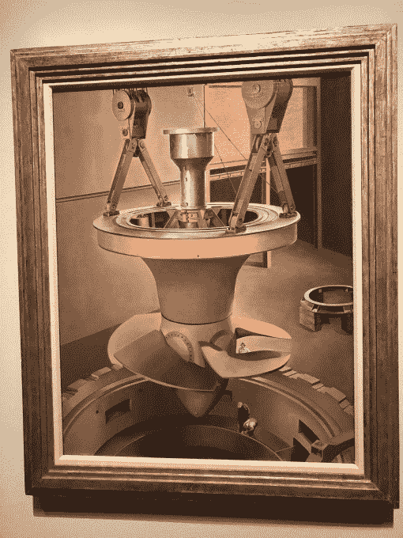
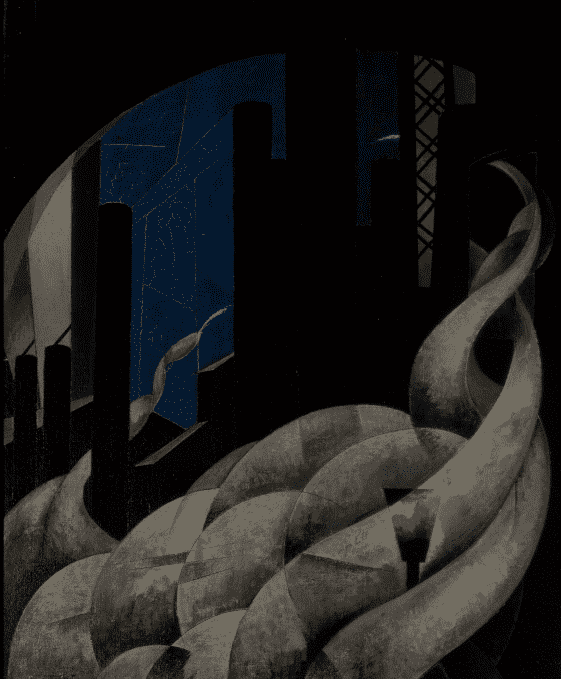
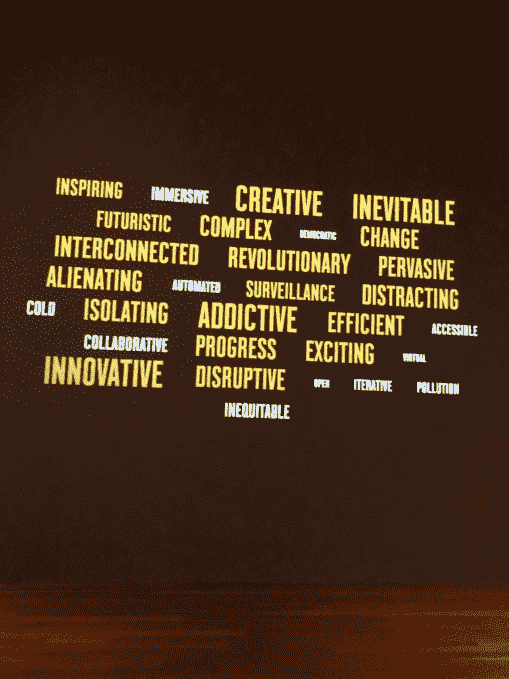
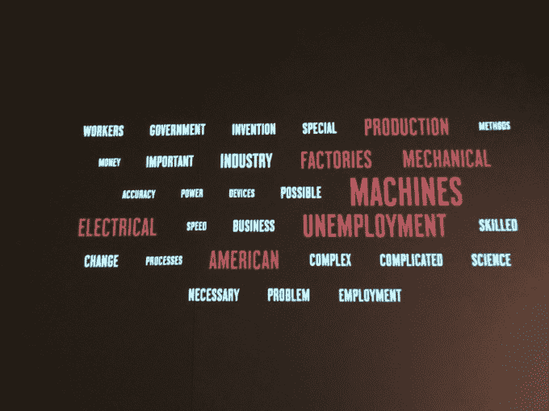

# 回顾:de Young TechCrunch 的机器崇拜

> 原文：<https://web.archive.org/web/https://techcrunch.com/2018/05/27/review-cult-of-the-machine-at-the-de-young/>

让我们回到机器时代，美国历史上的那个时代给了我们装配线、第一次不间断的洲际飞行、定期的无线电广播和第一个能够完成 20 多种动作的机器人。这些技术进步激发了一种被称为精确主义的艺术风格，这种风格因乔治娅·奥基夫、查尔斯·希勒和查尔斯·德穆斯等名人而流行开来。

旧金山德扬博物馆(de Young museum)展出的对机器的崇拜反映了机器时代人们对机器和机器人的态度，那是两次世界大战之间的时期，当时工业效率是占主导地位的咒语。在一个效率被视为美丽和威胁的时代，人们对工业技术崛起的焦虑激发了艺术的涌入。展览重提了“机器是人类的朋友还是敌人？”辩论通过精确的镜头与彻底，可能太彻底，收集。

由艾玛·阿克尔策划，这次展览主要是精确主义作品。精确主义是 20 世纪早期美国的现代主义风格，它诞生于综合了欧洲立体主义和未来主义以及美国工业和城市主题的艺术家。我们看到烟囱、工厂、桥梁和摩天大楼被涂上几何平滑的技术。

今天的技术专家已经表达了对机器人技术的接管、制造业就业岗位的减少、对人工智能失去控制、[有偏见的算法](https://web.archive.org/web/20221209041409/https://techcrunch.com/2017/04/30/algorithmic-accountability/)和[技术被机器夺走](https://web.archive.org/web/20221209041409/https://techcrunch.com/2016/10/09/industrial-robots-will-replace-manufacturing-jobs-and-thats-a-good-thing/)的担忧。每个科技公司都有一个围绕机器学习和人工智能的战略。[风险资本家正在投资机器人初创公司](https://web.archive.org/web/20221209041409/https://techcrunch.com/2017/07/19/heres-what-robotics-investors-say-theyre-looking-for-in-startup-pitches/)。有设计用来做比萨饼的机器人。机器人[自主运送货物](https://web.archive.org/web/20221209041409/https://techcrunch.com/2018/04/24/delivery-robotics-company-marble-raises-10-million-with-plans-to-move-beyond-food/)通过最后一英里。旨在取代司机的自动驾驶汽车和即将出现的飞行汽车。科技继续让我们的世界变得更加高效和便捷，但我们不可能预测机器最终会帮助还是阻碍我们这个物种。当漫步在 de Young 的机器崇拜展览时，人们开始怀疑这种质疑是否会结束。

**机器作为光明和黑暗的二元性**

德扬系列平衡了美国人在机器时代对技术的焦虑，以及技术带给一个更加互联、便捷的世界的希望。一个画廊深入探讨了那个时期技术的含义。查尔斯·希勒 1939 年的《悬浮的力量》(Suspended Power)是一幅布面油画，描绘了工厂里一台巨大的机器悬挂在几个小人头上——这是科技对人类施加的巨大、几乎无法控制的力量的鲜明体现——以及一件设计不当的作品会如何压垮我们。这件作品是展览的明星，它浓缩了未来隐约可见的、无法量化的威胁。

艺术家们当然看到了美国对工业崇拜的黑暗面。以查尔斯·德穆斯的《新教堂的熏香》为例，1921 年。这里，工厂被比作教堂，烟被比作熏香。

展览的大部分是工厂、烟囱和城市景观的场景，没有人类、运动和色彩。这些作品本身看起来像是由机器绘制的，没有被检测到的笔触。这可能是这种艺术的单调的组合——静止的城市景观的数量——使展览的一部分感到空虚和乏味。但这可能就是重点。

克拉伦斯·霍尔布鲁克·卡特的《战争新娘》结束展览。新娘站起来面对她的新郎，一台机器。

没有人为错误会让人联想到技术世界中存在的匿名和异化。这些机械系统的特写镜头有一种诡异的空旷感。然而它们是组成我们世界的一小部分。

**混淆效率与美观**

在机器时代，对效率的需求成为了现代的驱动力。显而易见，效率是如何与美混为一谈的，而不是被视为经济需求的满足。然而，艺术家们正在艺术、商业和工业的交汇中寻找意义。

> “我用我时代的语言说话。机械的工业的。任何高效运转的东西都是美好的。”查尔斯·希勒。

这件展品一点也不漂亮。这里没有任何可以挂在客厅墙上的东西。

然而，第一次“艺术家们开始在我们美国的工业和生产结构中发现美和意义，并将其提升到美术的水平，”Acker 说。“这一时期作品中探索的思想和主题似乎与我们当前的时刻产生了很大的共鸣。这就是我想强调的。在机器时代和今天，精确主义是围绕我们与技术的关系思考更大主题的跳板。以及美国人对科技创新的兴奋和焦虑是如何反映在我们今天的社会力量中的。”

**人机冲突**

也许展览最有趣的部分是一个互动功能，邀请参观者从 30 个词中选择 3 个词来表达技术对他们的意义。一些选项是:创造性的，互联的，革命性的，自动化的，孤立的，监视的，合作的，上瘾的，疏远的，冷漠的。在展览的最后，最常被选中的单词会以单词肖像的形式展示出来。

词云每三秒更新一次，与另一个词云对比。另一个是描述技术的机器时代术语的组合，取自 20 世纪 20-30 年代的美国期刊。单词的大小和颜色取决于它在文本中出现的频率。似乎这个展览的参观者比机器时代的媒体对科技有更乐观的看法。

总的来说，这次展览联系了两种技术观点:对一个更好的工程世界的邪教般的承诺，以及对威胁人类生计的未知事物的极度恐惧。

这给我们带来了什么？“当我们进入第四次工业革命的时候，我们可以联想到【机器时代】。Acker 说:“我们怀着兴奋和恐惧的心情期待着即将到来的破坏、转移和变化。

机器崇拜:精确主义和美国艺术将于 2018 年 8 月 12 日在旧金山的德扬博物馆举行。对于那些有兴趣探索科技如何塑造美国历史上的艺术的人来说，这个展览是值得一看的。