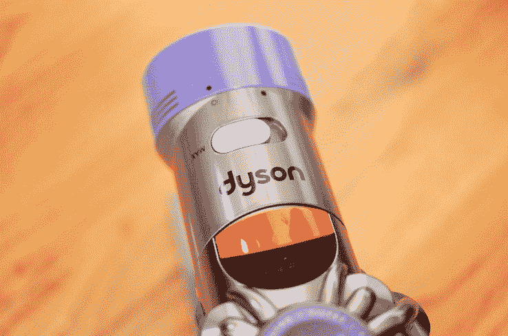

# 评论:戴森的 V8 绝对真空可能是有用的，减去中等电池寿命 

> 原文：<https://web.archive.org/web/https://techcrunch.com/2016/07/14/review-dysons-v8-absolute-vacuum-can-be-useful-minus-meddling-battery-life/>

早在戴森 V8 出现绝对真空之前，关于戴森产品的定价和整体效果就存在偏见。虽然我不试图证明或反驳这一点，但我将分享我对他们最新(昂贵)家用电器的印象:V8 绝对真空。

毕竟你要知道到底烂不烂。剧透:两者兼而有之。

***点评价格:[【戴森](https://web.archive.org/web/20221210070607/http://www.dyson.com/vacuum-cleaners/cordless/dyson-v8/dyson-v8-absolute.aspx)***599 美元

## 基础

*   吸力在 115 瓦时最大
*   重 5.75 磅
*   箱容积 0.14 加仑
*   可清洗寿命过滤器
*   软辊和直接驱动清洁头
*   5 小时内使用/充电 40 分钟
*   两年制造商保修

## 经验

> 那么这有用吗？是的，但是电池能持续四十分钟。

老实说，作为一名评测者，我没有接触过戴森的许多产品，所以我没有机会测试一个流行的观点，即他们的产品都不工作，尽管被定价为“高端”技术。不过没关系，因为我在布鲁克林用 V8 绝对真空吸尘器打扫房子的时候收集了不少东西。

它带有各种附件，包括一个用于地毯，另一个用于硬木地板。有四个辅助附件(两个带刷子)，设计用于进入你生活空间周围需要吸尘的小空间。是的，这包括一个用于清洁键盘的软除尘刷附件，我个人对此表示欢迎。

戴森还因其直观性而获得加分:真空或附件上任何红色的位置都表明某些东西可以被替换掉。为了进一步方便，还包括一个壁挂支架，可以让你悬挂和充电吸尘器(带扩展附件)——尽管我必须承认，我已经使用了那个附件。

那么这有用吗？是的，但是电池可以持续四十分钟。以最大功率清洁，比如说，一块小地毯或一些地毯，不会让你走得太远。

因此，V8 Absolute 的主要缺点是太轻太小(但有一个“V8 发动机”)，它在不到一个小时内就耗尽了它的小电池。这个时间段对一些人来说听起来不错，但是让我们这样想:我需要三次充电来清洁一个三层五间卧室的房子。

[gallery ids="1353040，1353037，1353038，1353039"]

那么每次充满电要多长时间？*五个小时。没错。*

我要花 15 个小时来打扫整个房子，戴森！这是一个非常昂贵的承诺，当然是减去电费。

## 结果

> 这款车还很悬，但我会放弃 V8 Absolute——只是因为它的电池寿命与其成本不符。

在追求生产另一个雄心勃勃的真空时，戴森提供了一个具有出色吸力的设备，它不会持续太长时间。

请记住，电池续航时间取决于通过 V8 绝对滑块请求的功率。但是话说回来，如果你没有用最大功率收集所有的灰尘和碎片，你用 600 美元的吸尘器打扫房子干什么？

这款车还很悬，但我会放弃 V8 Absolute——只是因为它的电池寿命与其成本不符。

简而言之，戴森 V8 绝对是一个有点烂的真空，因为它吸得不够久。