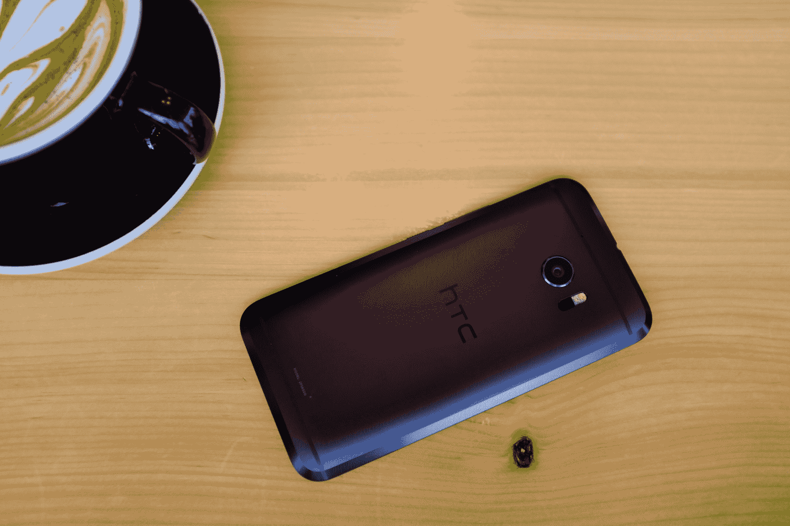

# 回顾:HTC 10 是坚实的，但消费者需要被说服

> 原文：<https://web.archive.org/web/https://techcrunch.com/2016/04/14/review-htc-10-is-solid-but-consumers-need-to-be-convinced/>

T

HTC 10 不是事后才想到的:这是一款设计精良的智能手机，拥有真正旗舰产品的所有规格和功能，风格令人想起该品牌。

但是，我已经有一段时间没有兴奋地评论 HTC 设备了。这不是纯粹的主观感觉。一年前，HTC 推出了 One M9，据报道这是一款非常平庸的设备；这几乎感觉像是事后的想法。

现在，有了 HTC 10，问题不再是“HTC 能否再次做出一款伟大的手机？”，而是“HTC 能卖出很棒的手机吗？”。毕竟这次应该是全面复出了。

***价格审核:*[【HTC.com】](https://web.archive.org/web/20221210032937/http://www.htc.com/us/go/buy-htc-10/)**699 美元

## **基础知识**

*   5.2 英寸四核高清(2560 x 1440 像素)，564ppi
*   2.2GHz 高通骁龙 820 四核 64 位处理器
*   1200 万像素 UltraPixel 2 摄像头，支持 4K 视频录制，高分辨率音频，1.55μm 像素，OIS
*   500 万像素前置摄像头，支持 1080p 高清视频录制，1.32μm 像素，OIS
*   32GB 内部存储，可通过 microSD 扩展至 2TB(支持自适应存储)
*   带 HTC Sense 的 Android 6
*   3000 毫安时电池和 USB-C
*   4GB 内存
*   尺寸:145.9 x 71.9 x 3.0–9.0 毫米，161 克
*   深灰色或银色铝制一体式车身

## **体验**

我和 HTC 10 一起生活了近一周——时间不算长，但这是行业的最后期限。于是，我把 HTC 10 当成了我的日常司机；我的“唯一的手机”——如果最后一部分是真的就好了。

> 那么，带着一台 HTC 10 生活是一种怎样的体验？很整洁。

不管我喜不喜欢，使用设备的主观性是必然的。但可靠性、性能和充电一整天这样的事情更客观，如果不是严格意义上的话。那么，带着一台 HTC 10 生活是一种怎样的体验？

[gallery ids="1307569，1307574，1307572，1307573，1307634"]

结果:很整洁。请注意，我没有说很棒，但也避免称之为粗制滥造。

一体式铝制机身与 HTC 一起亮相，这一次背面有 45 度倒角，增加了人体工程学和握持感——这是一个受欢迎的附加功能。

HTC 10 是每个人都想从智能手机中得到的东西——所有的概括都是危险的，即使是这款——但对我来说，它缺乏刺激。这是一款顶级智能手机，通过耳机打电话很棒(高音扬声器有专用放大器)，但也是一款丰富的扬声器，因为底部的扬声器是低音扬声器，也有专用放大器。

类似的故事在其他任何地方都适用:HTC 10 拥有它所需要的一切:真的好。基于激光的自动对焦有助于在更亮的光线下快速拍摄出像样的照片，但在弱光情况下会有一些颗粒和 ISO 补偿。通常情况下，具有精确细节和颜色的渲染几乎没有过度补偿。

捕捉饱和或充满活力的照片可能会很棘手，但该应用程序的“专业模式”允许自定义相机控制，加上 RAW 拍摄，因此有一些灵活性。

## **照片示例**

[gallery ids="1307591，1307593，1307594，1307592，1307596，1307590，1307589，1307588"]

有大量的内存来保持 Android M 的流畅运行。在使用和打开应用程序时，它的速度非常快，这是因为它采用了高通最好的处理器:Snapdragon 820。还是那句话，HTC 10 天赋异禀，执行令人钦佩。

HTC Sense 从未如此精简，但也是对默认 Android 用户界面的补充。因此，它不仅体现了速度，还体现了易用性。尽管如此，HTC 还是在 Android 上推出了自己的个人风格，比如 Blinkfeed(可以在主屏幕左侧访问的新闻屏幕)，HTC Zoe(一种视频故事编辑器)，或者像在屏幕上向上滑动解锁或双击唤醒这样的手势(都非常有用)。想要贴纸摆脱主屏幕上的网格布局，而是链接到任何你想要的应用程序？理智也有这种感觉。

[gallery ids="1307609，1307616，1307610，1307612，1307613，1307608，1307611"]

但最重要的是，这些软件没有一个对使用 Android、放置小工具、使用 Google Now 或以其他方式创下播放 *Crossy Road* 的新纪录造成太大干扰。

最重要的是，电池续航时间很长，几乎可以让我“使用一整天”——从早上 6 点开始，到中午 12 点结束。如果需要快速充电，那么 USB-C 电缆和兼容的快速充电器(就像随附的那样)可以在不到半小时的时间内将电量充到 85%。

但这不是一个令人兴奋的设备。相反，感觉就像是:一个设备。一项联系紧密、设计精良、功能强大的技术，它可以让你做任何你想做的事情(当然是主观的)，但没有任何吸引力。我并不是说你需要爱你的手机——尽管有些人爱你的手机——我是说它必须让人感觉不仅仅是金属、玻璃、硅胶或者一些锗的集合。

当一个设备的几乎所有方面都很好的时候，让它更令人兴奋的方法是什么？激发消费者兴趣的营销。消费者的吸引力(或者至少看起来是这样)是 HTC 最大的问题。

> 消费者的诉求是 HTC 现在最大的问题。

他们已经远离公众太久了，即使有一流的产品，要推动销售，最终拯救品牌，需要的不仅仅是对顽固分子、技术评论家和一直在等待“完美 HTC 手机”的人的安抚——如果有这样一群人的话。

## **底线**

> 这是一款很棒的手机，HTC——现在让我们相信为什么我们需要 10。

如果 HTC 能够让全世界——即使只是它的几个主要市场——相信 HTC 10 是一款值得拥有的手机，那么他们就有机会成为顶级 Android 手机制造商。

HTC 10 本身是一款很棒的智能手机，外观漂亮，规格强大，支持现代标准，电池也不用担心。

但是如果没有人购买这种体验，这些都不重要。然而，另一方面，现在是购买 Android 手机的最佳时机，因为三星、LG 和 HTC 这三大巨头的产品规格非常相似，唯一真正的区别是专有功能和基于 Android 的软件设计。对 HTC 来说幸运的是，10 在竞争力和独特的审美之间取得了坚实的平衡。

伟大的手机作品，HTC。现在让我们相信我们需要它。