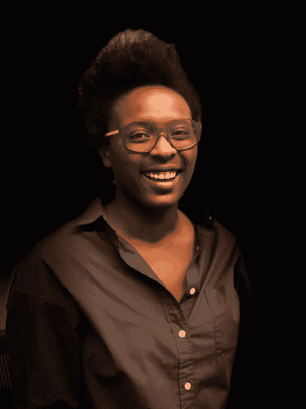

# 回顾:iPhone 8 是对摄影增强未来的展望

> 原文：<https://web.archive.org/web/https://techcrunch.com/2017/09/19/review-iphone-8/>

这是一个摄像机的回顾。iPhone 8 和 8 Plus 应该有一些更新，但大多数升级者会问的一个问题是相机有多好？

iPhone 中的摄像头系统正成为其技术进步的焦点。这不再仅仅是照片的问题了。随着增强现实和计算机视觉成为平台开发下一波主要浪潮的竞争者，相机系统是一种输入机制、通信系统和意图声明。

如果相机是一个平台，那么早就应该开始把 iPhone 作为一个相机来审视了。

两年前，在我在[对 iPhone 6s](https://web.archive.org/web/20230402214329/https://techcrunch.com/2015/09/22/review-apples-iphone-6s-and-6s-plus-go-tick/) 的评测中，我注意到 iPhone 性能提升的步伐已经加快。iPhone”型号的间歇期正成为大量硅产品被注入设备的时代。在处理能力和效率方面的巨大飞跃，这些版本被认为是上一年型号的迭代。

iPhone 8 被证明是对这一假设的一种奇怪的证明。苹果在 iPhone 7 发布一年后推出了这款手机，几乎同时进行了桌面翻转，并在几分钟后发布了 iPhone X。“s”附录不见了，但继续存在的是以疯狂的速度向前“滴答”硅改进的传统。

我会在最上面把这部分去掉。我的建议与去年没有变化:如果你愿意升级，这些手机很容易推荐，因为它们的摄像头得到了很好的增强，功能更强，外观更新颖。

但是让我们再深入一点。

## 把玻璃倒回去

玻璃背面的回归将是 iPhone 8 的一个爱它或恨它的功能。但对我来说，这是一个爱它。自从我放弃了我的 iPhone 4s，我一直很怀念那种手机两面都涂上玻璃的感觉。

玻璃的质地有些问题。它比铝更光滑，但通常不太滑，更容易抓握。玻璃也能更快地升温到你手的温度，并保持在这个温度而不是变热。当你的手机真正运行时，它可以更好地分配处理器的热量，使热点不那么明显。

但玻璃涂层的主要原因不是这些，而是它需要对无线电透明，以实现无线充电。我还不知道手机的确切内部布局，我们必须等待拆卸，但它很可能是一个充当电源天线的导线环。有了铝背，苹果将不得不求助于某种外部天线，而这是永远不可能发生的。事实上，在功能服务中，你得到了一个很好的形式回报。

每年都有如此多的 iPhone 屏幕被打破，以至于两面都是玻璃似乎是不明智的，但苹果在这方面做了一些帮助。

首先，该公司直接与康宁合作开发更强的玻璃。然后，在任何竞争对手可以使用它之前，它可以在一段时间内独占使用这个杯子。这就是苹果一直在玻璃中使用的离子交换过程的来源。这一加固层现在比以前深了 50%。把它想象成你手指上的一层坚硬的皮肤。

还有一个更有帮助的形状是铜和钢的子结构，通过专有的激光工艺分子结合在一起，并铺设在带有间隙的网格状层中，允许无线充电等事情通过背面进行。钢很坚固，铜是很好的散热器。希望它们合在一起，能让 iPhone 不那么容易碎。

机身的铝制也再次得到了加强，就像 iPhone 6s 第二次修改这个边框时一样。因此，从理论上讲，你看到的是你能找到的最坚固的玻璃手机。不管怎样。

这种玻璃还可以在 iPhone 8 和 8 Plus 的背面形成美丽的半透明效果。光线穿过玻璃，离开底部涂层，然后返回，给了玻璃一种层次感。相比之下，它使 aluminum 7 车型的背面看起来非常单调。

对于那些感兴趣的人来说，金色的表面有很多粉红色。背面几乎是“千禧年粉红”，突然无处不在的阴影。我认为可以肯定地说，苹果认为玫瑰金已经过时了(时尚界也同意)，粉色正在流行。

简而言之就是这样。从正面看:真实相似；从侧面看:真实相似；从后面看:新的性感。

## 购买新 iPhone 的最佳理由

相机是今年购买新 iPhone 的最佳理由，因为它已经连续几年了。到目前为止，iPhone 是世界上最受欢迎的相机，苹果继续认真对待改进它的业务。

正如我之前在这些评论中提到的，我有很长的摄影史。我是一名职业摄影师，卖过相机，做过维护，还经营过一个冲印实验室。这帮助我认识到苹果对待摄影的认真程度和其他公司“让相机更好”的方式之间的差异。

还有其他拍摄出色照片的智能手机，其中包括三星的 [Galaxy S8+](https://web.archive.org/web/20230402214329/https://techcrunch.com/video/samsung-galaxy-s8-and-s8-review/58f58ffc955a317b117bc15a/) ，这是苹果在硬件方面最直接的竞争对手。然而，一旦你超越了提高分辨率、基本优化和添加仿模糊等计算功能的基础，你就会开始意识到，地球上没有一家智能手机公司像苹果公司那样走得这么远。一旦你了解了事情的本质，这两者就不可同日而语了。这里有几个你会在 iPhone 8 中找到的例子。

**传感器的改进。**分辨率相同，12MP，但传感器整体更大。这是提高图像质量的一个好方法。我非常喜欢关注单个图像传感器的大小，这些传感器可以转化为更大的单个像素，并使它们之间的墙更深，这两者都是苹果在这里做的。这些更深的像素井在捕捉元素之间提供了更好的隔离，因此您不会得到导致两个像素之间颜色混淆的斑点。

还有一个新的颜色过滤器。鉴于数码相机的滤色镜多年来没有太大变化，我对这里的细节很好奇，但除了它应该会改善动态范围和颜色之外，我无法了解更多。

高动态范围(HDR)射击也得到了极大的改善，甚至不再有一个切换。你只是拍摄，如果相机认为你的照片将受益于色调扩展到黑暗和光明，它会使用它。在用于合成 HDR 镜头的图像之间有如此微小的延迟，以至于你很少会发现在以前的系统下发生的重影。你会注意到你不再有两张照片——一张 HDR，一张没有。苹果就是这么自信。这真的做得很好，甚至天衣无缝。

8 Plus 中的广角和长焦传感器都得到了更新，系统的吞吐量增加了 83%，这使得更多的数据可以以更节能的方式传输。这将有助于快速拍摄图像，但更重要的是，它允许需要通过管道推送的大量信息，以支持每秒 60 帧的 4K 视频和每秒 240 帧的 super slo-mo 1080p。

苹果公司采用 HEVC 视频格式，这在减少文件大小方面非常有效，有助于这一点，但这仍然令人印象深刻。特别是考虑到苹果没有在视频质量上耍花招，这仍然给它在视频上使用的计算机视觉智能留下了大量开销。

结果是，在各种拍摄环境中，色彩更好，色调范围更广。苹果特别喜欢他们用 iPhone 8 和 8 Plus 捕捉天空的作品，因为天空充满了各种光谱的光。我的测试证明了这一点——更少的条带，更多的色调层次，重现得更准确。

近距离拍摄布料或任何其他精细细节时的纹理也得到改善，当图案超级规则时，出现泥泞或莫尔图像的机会更少。这也反映在 4K 视频模式中，该模式在黑暗和明亮的场景中具有更好的色彩再现，并且较少人为因素。

虽然你还没有达到全 240 FPS，但一些慢动作摄像师可能会对你现在以 1080p 120 FPS 的速度连续自动对焦感兴趣。这将有助于在慢镜头中追踪拍摄对象靠近或远离你的情况。

同样，肤色也得到了改善，不像 iPhone 7 那样粗糙光滑。这是传感器改进的结果，也是苹果将深度学习和智能应用于确定对象和优化曝光的过程的结果。稍后会详细介绍。

随着手机相机在弱光摄影方面变得越来越好，闪光灯已经减少到记录你给朋友发短信的奇怪增长，希望是医疗专业人士。

**硬件加速降噪。**我知道这对于一些人来说可能有点过时，但我真的很期待这一次。降噪(NR)是每个数码相机系统用来消除多色斑点的过程，多色斑点是(相对)微小传感器、热量和模数转换过程的典型副产品。大多数人只是称之为“谷物”

在以前的 iPhones 中，这完全是由软件完成的。现在是由硬件直接完成。我一直觉得苹果的 NR 在效果上太“绘画”了。他们选择的降低噪点的积极方式产生了整体“软化”，尤其是在裁剪或缩放时具有精细细节的照片中更明显。

这是我抱怨苹果公司处理 iPhone 7 降低噪音[的方式的地方:](https://web.archive.org/web/20230402214329/https://techcrunch.com/2016/09/13/review-apple-tees-up-the-future-with-iphone-7/)

> 我仍然对苹果的图像信号处理器(ISP)应用于图片的降噪量不太满意，但我充分意识到这不是大多数人会注意到的事情。
> 
> 因为大多数人希望他们的图像中有更少的“颗粒”或像素噪声，所以 NR 更积极是有道理的。但我觉得，在光线较暗的情况下，这仍然会导致锐度有所下降。需要澄清的是，这与我对 ISP 在 iPhone 6 中的调整方式的感觉基本上没有变化。苹果这次在摄像头方面做了一些疯狂的改进，但我希望它在未来会注意如何减少噪音并进行调整。

好吧，调整一下。降噪不再是软件独有的功能。它是由图像信号处理器(ISP)完成的硬件加速、多频带降噪，苹果正在继续改进。结果是噪音减少，但感觉更清晰，更爽脆，没有前一个过程中的污点副产品。这是一个坚实的进步，每个人都会从中受益，不管他们是否意识到这一点。

## “零”快门延迟

一段时间以来，在你按下快门按钮之前，iPhones 已经在内存中保存了一些图像。这些被记录下来，但几乎立刻就被扔掉了。在最佳条件下，当你按下快门时，它在你按下快门之前记录的最后一张照片就是你实际拍摄的照片。

这有助于补偿当你看到你想拍摄的东西时按下按钮的正常人类滞后，以及系统本身的滞后。它让拍照过程感觉是瞬间的。

在 iPhone 8 中，这个缓冲区的大小有所增加，苹果现在正在应用深度学习来优化拍摄时间、主题和其他智能的过程。

没有大量的例子，结果很难确定，因为任何给定的镜头都有很多变量。但是，有趣的是，它确实感觉像图片发射得更快。结论:我相信他们，但我需要更多的时间来感受这一点。

## 闪光

你讨厌闪光图片的一个主要原因是，它们往往会用大量的光线来突出主题，并使背景变成黑灰色。它扼杀了氛围和情绪，随着手机相机在弱光摄影方面变得越来越好，闪光灯已经减少到记录你给朋友发短信的奇怪增长，希望是医疗专业人士。

但是专业摄影师一直都在用闪光灯。主要是因为他们可以控制快门速度和闪光灯。这使得他们可以在闪光后选择打开快门，用更多的光填充背景，平衡曝光。

现在，苹果为你自动做到了这一点。如果你用闪光灯拍摄一个人或物，并且有足够的光线来“填充”主体后面，iPhone 会拖动快门或自动打开快门。它通过智能处理主题、距离、环境曝光以及快门关闭所需的时间来做到这一点。

我上面提到的所有例子的美妙之处？对于希望在孩子上幼儿园的第一天给他们拍一张最好的照片的父母来说，它的每一点都像专业摄影师一样容易得到。是的，苹果有一个不可思议的硅团队。是的，它处于移动计算摄影和深度学习应用于照片的前沿。但是你真的不需要给出一个飞行的动画便便表情符号就能得到好处。

这是苹果的关键创新:不管你是否阅读、喜欢或理解我上面写的东西，你仍然会受益于难以置信的图片。

### iPhone 7 闪光灯

### iPhone 8 闪光灯

## 相机值得升级吗？

过去几年，几乎每一次 iPhone 升级都是由摄像头推动的。硬件和功能的更新令人印象深刻，但有趣的是，我无法统计人们有多少次将摄像头作为他们对更新手机感兴趣的主要原因。

那么，iPhone 8 和 8 Plus 中的摄像头是如何叠加的呢？

黑仔。

当人们谈论苹果的硅团队时，他们往往会集中在 A 系列处理器上，这没什么。但该团队也为 iPhone 相机系统的图像管道做出了巨大贡献。

这是我第一次不对 iPhones 说“如果你喜欢大屏幕，就买大的，否则就买小的”。如果你想升级，并且可以忍受使用更大的手机，我强烈推荐 iPhone 8 Plus。为什么？

## 肖像照明

大多数人都没有意识到这一点，但苹果几乎从来不会以增加硬件或增加功能为目标来开始一个硬件或功能的开发过程。他们从一个问题开始。有时候像“为什么还有人买单反相机？”“因为他们喜欢模糊的背景来分隔主体”，这样你就可以选择肖像模式。

现在肖像模式已经退出测试，在大多数情况下看起来都很好，我们正在进行一次大的更新。

iPhone 8 Plus 的标志性功能是人像照明。这种模式使用深度学习和计算机视觉，在图像中找到人脸，检测需要照明的平面和角度，并应用各种不同的照明风格，用户可以在拍照之前或之后进行选择。

它比它有权做的更好。

不同风格的光线几乎无一例外地被恰当地描绘出来。一个自上而下的工作室风格的灯，一个增强颧骨的轮廓鲜明的灯和两个脱离背景的“舞台”照明模式，将常规的蹩脚快照转变为你自豪地扔在“gram”上甚至打印出来的东西。

一旦人们拿到 iPhone 8 Pluses，studio 和 contour 选项将会充斥整个互联网的社交网络和手机。舞台灯光需要更多的努力，但当你搞定它，软件能够通过准确检测头发和头部形状来完成工作时，它真的很棒。它可以产生专业的图像，需要几十盏灯和设备才能完成。

### 原创

深度学习和计算机视觉是人像照明的关键。

### 工作室

工作室风格的照明

### 轮廓

轮廓照明的戏剧效果增强了颧骨。

### 舞台效果

舞台灯光需要更多的努力。

### 专业舞台

但当软件精确检测头发和头型时，它可以生成感觉专业的图像。

这并不令人震惊，因为苹果就是这么做的。他们使用专业摄影师和电影摄影师设置的专业照明设备拍摄了数十万张照片。然后，他们将这些提炼为一组主特征，并找出如何通过计算来复制它们。

该功能仍处于测试阶段。但这是对摄影未来的展望。所有的摄影，不仅仅是在智能手机上——尽管这正迅速成为大多数人拍摄照片的主要方式。

有些事情它现在会有麻烦，比如卷发或细毛。

它也是其他东西:增强现实。

虽然你可能不会马上给这种功能分配 AR 这个术语，但这是苹果公司的想法。和我交谈过的对 AR 非常感兴趣的人也是这么想的。

它正在改变现实的结构来增强、消除或扩大它。它将扩展到计算机视觉、摄影和成像的各个方面。AR 不仅仅是把一只虚拟的鸟放在上面，或者把一张宜家沙发放到你的客厅里。它将无处不在，苹果正准备在这一领域大力推进。当然，所有这些都是通过定制硬件实现的。

因为该功能仍处于测试阶段，显然有些东西它现在会有问题，比如卷发或细毛。但它对从深色到浅色的肤色都很有用——它显然在各种各样的人身上进行了测试。它并不完美，但仍然令人印象深刻。

## 仿生到底是什么意思？

没什么。至少，不具体。A11 仿生芯片携带这个名字只是为了区分它，而不必开始附加一串数字。但这并不意味着它与之前没有什么不同。

仿生只是营销，但有真正的机器学习优势。例如，对于不需要额外开销的计算，它可以运行 16 位而不是 32 位指令。这可以大大加快 ML 库的计算速度。它也有增强的 GPU 支持，允许 ML 应用程序更好地利用苹果设计的 GPU。显然 GPU 对于 ML 训练和建模有很多优势。是的，它确实有一些具体的增强功能，苹果将其用于自己的 ML 产品，如人像照明、Face ID 等。

苹果正在努力穿越这片水域，走向一个未来，那就是必须远程完成的神经网络处理可以在设备上完成。这当然有利于隐私和安全。它允许苹果向你承诺，你的敏感数据永远不会离开你的手，同时仍然能够提供现代功能所需的高级智能。

苹果的 A11 芯片具有与 i5 MacBook Pro 不相上下的性能，但这是因为它必须安装在电池供电的设备上而受到限制。定制设计的性能控制器——CPU 流量警察——位于六个内核之间，针对更高或更低的性能任务进行调整。

这对于你，当然是用户来说是不透明的。但这意味着你获得了更多的电力，但电池寿命不变。当你意识到电池实际上比去年的型号更小时，这是一个更令人印象深刻的壮举。

苹果公司没有一个工程师团队比其芯片制造商团队对 iPhone 的成功更有责任。

## 接触高

无线或接触充电可以工作，但你必须自己购买第三方 pad。这就是关于它的所有说法，此外，它确实可以与外壳一起工作，充电速度与标准适配器一样快。

我用安卓手机无线充电也有一段时间了，绝对是得心应手。很高兴看到它出现在 iPhones 上，这种“拿了就走”的体验很可爱。当它自己的触点充电 AirPad 到来时，我们将看到苹果认为它能真正做出多好的体验。

## 生活在 X 的阴影下

当然，所有这些都处于 iPhone X 的阴影之下。如果苹果没有在 X 发布时发布，iPhone 8 将是升级者的一个轻松选择，早期采用者的讨论量将与我们在 iPhone 7 发布会上看到的一样多。一系列内部升级和漂亮的新玻璃以及新的摄影器材意味着苹果将出售大量的 iPhone 8 和 iPhone 8 Pluses。

我不认为苹果知道人们是否会倾向于某一种方式。他们对本季度的指导无疑表明此事仍悬而未决。但我确实相信，他们不会过分担心人们是否会购买 iPhone 8 或 iPhone X。你仍然在购买 iPhone。

然而，就消费者而言，iPhone 8 是今年最容易的传统选择。除了原深感摄像头和有机发光二极管屏幕之外，它几乎拥有 iPhone X 的所有技术改进。我认为关于这一点的心理计算可能比以往任何时候都更接近，但框架大致相同:如果你是那种每年都购买高端 iPhone 的人，那么就等着 iPhone X 吧。有一个警告是，如果 X 前面的深度摄像头的凹槽冒犯了你，那么你在 iPhone 8 中拥有大多数主要技术。

我一直在思考这个问题，我认为将 iPhone X 归类的最佳方式是作为 iPhone 8 系列的超集。在讨论 X 的时候，我会更多地谈到这一点，但现在 iPhone 8 仍然会让你在很大程度上达到“最好”——特别是在相机方面。

iPhone 成为世界上最受欢迎的相机已经有一段时间了，它已经成为 iPhone 用户升级的一个巨大原因，也许是主要原因。每年，硅或设计的改进也有助于 iPhone 作为相机的改进。今年，苹果在人像照明模式方面做了一些令人难以置信的事情，这就是为什么如果你想买一部新 iPhone，我推荐 8 Plus。