# 回顾:iPhone XS、XS 马克斯和长期思考的力量 

> 原文：<https://web.archive.org/web/https://techcrunch.com/2018/09/18/review-iphone-xs-and-the-power-of-long-term-thinking/>

iPhone XS 明确证明了一件事:iPhone X 可能是有史以来最雄心勃勃的产品赌注之一。

当苹果在 2017 年告诉我，他们搁置了将要推出的迭代升级计划，并在 iPhone X 上投入全部资金，因为他们认为他们可以提前一年跳跃时，他们并没有虚张声势。iPhone XS 给人的感觉，至少在表面上，是苹果有史以来最“S”的型号之一，这证明了 iPhone X 的时间表是多么激进。

我认为会有很多人认为这是 iPhone XS 的一个弱点，我可以理解他们的观点。相对于 iPhone X，XS 有大约六项决定性的改进，但没有一项像 64 位、3D 触摸或无线充电这样的大升级那样具有相当时髦的效果——所有这些好处都是在以前的“年代”提供的。

然而，如果你从年复一年的升级者的角度来看，这种弱点才真正存在。作为对 iPhone X 的升级，我想说你必须喜欢他们对相机所做的一切，才会想要实现飞跃。作为任何其他设备的一个举动，这是一个巨大的胜利，你将首先进入雕刻的有机发光二极管屏幕、人脸识别和[超级耐用的](https://web.archive.org/web/20230219165305/https://twitter.com/panzer/status/1004845920716902400)手势优先界面，以及苹果在 2017 年做出的一系列其他风格定义的举动，思考 2030 年，而你在 2016 年还坐在那里。

由于我没有 iPhone XR，我真的不能为你做这样的比较，但根据我在活动中看到的情况，以及我在过去一周使用 iPhone XS 和 XS Max 时了解到的技术，我有一些关于它将如何叠加的基本理论。

然而，对于那些对信封边缘感兴趣的人来说，这两款新手机有很多东西要吸收，只是大小不同。一旦你开始解开 XS 每一次升级背后的技术进步，你就开始理解苹果芯片团队的真正竞争优势和能力，以及他们对软件方面现在和未来需求的倾听程度。

这对你的日常生活有没有影响是另一个问题，正如我上面提到的，这个问题取决于你有多喜欢相机。

但是首先，让我们看看其他一些有趣的新东西。

## 关于耐久性的说明

正如我的测试方法一样，我把这当成任何一个买了新 iPhone 并在上面加载了 iCloud 备份的人都会做的事情。如果你喜欢比较色情，很多其他网站会做洁净室测试，但我真的不认为这对大多数人有什么好处。总的来说，大多数人不会根据这样或那样的规范在生态系统之间做出选择。相反，无论是为 TechCrunch 工作、度假还是做家务，我都尽量带着它们进行日常携带。脚伤排除了今年去任何主题公园的可能(另外，我不喜欢被预测),所以我做了一些办公室工作，在加州中心自驾游，以及一些去公园和动物园的家庭出游。混合使用案例，包括 CarPlay、导航、照片和郊区环境中的一般用途。

就测试地点而言，弗雷斯诺可能不是最大的都市，但它有一些有趣的条件，使它有别于大多数 iPhones 最终将被测试的城市。首先，很多地方的网络条件相当糟糕。这里有很多农田和未开发的区域，而且并不是所有地方都被无线运营商覆盖。然后是热度。一年中的大部分时间都在华氏 90 度以上，其中很大一部分时间都在华氏 100 度以上。这意味着电池在这里受到了绝对的打击，通常比旧金山等其他更温和的地方表现更差。我认为在很多使用 iPhones 的地方都是如此，但在那些被评论的地方就不是这样了。

也就是说，电池寿命很难判断。在我的例行测试中，iPhone XS Max 显然进入了野兽模式，比我的 iPhone X 和 iPhone XS 更耐用。然而，在这两者之间，很难区分。我尽量等到我必须测试手机电池的那段时间结束，这样背景索引就不会影响数字。我在这里 90 多度的高温下进行了“真实世界”测试，iPhone XS 比我的 iPhone X 高出几个百分点，这是苹果公司的说法，但我的 X 也是一岁了。即使在 XS 的激烈测试中，电池也没有出现故障。

在存储方面，我的目标是 256GB，所以增加 512GB 的选项真的很好。像往常一样，确定你应该买多大尺寸的最简单的方法是检查你现有的空闲空间。如果你用的是你手机现有容量的 50%左右，那就买同样大小的。如果你使用更多，考虑升级，因为这些手机在拍摄更好的照片和视频方面只会变得更快，而这会占用更多空间。

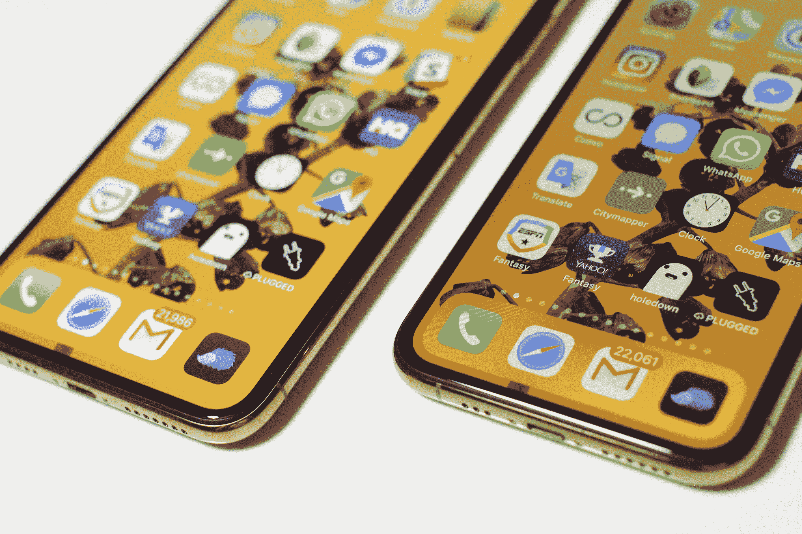

给我的复习单元都有新的金色表面。正如我在那天提到的，这是一个比 Apple Watch 版本更深、更黄的金色。与其说是“当铺黄金”，不如说是“这是非常昂贵的”黄金。我非常喜欢它，尽管很难准确地拍下来——如果你持怀疑态度，试着亲自看看。它添加了一点粉红色，尤其是当你看着玻璃背面以及边缘周围的金属带时。背面玻璃现在也有了珠光外观，我们被告知这是苹果公司专门与康宁公司合作开发的新配方。苹果表示，这是智能手机中最耐用的玻璃。

我目前的 iPhone 在过去一年里经历了多次超过 3 英尺的跌落，其中一次导致屏幕破裂，并在保修期内进行了更换。毫无疑问，很快就会有很多 YouTubers 用户用锤子敲打这个东西，并把它从漂亮的幻影 Flex slo-mo 大楼上扔下来。我没有测试它。然而，我感兴趣的一件事是，随着时间的推移，玻璃如何承受细微的磨损和划痕。

我的 iPhone X 正面和背面都布满了划痕，这与玻璃配方更硬、但更脆有关。碰撞时不太可能断裂，但更容易磨损。我是一个专注的无案例者，这就是为什么我的手机看起来是这样，但如果不给 iPhone XS 和 XS Max 更多的时间，我没有办法告诉他们如何坚持下去。几周后我会回到这个话题。

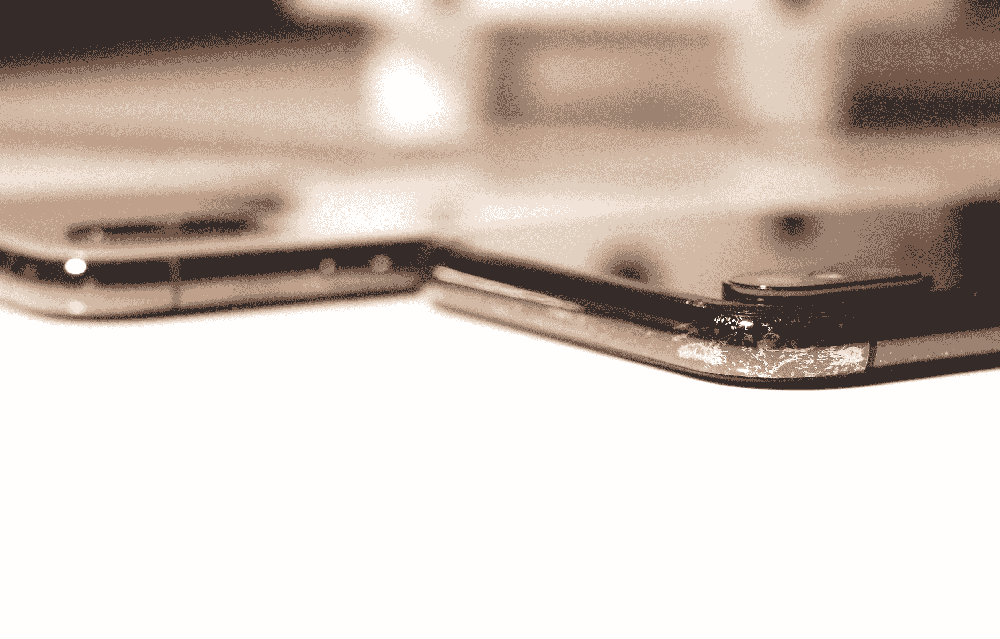

金色和太空灰 iPhones 都经过了一种叫做物理气相沉积或 PVD 的涂层工艺。基本上，金属颗粒被蒸发并结合到表面，以覆盖和着色金属带。PVD 是一个过程，而不是一种材料，所以我不知道他们实际上是用什么来覆盖这些，但一个建议是氮化钛。我不介意我的 iPhone X 表带发生的风化，但我认为它在金色上看起来会更糟糕，所以我希望这种工艺(众所周知，这种工艺非常耐用，用于机器加工)将提高表带的耐用性。也就是说，我知道大多数人并不像我一样不办案，所以这可能是一个有争议的问题。

现在让我们来看看它的核心:摄像机。

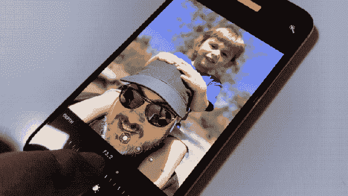

## 让我们开始吧

我(仍然)不会将 iPhone XS 与可换镜头相机进行比较，因为人像模式不能取代它们，它只是让它们看起来更少。也就是说，这是有史以来最接近的。

与装有漂亮玻璃的相机相比，智能手机相机必须克服的一个主要障碍是其固有的焦深。没有太多的杂草(随意[阅读这个](https://web.archive.org/web/20230219165305/https://techcrunch.com/2016/09/21/hands-on-with-the-iphone-7-plus-crazy-new-portrait-mode/)了解更多)，因为它们是如此之小，智能手机相机产生一个令人难以置信的压缩图像，使一切都清晰。这感觉不像是用大相机拍摄的肖像或构图良好的照片，因为它不会产生背景模糊。这种模糊是几年前苹果公司的肖像模式添加的，从那以后，每一个重要的制造商都复制了这种模糊——成功或失败的程度各不相同。

总的来说，大多数制造商用软件来实现。他们找出可能是什么主题，使用图像识别看到眼睛/鼻子/嘴三角是什么，快速建立一个遮罩并模糊其他一切。苹果做得更多，增加了两个镜头的视差或 TrueDepth 阵列的红外投影仪，使 Face ID 能够收集多层深度图。

请注意，iPhone XR 的工作方式不同，使用的工具更少，可以启用纵向模式。因为它只有一个镜头，所以它使用焦点像素和分段遮罩来“伪造”两个镜头的视差。

凭借 iPhone XS，苹果继续推进其肖像模式建模的复杂性。过去相对简单的光盘模糊正被真正的散景效果所取代。

图像中的背景模糊与镜头压缩、主体到相机的距离和光圈直接相关。散景是那个模糊的*角色*。这不仅仅是“有多模糊”，而是光源产生的形状，它们在整个画面中从中心到边缘的变化方式，它们如何扩散颜色，以及它们如何与图像的清晰部分相互作用。

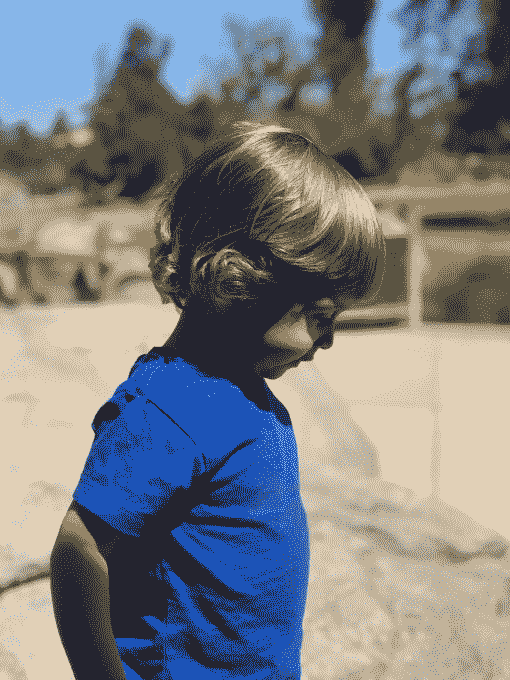

Bokeh 是为了混淆什么是一顿美餐的调料。除非你是厨师，否则你可能不关心他们做了什么，你只关心味道好极了。

好吧，苹果主厨做了这个。不愿意满足于一个感觉良好的模板化散景，摄影团队更进一步，创建了一个包含 iPhone XS 镜头虚拟“特征”的算法模型。正如摄影师可能会选择一个或另一个镜头来获得特定的效果，摄影团队在测试了所有经典相机系统的大量镜头后，建立了散景模型。

我一直说模型，因为强调这是一个活的构造是很重要的。在不同的距离和不同的照明条件下，你得到的模糊看起来会有所不同，但它将保持真实的虚拟镜头的本质。苹果的散景有一个中等大小的半影，分散光源但不吹灭它们。它很好地保持了色彩，确保光线的质量不会像其他手机中的许多其他人像应用程序那样模糊，这些应用程序只是选择一个点，创建一个标准的高斯或圆盘模糊。

例如，看看这两张图片。请注意，当光源为圆形时，它会保持其形状，矩形光源也是如此。它被软化和模糊，就像通过普通镜头的加宽光圈漫射时一样。反射光场景中的其他形状也是如此。

这是来自 iPhone X 的同一张照片，注意光线的模糊。这种建模努力是我很高兴调整滑块自豪地进行 f-stop 或光圈测量的原因。这是这张图片在给定光圈下的样子，而不是 0-100 的比例。它做得非常好，因为它是模型化的，所以可以随着时间的推移而改进。我的希望是，最终，开发者将能够插入他们自己的数字，为用户的工具包“添加镜头”。

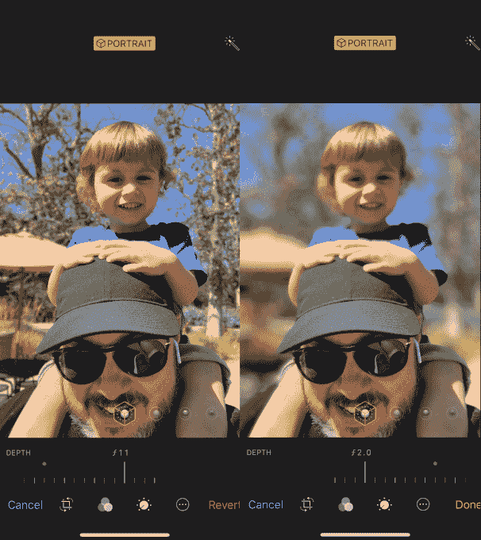

可调焦深不仅有利于模糊，也有利于消除模糊。这张肖像模式自拍将我的儿子置于模糊区，因为它聚焦在我的脸上。当然，我可以在 iPhone X 上关闭肖像模式，让一切变得清晰，但现在我可以选择将他“添加”到对焦区域，同时仍然保持背景模糊。超级酷的功能，我认为会得到很多使用。

它还可以通过提高模糊度来去除背景中不想要的人或物。

是的，它对非人类有效。

如果你最终有了一部 iPhone XS，我会玩一堆功能来习惯超宽光圈镜头的感觉。当它一直开到 f1.4(顺便说一下，不是镜头的实际最宽光圈；这是我们控制的虚拟模型)几乎只有眼睛应该在焦点上。耳朵，肩膀，甚至鼻子都可能不在焦点范围内。这需要一些时间来适应，但可以产生戏剧性的结果。

放大照片的 150%裁剪，以显示细节保存。

开发人员可以使用一个新功能，分段屏蔽。这是一个更精确的遮罩，有助于边缘细节，改善人像主体边缘周围的头发和细线细节。在我的测试中，它导致了对这些过渡区域的更好的处理和更少的笨拙。虽然还不完美，但已经好多了。像 Halide 这样的第三方应用已经在使用它了。Halide 的联合创始人[本·桑多夫斯基](https://web.archive.org/web/20230219165305/https://twitter.com/sandofsky)表示，他们已经看到了 Halide 在分割地图方面的改进。

“分割是将像素集合分类到不同类别的能力，”Sandofsky 说。这不同于“热狗，不是热狗”的问题，后者只是告诉你热狗是否存在于图片中的任何地方。分割的目标是只画出热狗的轮廓。这是关于[自动驾驶汽车](https://web.archive.org/web/20230219165305/https://www.youtube.com/watch?v=HbPhvct5kvs)的一个重要话题，因为它不足以告诉你图像中的某个地方有一个人。它需要知道那个人就在你的正前方。在支持它的设备上，我们使用 PEM 作为应该保持焦点的权威。我们仍然在旧设备上使用经典方法(任何早于 iPhone 8 的设备)，但质量差异巨大。”

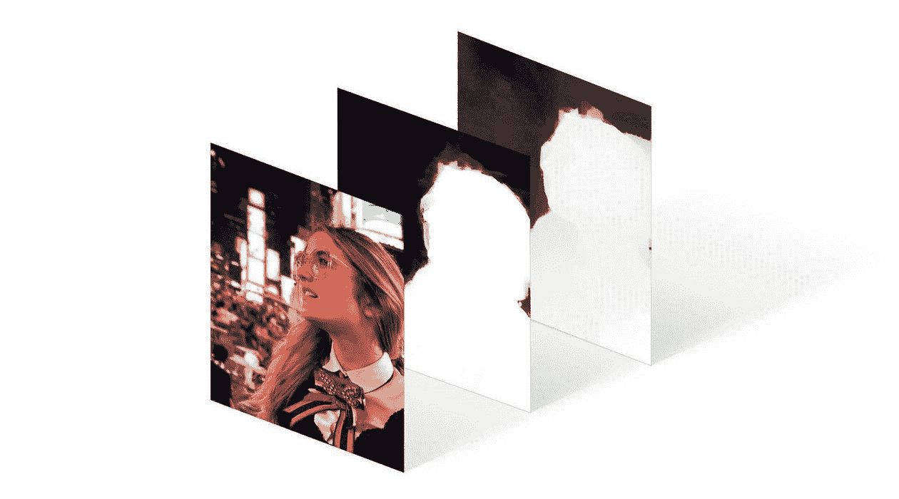

以上是 Halide 拍摄的示例，显示了图像、深度图和分割图。

在下面的例子中，中间的黑白图像是 iOS 12 之前可以实现的。使用一些规则，比如“用户在图像的什么地方点击了？”我们构建这个遮罩来应用我们的模糊效果。无论从哪方面来说都不差，但是对比一下右图。首先，它的分辨率要高得多，这意味着边缘看起来很自然。

我对 iPhone XS 的肖像模式进行了测试，结果显示它有了很大的改进，但仍然有一些非常明显的怪癖，会导致一些照片变得奇怪，比如错误的东西变得模糊，以及主体周围出现光晕。它对前景物体也不够积极——那些也应该模糊，但只是有时模糊。但是这个怪癖被超级酷的可调背景模糊所掩盖。如果条件合适，它会把你吹走。但是每隔一段时间，你仍然会有这种感觉，就像神经引擎只是举起双手，耸耸肩。

iPhone XS 发布时，iOS 12 中没有相机视图中深度控制的实时预览，但它将在今年秋天的 iOS 12 未来版本中出现。

我也用长焦镜头拍摄大量照片。它更接近于你认为的相机上的标准镜头。普通镜头真的很宽，一旦你适应了长焦，你会奇怪为什么你会在一大堆前景和天空中间有一堆人的照片。如果你还没有，我会说试着默认设置为 2x 几个星期，看看你喜欢你的照片。对于那些紧张的条件或真正广泛的景观，你可以随时下降回宽。正因为如此，任何没有长焦的 iPhone 对我来说都是基本不可能的，我相信这将是人们从 iPhone X 转向 iPhone XR 的限制因素之一。就算是依赖长焦的 iPhone 8 Plus 用户我相信不去 XS 也会错过的。

但是，伙计，聪明的 HDR 才是最重要的

我现在要说的话肯定会让一些苹果粉丝嗤之以鼻，但这是真的。这是:

对于一个倾向于夸大其词并对其产品充满热情的公司来说，我认为从 iPhone X 到 iPhone XS，他们已经戏剧性地销售了多少改进的照片。这很极端，而且与苹果公司称之为智能 HDR 的技术有关。

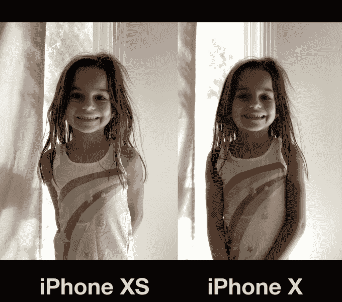

iPhone XS 上的智能 HDR 包含一系列技术和工艺，包括高光恢复、快速启动传感器、动态范围大幅提高的有机发光二极管屏幕以及神经引擎/图像信号处理器组合。它现在运行更快的传感器，并将一些工作卸载到 CPU，这使得它能够在过去的每张图像中发射近两张图像，以确保运动不会在 HDR 图像中产生重影，它会选择最清晰的图像，并以更智能的方式将其他帧合并到其中，并应用色调映射，在最恶劣的照明条件下产生更均匀的曝光和颜色。

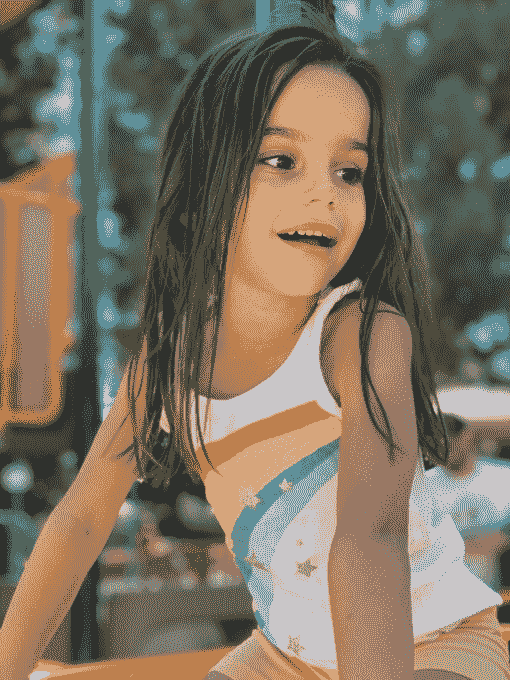

iPhone XS 拍摄，更好的色调范围，肤色和黑点

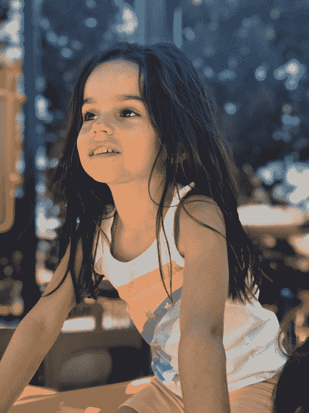

iPhone X 拍的，一点都不差，但是遮挡了阴影细节，肤色变平，蓝移

几乎你在 iPhone XS 或 iPhone XS Max 上拍摄的每张照片都会应用 HDR。它做得太多了，以至于苹果已经完全停止给大多数图片贴上 HDR 的标签。如果你愿意，还有一个开关可以关闭智能 HDR，但默认情况下，它会在任何需要的时候触发。

这包括了更多以前无法从 HDR 中获益的镜头。例如，全景照片、连拍照片、弱光照片和每一帧现场照片现在都可以处理。

对我来说，结果是*大幅*改善了快速拍摄，没有考虑到曝光或因光线不足而进行的调整。你的相机卷作为一个整体会突然看起来像一个更好的摄影师，没有你的干预。所有这些都被一个事实所掩盖，那就是 iPhone XS 和 XS 马克斯的有机发光二极管屏幕显示一系列颜色和亮度的能力有了显著提高。因此，图像在更宽色域的屏幕上看起来会更好，这可以显示更多的 P3 色彩空间。

## 在后台

就 Face ID 而言，我在速度和阳性数量上没有明显的区别，但我的面部模型已经在我的 iPhone X 上训练了一年。它在 iPhone XS 上重新开始。我一直很幸运，Face ID 大部分时间都在为我工作。这里改进的要点是采集时间的跳跃和模式匹配图的确认。据说，当你躺着或者手机平放在桌子上时，你的面部在斜角识别方面也会有所改善。我在这里尝试了许多不同的位置，但从来没有真正肯定地说 iPhone XS 在这方面更好，尽管正如我上面所说，这很可能需要训练时间才能接近我的 iPhone X 储存的信心水平。

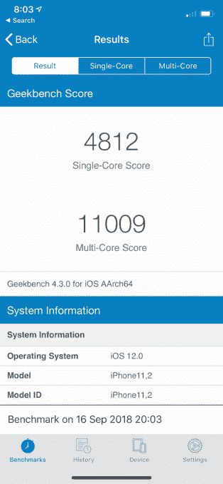

就 CPU 性能而言，世界上第一个大规模 7 纳米架构已经获得了回报。你可以从 iPhone XS 基准测试中看到，它与快速笔记本电脑相比毫不逊色，并轻松超过 iPhone X 的性能。

神经引擎和更好的 A12 芯片意味着在激烈的游戏和 AR 中更好的帧速率，图像搜索，应用程序启动方面的一些小改进。证明这一点的一个简单方法是来自 iScape 应用程序的视频，它是在 iPhone X 和 iPhone XS 上拍摄的。你可以看到在类似的 ar 场景中，跳动和 FPS 是如何挑战 iPhone X 的。增强现实体验的开销如此之大，我知道开发人员会对他们在这里能做的事情垂涎三尺。

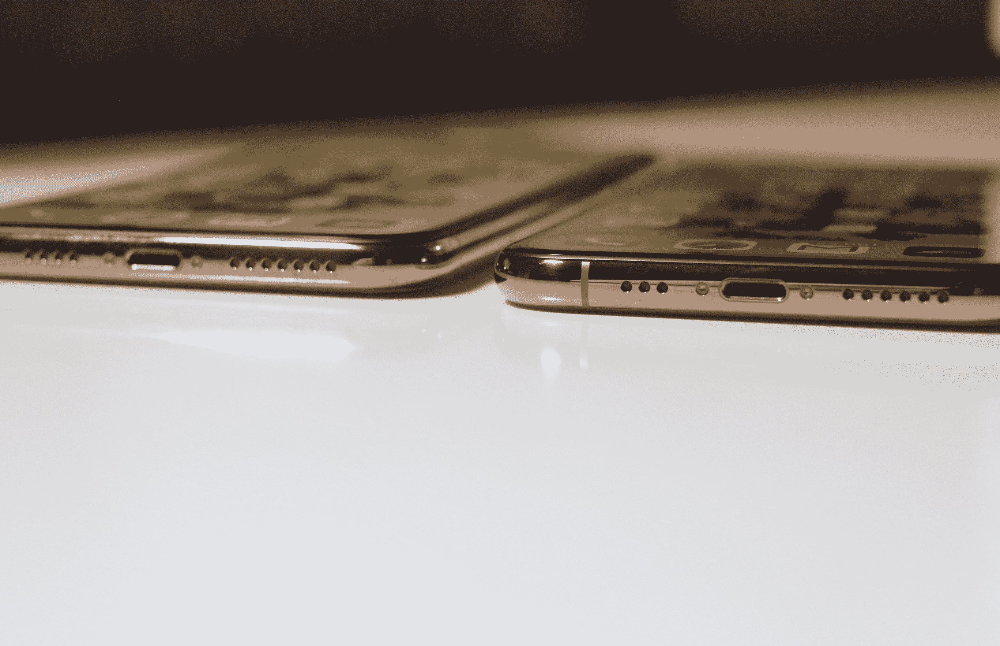

立体声令人印象深刻，对于一部手机来说，这种分离非常体面，而且声音肯定更大。权衡的结果是，你会得到不对称的扬声器格栅，所以如果这种事情让你恼火，你就不用客气了。

## 升级与否

对于 iPhone，每隔一年我都会看到和听到同样的事情——中间的几年平淡无奇，不值得升级。我明白，钱很重要，手机是我们的主要电脑，我们希望我们的钱花得最值。今年，正如我在开始时提到的，iPhone X 仍然感觉有点超前，从而创造了自己的不确定性。

我不会欺骗自己，认为我们会就你是否想从 iPhone X 升级到 iPhone XS 进行一次诚实的讨论。你要么因为你想做而去做，要么因为你觉得这不是一个足够大的改进而不去做。

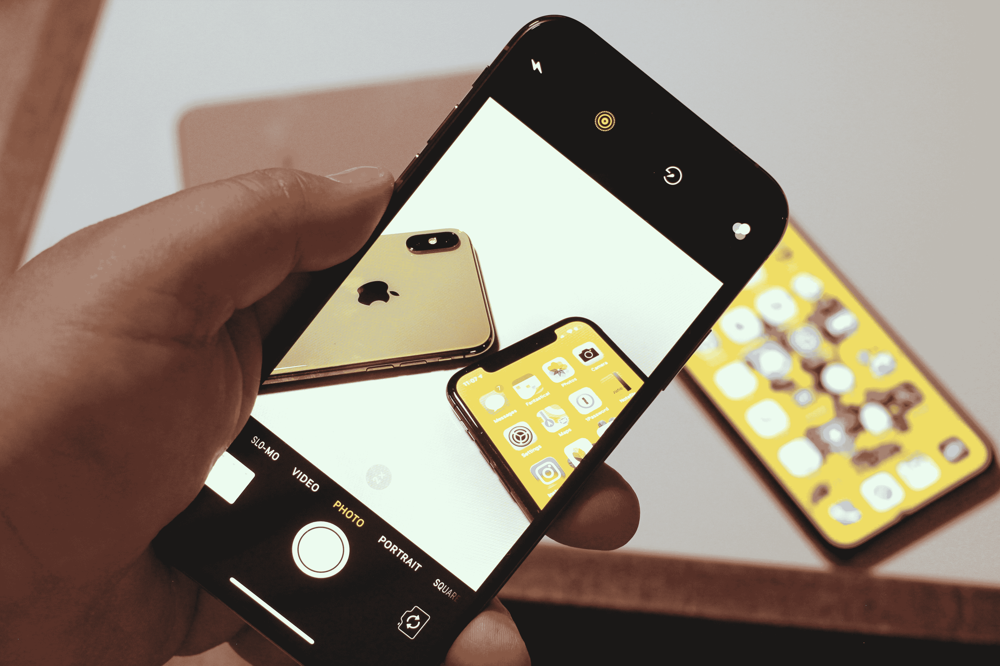

我认为苹果完全同意这一点，因为 iPhone XS 真的不是针对 iPhone X 用户的，而是针对数百万没有使用 Face ID 的手势优先设备的人。反正我从来不是那种每年都会推荐某个人升级的人。对大多数人来说，每两年一次已经足够了——除非你想要最好的相机，那就去吧。

而且，鉴于苹果公司[相当大胆地谈论](https://web.archive.org/web/20230219165305/http://www.asymco.com/2018/09/13/lasts-longer/)要确保 iphone 尽可能长久地使用，我认为它已经进入了一个时代，它正计划拥有一个庞大的安装用户群，以每月、每年或每两年的周期从它那里租赁 iphone。它也不在乎这些手机是属于第一、第二还是第三所有者，因为这些用户群将需要苹果能提供的付费服务。它似乎已经在朝着这个方向前进，像五岁的 iPhone 5s [一样老的手机仍然在更新 iOS](https://web.archive.org/web/20230219165305/https://twitter.com/DanFrakes/status/1041816216766054400)。

有了 iPhone XS，我们可能会看到 iPhone 即服务时代的真正开始。