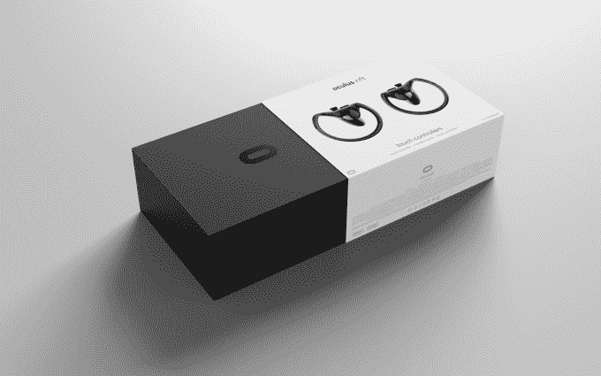

# 点评:Oculus Touch VR 运动控制器 

> 原文：<https://web.archive.org/web/https://techcrunch.com/2016/12/05/review-oculus-touch-motion-controllers/>

如果我没记错的话，2016 年应该是 VR 腾飞的一年。

虽然今年不可否认地看到了来自主要参与者(谷歌、Oculus、HTC、三星和索尼等)的相当多的主要硬件计划，但 2016 年仍然有相当艰难的时间来解决虚拟现实行业最紧迫的一些问题。

让虚拟现实变得更便宜，并确保它能在你已经拥有的设备上工作，这是其中的两个问题。Oculus 在降低最低规格个人电脑的硬件需求方面的软件魔法，以及谷歌通过 Daydream 将高质量虚拟现实引入 Android 手机的工作，已经开始有效地解决虚拟现实的一些结构问题。

但最终最困难的任务是让消费者相信 2016 年的虚拟现实很有趣。对于许多拥有 Oculus[Rift](https://web.archive.org/web/20221210051111/https://beta.techcrunch.com/2016/03/28/review-the-oculus-rift/)系统的人来说，这些耳机只提供了几周的美好时光，然后就被推到书架的后面，任其堆积灰尘。

部分原因是缺乏酷的新内容，但很大一部分原因是耳机没有满足用户的期望。

在 Rift 推出 9 个月后，明天 Oculus 将向公众推出其 Touch motion 控制器。199 美元的外设不仅仅是 Rift 的一个新配件，它们是一个完整的系统品牌重塑；控制器带来的体验是我迄今为止在虚拟现实中最有趣的体验。

## Oculus Touch 规格

**+** 六自由度运动跟踪
**+** 包括一个额外的摄像头传感器
**+** 需要 2 节 AA 电池
**+** 重量:约。272g(不含电池)
**+** 价格:199 美元(附加摄像头传感器为 79 美元)

一个快速的事情，如果你已经有一个 Rift 耳机，并且你打算继续玩它，你实际上很有可能*去买 Touch。否则，你将会看到一些很酷的新游戏来来去去，而你将无法用 Rift 附带的小小 Xbox 手柄玩这些游戏。幸运的是，这些新的控制器很棒，所以无论如何你都应该买下来。*

然而，更有价值的问题可能是，这些新的控制器是否给了那些一直在 VR 围栏上的人一个购买 Rift 和拥抱 Oculus 品牌高端虚拟现实的理由。

你买的其实不是一对控制器，你是在为访问下一代虚拟现实内容付费。在 Oculus ergo 脸书公司，触摸是虚拟现实的未来，也是更广泛的虚拟现实行业的未来。明天发布的 53 款触控产品将让您一瞥即将看到的一些高品质体验。

触摸控制器将你的手带入虚拟现实，让你拿起物体，并使用它们将活力四射。控制器是第一人称射击游戏者的一个疯狂的梦想，让我一遍又一遍地玩了几个小时的演示，因为我试图获得最快的绘制和最精确的拍摄。触摸提供的不仅仅是观察虚拟现实的能力，还有操纵虚拟现实的能力。

## **同类最佳**

触摸控制器可以让你在虚拟现实中获得最丰富的整体体验。Vive 上的跟踪可能仍然更好，但触摸控制器的增强人体工程学加上控制输入的多样性使其在游戏性方面具有强大的优势。最终，它最致命的弱点是价格，200 美元的控制器和 79 美元的第三个摄像头传感器使已经 599 美元的 Rift 耳机成为一个独特的高端产品类别。

## **硬件**

对于游戏控制器，最好的说法是它从你的视野中消失，成为你思维的延伸。

触摸控制器并不完美，但它们是一套比我们过去见过的 VR 控制器好得多的控制器，它们真正带来了这一代 VR 游戏所需的控制。

关于触摸控制器，首先要欣赏的是它们舒适、轻松的感觉。在你的手中，控制器很难与任天堂 Gamecube 控制器区分开来，尽管它被切成了两半。触摸控制器的按钮布局非常棒，让您可以随时访问一组精确的按钮，提供完美的反馈。

触摸控制器上的电容按钮可以让系统推断出你手指的位置。控制器可以使用这些线索来推断你的手是握在拳头里还是指向什么东西。在我尝试过的发布产品中，开发人员还没有疯狂地试图集成手势跟踪系统。然而，这里似乎有一些很好的社交潜力。

某些事情就是完美的。HTC Vive 上的手柄按钮很难按下，因此很大程度上被开发者放弃作为动作触发器。然而，触摸上的抓取和触发按钮使握住和使用工具变得毫不费力。很明显，仍然可以进行设计改进，今年 Valve [展示了](https://web.archive.org/web/20221210051111/https://beta.techcrunch.com/2016/10/12/valve-teases-next-gen-vr-hardware/)一个虚拟现实控制器的原型，它附着在用户的手腕上，可以让他们放开控制器而不会掉落。

触摸控制器的传感器环缠绕在你的手外侧，不仅让跟踪传感器更容易看到，而且当你不可避免地撞到某物或某人时，它们还会给你一套漂亮的塑料指关节。我有一两次是这种情况的受害者，所以我能说的是，如果你正在看某人玩超热的虚拟现实，请不要挡他们的路…

## **追踪**

每组触摸控制器都包括一个额外的摄像头传感器，以提高触摸所需的移动广度所需的跟踪质量。有了两个传感器，推荐的玩耍空间约为 5×5 英尺，很容易将一些家具推到一边。

设置触摸很简单，只需将另一个传感器插入电脑，并设置游戏空间。Guardian 系统的操作几乎与 SteamVR 伴侣系统相同，它有一个光网格跟踪你游戏空间的外部边界，这样当你处于特别紧张的场景中时，你就不会撞到你的墙壁或撞到你的显示器。

Oculus Touch 控制器售价 199 美元，但事实是，你最终可能会花 280 美元来将运动跟踪输入的全部好处带到你的体验中。第三个传感器的添加最终远没有 Oculus 让你想象的那么可选。很可能没有游戏会真的*要求*你拥有第三个传感器摄像头(在 Oculus 网站上售价 79 美元),但如果你已经花了相当昂贵的游戏电脑、599 美元的耳机和 199 美元的一对控制器，第三个跟踪传感器真的是你应该花钱买的东西。

其必要性有两个原因。

首先，遮挡，即你的身体阻挡相机传感器收集触摸控制器发出的信号，如果你的传感器只在你面前，这是一个相当大的问题，当跟踪水滴时，它真的会干扰沉浸感。第三个摄像头传感器负责这个空间，虽然我的三个 Oculus 传感器设置比 Vive 的两个传感器设置有更多的盲点，但这仍然是一个很好的体验。

或许更重要的是，由于 kickass SteamVR 的跟踪系统以及 Valve 的 Steam store 支持多个系统的可扩展性，没有直接获得 Oculus 资助的开发人员可能会首先使用 Vive 作为他们构建的系统。虽然 Oculus 游戏如 Dead and Buried 可以确保你始终面向显示器，但最具沉浸感的体验会让你不确定你的身体朝向哪个方向，这将很快强调双摄像头设置的限制。

简而言之，人们会抱怨 Touch room-scale 的推荐游戏空间比 Vive 小得多，但经过一点欺骗，我对容纳一个 12×12 英尺的区域和三个传感器没有问题。

## **值得吗？**

最终，Oculus 在是否升级的问题上真的没有给你太多选择，因为本周和未来几个月推出的许多主要产品都需要触摸，并且不支持 Xbox One 手柄。这种对早期硬件的计划淘汰总是令人讨厌的，尽管 Xbox One 控制器将继续用于 Rift 的未来产品，但你真的没有充分利用你的系统，除非你为触摸支付额外的 199 美元，为第三个跟踪传感器支付 79 美元。

幸运的是，这些新的控制器非常棒，提供了高度沉浸式虚拟现实体验的最佳外观。他们很聪明，但是他们会让你付出代价。

随着像 PlayStation VR 这样的控制台耳机系统在更实惠的 500 美元范围内浮动，以及来自联想、宏碁、戴尔和其他公司的新系列 VR 耳机从 300 美元开始，高端 VR 的未来是什么样子还不清楚，但如果你决定从消费级 VR 耳机中寻找最佳体验，就不要再看了。