# 点评:NES 经典版和上面的全部 30 款游戏 

> 原文：<https://web.archive.org/web/https://techcrunch.com/2016/11/07/review-the-nes-classic-edition-and-all-30-games-on-it/>

和往年一样，任天堂今年也在寻求对节日的怀旧——但 NES Classic Edition 是对原始游戏机的手掌大小的重建，内置 30 款游戏，即使对于一家心停留在 20 世纪 80 年代的公司来说，它在怀旧程度上也排名很高。这已经是数百万 30 多岁的游戏玩家梦寐以求的东西，毫无疑问:这是一封写给任天堂老粉丝的情书。

## 一眼

*   内置 30 个游戏
*   HDMI 输出
*   USB 供电
*   盒子里有一个控制器；额外费用 10 美元
*   $60;11 月 11 日上市

## 复古爱情

[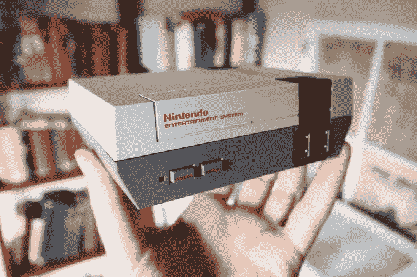](https://web.archive.org/web/20230205181118/https://techcrunch.com/wp-content/uploads/2016/11/pb070217.jpg)

现在你在玩弄权力。

首先，我们得谈谈设备本身:它很小。喜欢，适合你的手掌小。虽然它是原版的伟大复制品，但很明显它只是为了好看。没有可以放满游戏的 SD 卡的插槽，背面没有老式的视频，只有 HDMI。控制器端口不像旧的那样有令人满意的模拟感，但这真的没什么大不了的。

NES 立即打开；第一次会提示你设置你的语言，但之后你会被直接送到游戏选择界面。享受活泼的 NES 风格的菜单主题——我想把它用在我的手机上。菜单显示了对细节的关注；任天堂本可以打电话给它，但却非常小心，整个体验对它来说更好。

点击控制器会将你带到设置菜单，在那里你会发现显示选项(稍后会有更多介绍)、语言、一些杂项调整，如演示/屏幕保护模式和自动关机、一些法律信息和一个毫无帮助的链接，可以将手册下载到你的手机上。

[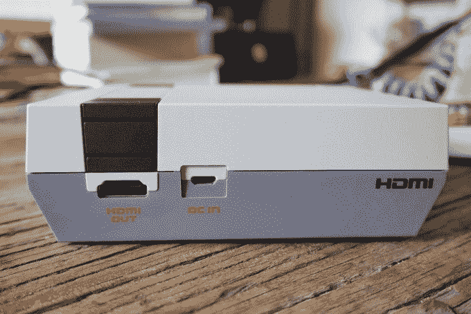](https://web.archive.org/web/20230205181118/https://techcrunch.com/wp-content/uploads/2016/11/pb070227.jpg)

从这边看不太熟悉。

对于老派粉丝来说，这真的是 NES 经典最大的失望之一:如果每款游戏都有原版手册，那就太令人满意了*。当然，手册会比游戏本身占据更多数量级的空间——一个 NES ROM 大约是 40-256 千字节，而当以合理的分辨率扫描时，一本手册可能是 5-10 兆字节。尽管如此，还是很遗憾。*

点击进入暂停菜单，我们稍后会讲到。左和右导航通过游戏列表，虽然它并不完全有效，但它足够快，你不会介意没有一个更紧凑的视图。

显然，电源按钮是控制电源的，它有我们熟悉的原版 NES 上的两步按钮。复位按钮用于返回菜单；当你这样做时，游戏会自动暂停。

[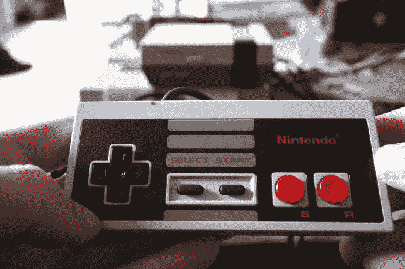](https://web.archive.org/web/20230205181118/https://techcrunch.com/wp-content/uploads/2016/11/pb070221.jpg)

如果你想知道，螺丝孔在背面的相同位置。你可以把它拆开，虽然我没有冒险。

从小就玩 NES 游戏，我非常了解*的感觉*，这种感觉有 95%是正确的。控制器是高度精确的复制品，虽然按钮感觉相同，但 d-pad 似乎更硬——这可能只是因为它是全新的。值得注意的是，这些控制器是 Wii 和 Wii U 上使用的标准端口，所以你可以在那些游戏机上使用它们(我们猜测这不是[开关](https://web.archive.org/web/20230205181118/https://techcrunch.com/2016/10/21/six-reasons-to-be-hyped-for-the-nintendo-switch-and-four-reasons-to-worry/)的情况)。

也就是说，控制器的电线太短了。不到三英尺，当你想把球传给沙发上的下一个人时，这没什么用。你可以买扩展器，甚至无线控制器，但短电线仍然是一种痛苦。

[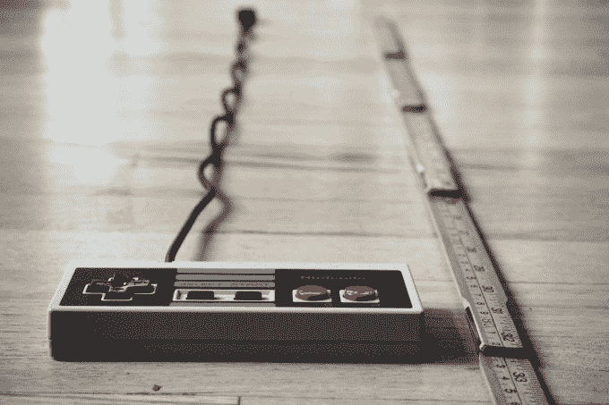](https://web.archive.org/web/20230205181118/https://techcrunch.com/wp-content/uploads/2016/11/pb070231.jpg)

这实际上使它看起来比实际长。相信我，太短了。

在这一点和按下游戏机上的重置按钮来保存游戏的必要性之间，很明显任天堂希望 NES 坐在你旁边的茶几上或诸如此类的东西上，但这意味着要在客厅里布线——这并不理想。如果你有一个很好的隐藏式视听设备，NES 经典就不适合了。

从好的方面来说，它使控制台非常便携。你可以拔掉插头，把线包起来，然后把它带到朋友家，非常容易，还可以从你停下的地方继续玩游戏。这里没有云存储或账户，一切都在设备本身。

## 为 NES 竞赛树立标杆

我从来都不是虚拟控制台的粉丝——我喜欢这个想法，但它从来都没有得到很好的执行，无论是控件、显示风格还是其他方面。这一次，任天堂做对了一切。

控件的响应一如既往，没有明显的滞后或其他怪异现象。在 NES 风格的控制器上玩也很不错。

在我玩的几个小时里，我看到了几个小的图形故障，但它们非常像你在玩原版时看到的那种:当你再次来回走动时，一些图形损坏会消失，等等。

任天堂也没有试图通过帧内插，取消每行 8 个精灵的限制或类似的事情来改进原作。这是非常追求原始体验，完成闪烁，游戏中众所周知的错误等等。

## 冻结帧

当然，与最初的 NES 不同，这款游戏可以让你随时保存游戏进度。你可以通过点击重置按钮来实现这一点，这将使你回到菜单，并显示一个有翼的屏幕截图漂浮在那里，等待恢复，保存或删除。

这里的界面有点迟钝，尽管随着时间的推移它变得更加直观。一旦你点击重置，你按下进入暂停菜单。这里有四个空位，如果它们是空的，你可以按 A 键把保存放进去。如果已经有一个保存，您按住大约半秒钟，它就会用一个可爱的小动画将之前的保存推开。

这个想法是，它使你不太可能意外覆盖另一个保存，但它需要一点技巧来操作任何速度和信心。您也可以锁定保存，这样它们就不会被覆盖，只需在暂停菜单中再次按下即可。

[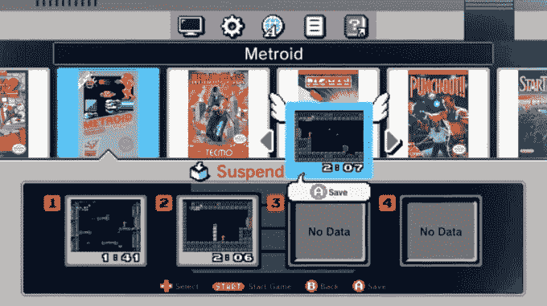](https://web.archive.org/web/20230205181118/https://techcrunch.com/wp-content/uploads/2016/09/suspend.jpg)

每个游戏都有自己的四个位置，一般来说绰绰有余。需要注意的一点是，使用挂起会覆盖游戏中的电池节省，比如塞尔达和 SMB3。为了防止混淆，只需使用其中一个，否则你会不小心删除你的游戏。(注意:密码保存工作很好，使用起来也很有趣。)

如果你经常使用该功能，就有点麻烦，比如在每一级之前保存。你必须按重启，然后按下，然后按 A(保存)或再次按下(选择之前的保存)，然后再按 A。这就像输入一个作弊代码！我无意中保存或加载了不止一次，但我怀疑肌肉记忆最终会解决这个问题。

想必任天堂不希望人们每一秒都使用这个，如果控制器本身有一个保存/加载按钮，就会出现这种情况。我尊重这个决定，但还是有点讨厌。

## 任天堂的样子

任天堂对显示模式很慷慨——当他们第一次宣布时，我已经详细介绍过这个了，所以我只是重复一下我当时说过的话作为回顾:

几乎可以肯定的是，NES 是在 4:3 的 CRT 电视上通过类似 RF 适配器或 RCA 的东西播放的。然而，NES 的输出不完全是 4:3 (~256x240px)，所以像素会被拉伸——也就是说，不完全是方形的，就像你在屏幕上看到的那样。这一点，加上当时电缆传输的视频信号很差，以及 CRT 荧光粉的自然模拟外观，给了 NES 奥运会一个非常独特和易于识别的外观。

【T2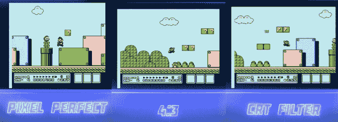

NES 迷你有三种显示模式(点击上面的大图):

*   **像素完美**，以方形像素显示图形，与 NES 输出的完全一样。在某些方面，这是理想的格式，但在其他方面对许多玩家来说完全陌生。因为它更窄，距离会显得更短，移动更慢——相信我，人们会注意到这些事情。
*   **4:3** ，将图像拉伸到你熟悉的老式电视的比例。这本身会使图像有些模糊，值得注意。
*   **CRT 过滤器**，它添加了一个覆盖层，模拟您通过模拟连接在 CRT 电视上看到的视觉伪像。

你用哪种真的是一个品味问题。发送像素完美的信号并在电视上拉伸可能比在盒子里看起来更好。

像素完美和 4:3 模式明亮、色彩丰富，看起来很棒——比以前的虚拟控制台版本好得多。这是体验这些游戏的好方法。

就我个人而言，我觉得 CRT 滤镜有点重，会使图像变暗很多。不合我的口味，但有这个选择还是不错的。喜欢这种东西的人会发现这是他们喜欢的那种东西，等等。

## 该不该买？

在我谈到游戏本身之前，让我先说:*是的，买吧。*我认为这是一个了不起的价值。你要为每个游戏支付 2 美元，外加制作精良的硬件和方便的保存状态系统。在很多方面都很划算。

[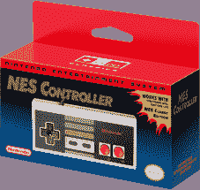](https://web.archive.org/web/20230205181118/https://techcrunch.com/wp-content/uploads/2016/11/nes-controller-box.png)

由于控制器只有 10 美元，所以很容易建议首先购买一个。

也就是说，你真的应该买第二个控制器——第一批中的许多游戏都是更好的双人游戏。10 美元的要求不算多——但为了方便起见，你可能会考虑等待，从第三方购买无线或延长线版本[。](https://web.archive.org/web/20230205181118/https://techcrunch.com/2016/11/03/nyko-nes/)

我说“这第一批”是因为对我来说，这是不可思议的，任天堂不会在接下来的几年里推出更多这样的产品。经典版拥有早期的热门产品和任天堂的主要特许经营权。运动版有冰球，双运球，田径等等。动作版有原版的魂斗罗，冲锋，漫步者之类的东西。益智版，RPG 版等。

这样做太有意义了，现在停下来太没意义了。许可问题可能是一个问题，但任天堂会让它工作，如果他们现在能第三次或第四次向你出售这些游戏。

但是，由于这些仍然是假设，这一个有这样一个坚实的选择，你应该继续下去，尽快给他们你的钱。

## 运动会

游戏的选择是一个大杂烩——看起来任天堂试图打击尽可能多类型的玩家，而不是专注于任何一种类型。在我看来，结果是太多的街机游戏，不够的魂斗罗和令人震惊的缺乏仿生突击队。

因为不是每个人都在第一次玩这些游戏，这里有一个你得到的游戏的快速纲要，它们是什么样的，它们有哪些模式。(注:这些截图很多来自 Wii U 虚拟主机版本；它们在 NES 经典版上会好看很多。)

## 气球大战

[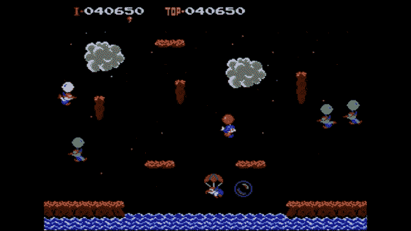](https://web.archive.org/web/20230205181118/https://techcrunch.com/wp-content/uploads/2016/11/balloon-fight.jpg)

*   一个或两个玩家(同时)
*   漂浮，躲避鸟人的动作

这种类似比武的游戏是 NES 上最早出现的游戏之一，即使对于 8 位时代来说，这也是非常基本的。然而，一旦你掌握了窍门，控制它就是一种乐趣。这对于孩子们来说很简单，但是要小心，在“气球之旅”模式下会很快变得很难。专业提示:动作要快，你可以在他们炸气球之前干掉几个家伙。

## 泡泡球

[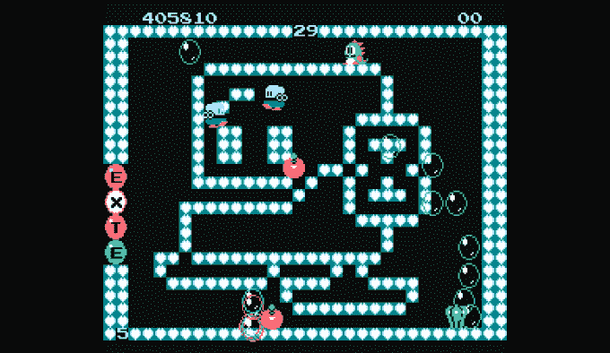](https://web.archive.org/web/20230205181118/https://techcrunch.com/wp-content/uploads/2016/11/bubble-bobble.png)

*   一个或两个玩家(同时)
*   泡泡漏接，骷髅闪避动作

吹泡泡把怪物变成水果和糖果的恐龙？顺其自然吧。最好是两个人一起玩，适合所有年龄的人，虽然，再次，难度上升很快。如果你过了几关还没有主题曲卡在脑子里，那你就比我强了 **Pro 提示:**按住 jump 在泡泡上弹跳。练习这个，很关键。

## 恶魔城

【T2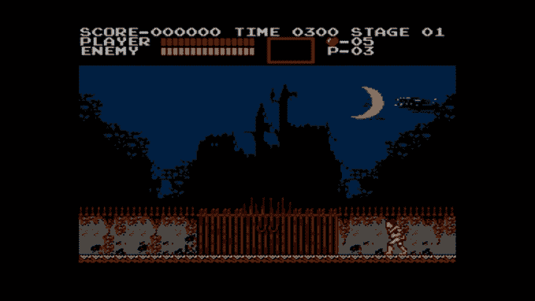

*   一个玩家
*   猎杀吸血鬼的行动

作为有史以来的经典作品之一，恶魔城在艺术和构思方面表现得令人惊讶——注意，这真的好像你正在渗透一个闹鬼的城堡，而不仅仅是做 1-2 级和 3-1 级等等。专注于掌握高跷跳跃，学习敌人的模式，不要害怕在网上寻找隐藏得非常好的秘密火腿。**亲提示:**回旋镖和圣水最适合 boss。

## 恶魔城二世:西蒙的探索

[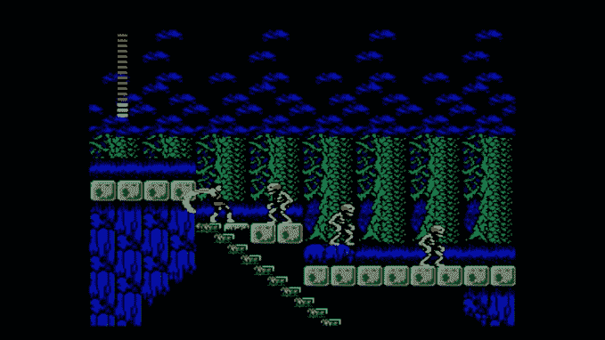](https://web.archive.org/web/20230205181118/https://techcrunch.com/wp-content/uploads/2016/11/castlevania-2.jpg)

*   一个玩家
*   猎杀吸血鬼动作游戏

这个游戏可能不会像经典的原创或开创性的第三个条目那样被人们记住，但请查阅指南，让你越过一些更不透明的谜题，我想你会发现这真的是一个非常创新和制作精良的动作 RPG。另外，那个火鞭有多酷？

## 大金刚

[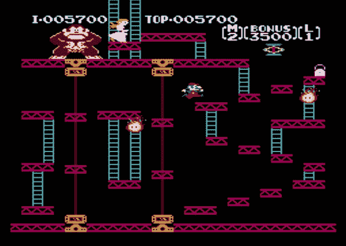](https://web.archive.org/web/20230205181118/https://techcrunch.com/wp-content/uploads/2016/11/dk.jpg)

*   一个或两个玩家(顺序)
*   拱廊桶跳跃动作

每个人都能打败 DK 的前几关，当然。但是接下来就开始变得很吓人了。观看*金刚*然后看看你如何与世界冠军相匹敌。

## 小金刚。

[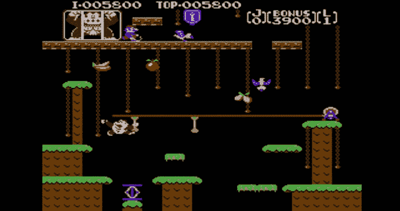](https://web.archive.org/web/20230205181118/https://techcrunch.com/wp-content/uploads/2016/11/dkjr.jpg)

*   一个或两个玩家(顺序)
*   拱廊爬藤动作

像这样的街机交叉总是意味着练习基本的动作和态势感知，在过去的日子里，这会节省你四分之一的时间。这些关卡旨在绊倒你，所以请密切注意。

## 双龙 2:复仇

[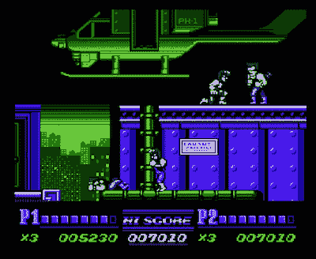](https://web.archive.org/web/20230205181118/https://techcrunch.com/wp-content/uploads/2016/11/doubledragoniitherevenge-screenshot.jpg)

*   一个或两个玩家(同时)
*   在街头行动中痛打他们

最初的可能是我们记得的那个，但是如果我们诚实的话，它是一种笨拙的游戏。续集速度更快，不那么迟钝，并且在故事中同时支持两个玩家。这比不上 River City Ransom，但话说回来，什么是？ **Pro 提示:**“模式 B”开启友军火力如果要打。

## 马里奥博士

【T2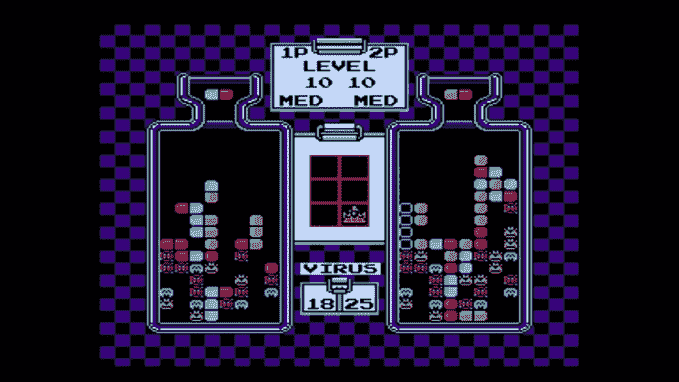

*   一个或两个玩家(同时)
*   第三场医学谜题

发烧还是发冷？选择你的配乐，找一个搭档，准备好在对方的瓶子里装满细菌、病毒或其他任何东西时对对方大发雷霆。和俄罗斯方块一样，这款游戏极其易学却很难掌握。

## 兴奋自行车

[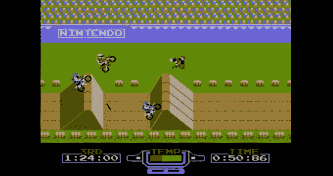](https://web.archive.org/web/20230205181118/https://techcrunch.com/wp-content/uploads/2016/11/excitebike.jpg)

*   一个或两个玩家(顺序)
*   侧滚摩托车赛

作为 NES 有史以来最伟大的人之一，Excitebike 仍然充满乐趣。找一个朋友，设计一些古怪的课程，陶醉在令人满意的反应控制和巧妙的获胜策略中。**专家提示:**永远不要放松涡轮增压。

## 最终幻想

[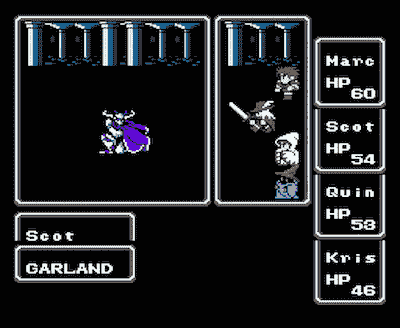](https://web.archive.org/web/20230205181118/https://techcrunch.com/wp-content/uploads/2016/11/finalfantasy-screenshot.jpg)

有着许多快乐和许多痛苦的原作。自第一部《最终幻想》以来，RPG 已经发展了很多，但事实是所有的关键部分都在这里:宏伟的故事线，令人着迷的统计数据和装备，金币，幻想的生物，以及——如果你聪明的话——大量的金币和经验值。其他系统上的重制者实际上改进了这个游戏很多，所以除非你想要完整的体验，否则就去找一个。**亲提示:**救*真的*常。尤其是在巫师附近。

## 加拉加

[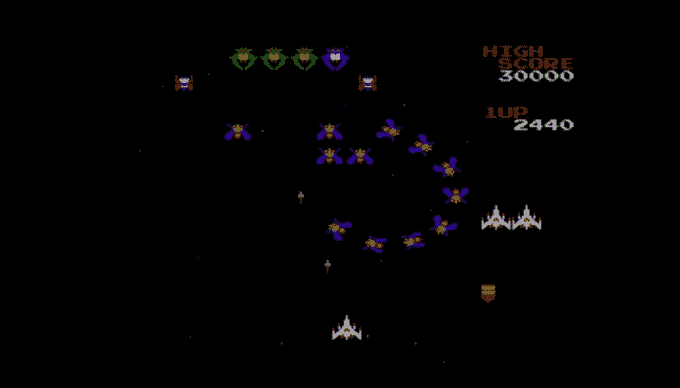](https://web.archive.org/web/20230205181118/https://techcrunch.com/wp-content/uploads/2016/11/galaga.jpg)

*   一个玩家
*   街机空间昆虫射击游戏

另一个街机港口。Galaga 是一个很棒的游戏，这是一个磨练你技能的好方法，这样你就可以在街机上给你的朋友留下深刻印象(你还是会去的，对吧？).练习你的时机，记住奖励波命令，不要害怕让你的船被捕获。**亲提示:**攻火比按住更快更精准。

## 幽灵和妖精

[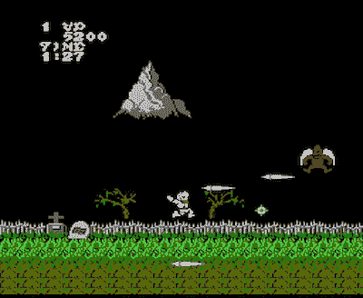](https://web.archive.org/web/20230205181118/https://techcrunch.com/wp-content/uploads/2016/11/ghostsngoblins-screenshot.jpg)

*   一个玩家
*   控制器投掷动作

这是一款赋予“任天堂硬汉”一词分量的游戏。它不像战斗蟾蜍那么糟糕，但不像街机幽灵和地精，你不能一直抽硬币来继续前进。你必须用你得到的生命打败撒旦，如果你和我一样，在这发生之前你的控制器上就会有咬痕。**亲提示:**准备受死吧。

## 格拉迪乌斯

[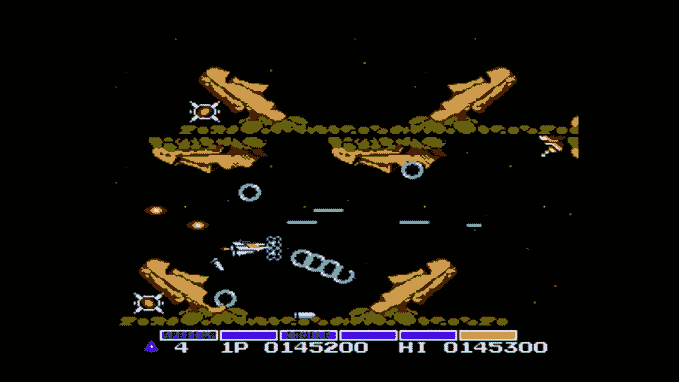](https://web.archive.org/web/20230205181118/https://techcrunch.com/wp-content/uploads/2016/11/gradius.jpg)

*   一个或两个玩家(顺序)
*   Konami 射射

格拉迪乌斯仍然弹得非常好，尽管它远没有现代的希普斯那么疯狂。这不是关于抽搐技能，而是关于了解和先发制人的独特威胁在每一个水平。顺便说一句，这仍然非常困难——我检查过了。**亲提示:**上，上，下，下，左，右，左，右，b，a，开始。

## 攀冰者

[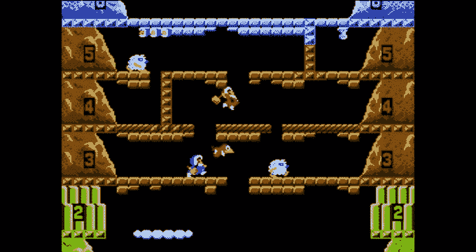](https://web.archive.org/web/20230205181118/https://techcrunch.com/wp-content/uploads/2016/11/ice-climber.jpg)

*   一个或两个玩家(同时)
*   爬上去

另一个早期的街机风格的 NES 游戏，这个游戏有简单的控制，可能会让你觉得有限制性。穿过前几座山，你会发现它有多曲折。不要和你不愿意离开的人玩这个游戏，如果他们不能跳跃的话。

## 基德·伊卡洛斯

[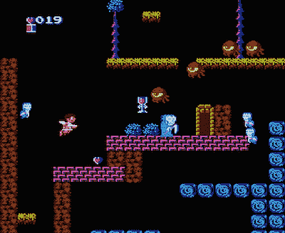](https://web.archive.org/web/20230205181118/https://techcrunch.com/wp-content/uploads/2016/11/15_kidicarus-screenshot.jpg)

*   一个玩家
*   神话动作 RPG

我一直最喜欢的游戏之一，《孩子伊卡洛斯》是一个漫长而艰难，但非常值得的冒险游戏，它控制得非常好，隐藏了相当多的游戏深度。保留一个 FAQ 来帮助你解决宝藏室中隐藏的得分机制和贫困之神。**亲提示:**敬畏茄子巫师！

## 科比的冒险

【T2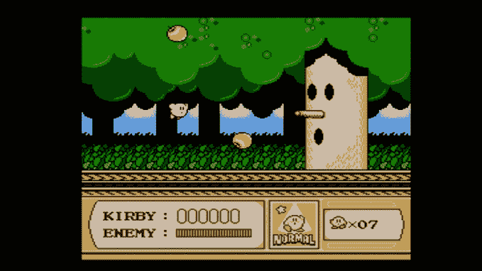

*   一个玩家
*   野蛮的吞噬敌人的行动

这是后来最先进的游戏机游戏之一；吸入你的敌人，并用他们自己的力量对付他们。伟大的图形和控制，加上智能和可爱的关卡设计。不要让浮肿的外表欺骗你，虽然，这是一个具有挑战性的标题。

## 马里奥兄弟。

[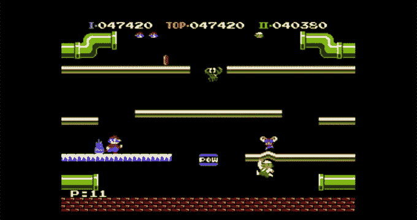](https://web.archive.org/web/20230205181118/https://techcrunch.com/wp-content/uploads/2016/11/mario-bros.jpg)

*   一个或两个玩家
*   踢乌龟下水道行动

这里有一个拔出来解决怨恨比赛。你可以一起工作，也可以互相破坏——只是不要浪费能源。那个是不可原谅的。

## 超级男人 2

【T2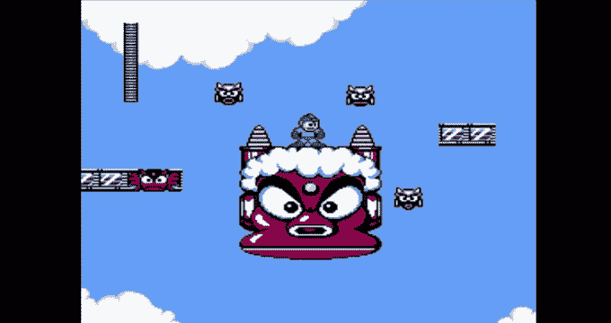

*   一个玩家
*   机器人控制动作

这是正确的百万人包括:第一个是粗糙的边缘，之后的不是很像激光聚焦在核心游戏上。它有很棒的音乐，坚实的控制，它只是“任天堂硬”的正确水平专业提示:先做金属人，然后用他的武器摧毁一切。甚至他自己。

## Metroid

[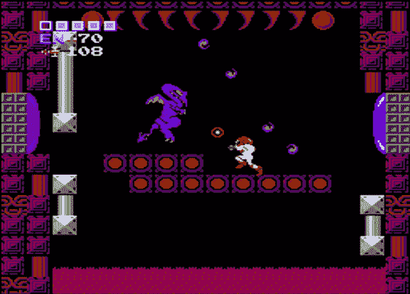](https://web.archive.org/web/20230205181118/https://techcrunch.com/wp-content/uploads/2016/11/metroid.jpg)

*   一个玩家
*   地下探索行动

最初的 Metroid 是多么的先进，真是令人惊讶。它不仅控制得很好，有一个巨大的，迷宫般的地图可以按照你自己的速度探索，而且音乐和气氛也很棒。如果你从来没有玩过 Metroid，你将会得到一个很好的机会——但是要准备好迎接一个严峻的挑战。保存状态对这个游戏非常有帮助。专家提示:不要去查地图，找些绘图纸，自己做一张——那样会更有趣。

## 忍者外传

【T2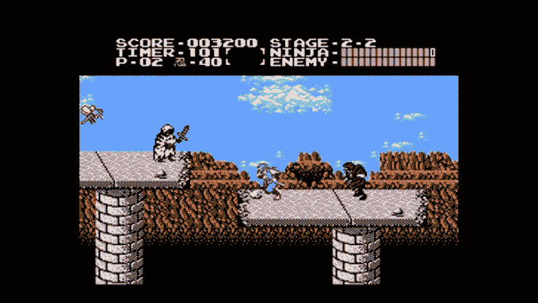

*   一个玩家
*   电影忍者行动

这款游戏和它的续作真的将 NES 的故事情节推向了新的高度，叙事驱动的水平和之间的详细场景。我碰巧更喜欢续集，但原著很棒(也很棒)。**专业提示:**密切注意你挥剑的实际尺寸和持续时间。

## 派克曼

[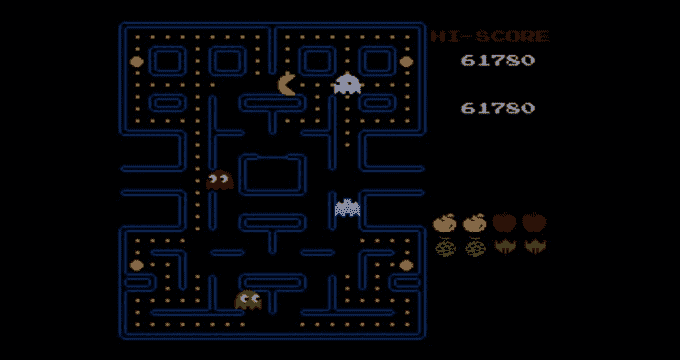](https://web.archive.org/web/20230205181118/https://techcrunch.com/wp-content/uploads/2016/11/pacman.jpg)

*   一个或两个玩家(顺序)
*   点嚼街机行动

我真的不用复习吃豆人了吧？我想值得一提的是，NES 版本是原版的一个不错的端口，尽管你*会*怀念有一个操纵杆。

## 打卡！！主角是梦想先生

[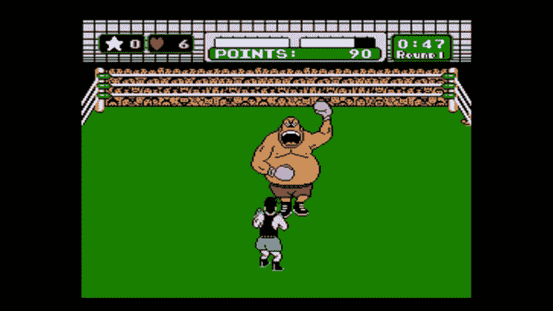](https://web.archive.org/web/20230205181118/https://techcrunch.com/wp-content/uploads/2016/11/punch-out.jpg)

*   一个玩家
*   打肚脐动作

注意到标题了吗？是啊，这不是迈克·泰森的拳击比赛！！游戏是完全一样的，但你在最后与一个调色盘交换的泰森战斗——他们把他变成了白人，并把他的名字改成了梦想先生。很遗憾，真的，但是你有多少次能走到那一步？专业提示:事实证明这是一个很棒的派对游戏。

## 星形细胞

[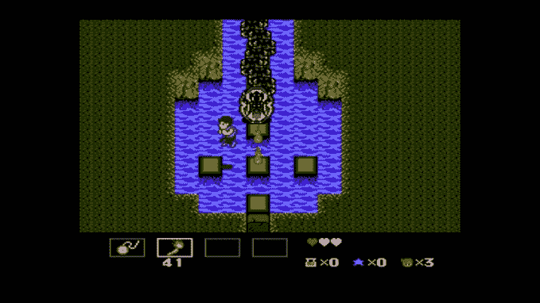](https://web.archive.org/web/20230205181118/https://techcrunch.com/wp-content/uploads/2016/11/startropics.jpg)

一个不被重视的宝石，星战结合了有趣的动作与谜题和一个完整的 RPG overworld 和故事。想再玩一遍塞尔达或恶魔城吗？为什么不试试这个呢？我想你会惊喜的。

## 超级 C

[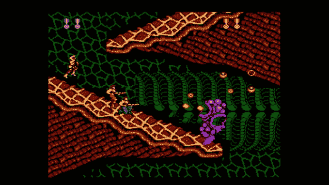](https://web.archive.org/web/20230205181118/https://techcrunch.com/wp-content/uploads/2016/11/super-c.jpg)

*   一个或两个玩家(同时)
*   跑枪行动

对我来说不可理解的是任天堂选择把这个而不是经典的魂斗罗放在这个东西上——真的很失望。但《超级 C》仍然是一款不错的游戏，即使它不像前作那样广受喜爱。**亲提示:**火其实在这一部里还是不错的。

## 超级马里奥兄弟。

[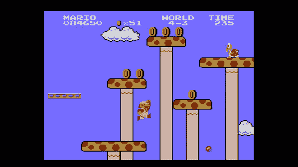](https://web.archive.org/web/20230205181118/https://techcrunch.com/wp-content/uploads/2016/11/mario-1.jpg)

*   一个或两个玩家(顺序)
*   爬蘑菇平台动作

这个肯定不需要任何介绍。它和以前一样好。寻找额外的挑战？观看几次速度跑，看看你的成绩如何。

## 超级马里奥兄弟 2

[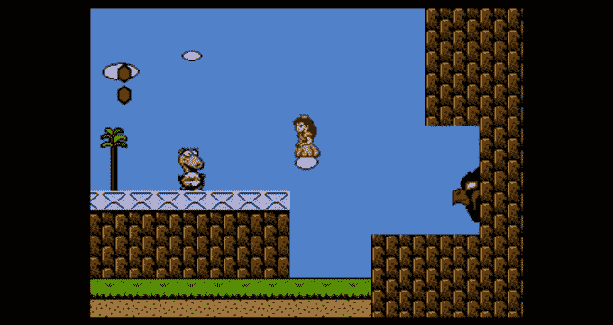](https://web.archive.org/web/20230205181118/https://techcrunch.com/wp-content/uploads/2016/11/mario-2.jpg)

*   一个或两个玩家(顺序)
*   莫名其妙的骑蛋动作

帮你自己一个忙，从头到尾重放一遍。它非常怪异，超级有趣，有着与其他马里奥游戏完全不同的关卡设计。可能是因为这只是一个[资产交换](https://web.archive.org/web/20230205181118/http://www.themushroomkingdom.net/smb2_ddp.shtml)游戏，在游戏中你扮演一个印度家庭翻阅一本故事书。**专业提示:**蛤蟆是挖关卡的人。

## 超级马里奥兄弟 3

[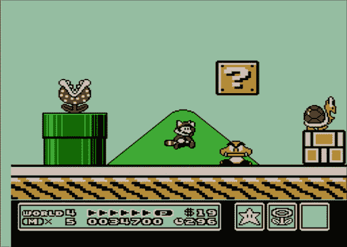](https://web.archive.org/web/20230205181118/https://techcrunch.com/wp-content/uploads/2016/11/mario-3.jpg)

*   一个或两个玩家(通常是连续的)
*   定义流派的平台行动

仍然是有史以来最好的游戏之一，永远值得再玩一次。利用游戏的保存能力，一次通过世界 4！带上一个朋友，基本上是双倍的生活，可以从对方的错误中吸取教训。**亲提示:**看《巫师》

## 泰克莫碗

[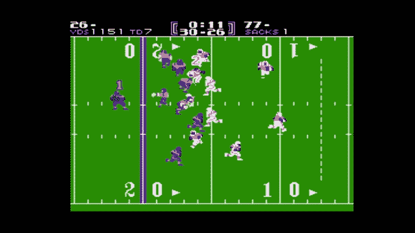](https://web.archive.org/web/20230205181118/https://techcrunch.com/wp-content/uploads/2016/11/tecmo-bowl.jpg)

*   一个或两个玩家(同时)
*   极其逼真的足球动作

它可能没有《疯狂 2017》那么详细，但教育你的朋友也一样有趣。职业提示:让电脑玩家互相对战来模拟(和预测)季后赛。

## 塞尔达传说

[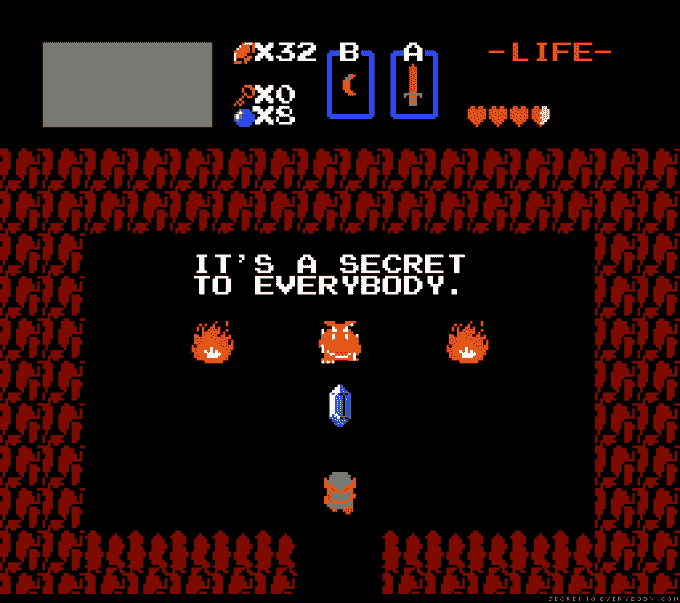](https://web.archive.org/web/20230205181118/https://techcrunch.com/wp-content/uploads/2016/11/zelda-secret.png)

*   一个玩家
*   三角形收集动作 RPG

没听说过这个。看起来不太好。

## 塞尔达 II:林克的冒险

[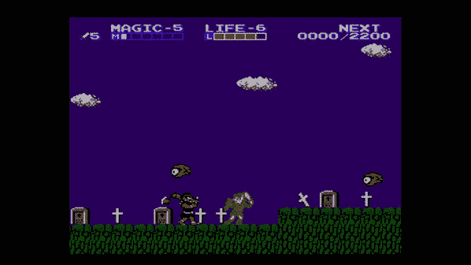](https://web.archive.org/web/20230205181118/https://techcrunch.com/wp-content/uploads/2016/11/zelda-ii.jpg)

*   一个玩家
*   被低估的动作角色扮演

所以，回到 20 世纪 80 年代，他们不确定视频游戏续集应该如何工作，所以他们基本上使第二个塞尔达成为一个完全不同的游戏。这不是塞尔达粉丝想要的，但事实是这实际上是一个非常好的游戏！翻译很奇怪，一些谜题是随机的，但有了 FAQ，我想你会发现塞尔达 II 很有趣，如果你假装它根本不是塞尔达游戏的话。这应该不难，因为它真的真的不像。**亲提示:**我是错误。

* * *

哇！那是一篇很长的评论。

如果你向下滚动到这里得到要点(我实际上把它放在游戏上面)，它是这样的:**如果你喜欢 NES 游戏，就买这个东西。**这是一个很大的价值，它有几个(虽然不是几乎所有)系统可用的最好的游戏，它玩起来像一个梦——除了一些关于保存系统的小抱怨。可能会有更多，不同的选择，但这是足够好的推荐。买第二个控制器(可能是无线的)进城。