# 点评:SNES 经典版和上面所有的 21 款游戏

> 原文：<https://web.archive.org/web/https://techcrunch.com/2017/09/28/review-the-snes-classic-edition-and-all-21-games-on-it/>

任天堂凭借 NES 经典版的成功(以及令人难以置信的稀缺)而得意洋洋，它宣布推出 SNES 经典版并没有让任何人感到惊讶，这是经典超级任天堂游戏机的一个微型版本，内置了 21 个最热门的游戏。但是一些新的功能和对原始产品的改变使它成为一个独特的产品——一个非常值得你花 80 美元购买的产品。

## 一眼

*   内置 21 个游戏
*   HDMI 输出
*   USB 供电
*   配有两个控制器
*   80 美元，9 月 29 日上市

## 所有的部分

所以。我是 SNES 人。

我从小就有同样的 SNES——它被打得一塌糊涂，后面的零件不见了，控制器上有咬痕，随着时间的推移变黄了，当然也很脏。但它仍然像魔咒一样有效，我仍然定期播放它。我喜欢那个东西，我对游戏的硬件和感觉非常熟悉。

我很高兴地说，SNES CE(我们将简称它)钉住了它，除了几个主要是美学上的例外。

首先说一下设备本身。很明显，这是一个微型 SNES，非常像原来的样子，尽管要小得多。但与 NES CE 一样，模仿也仅限于此。电源键和原装的一样，复位键也可以。

但是弹出按钮是假的，而且墨盒插槽实际上并没有打开。我是说，为什么这些东西会有用？不过，令人有点失望的是，任天堂没有想出一些创造性的方法来将它们纳入设备的功能中。

[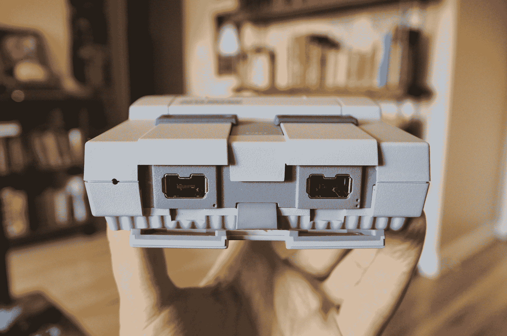](https://web.archive.org/web/20230327200802/https://techcrunch.com/wp-content/uploads/2017/09/snes_classic-9220036.jpg)

我遇到的唯一主要问题是，设备的正面必须以一种笨拙的方式翻转，以暴露控制器端口。我想这样做是为了保护 SNES 的外壳，但如果它在你实际使用它的任何时候都会破坏整个外观，那又有什么意义呢？不仅如此，它甚至没有正确的铰链——只有一个塑料扣和一个塑料条，可以弯曲并固定住前面的部分。

我预测一个无线设置适合这里，取代前面的一块，并连接到两个控制器端口。如果有人还没准备好…最好现在就开始。

[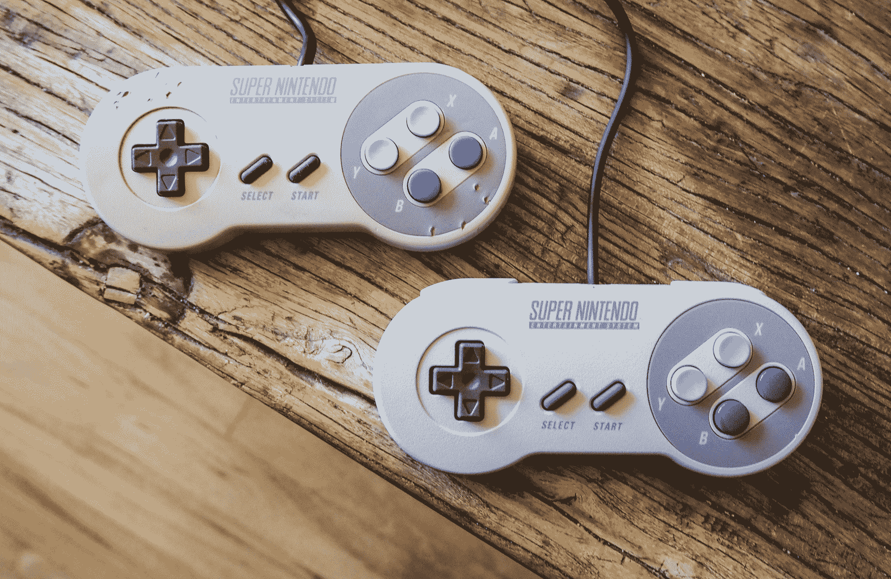](https://web.archive.org/web/20230327200802/https://techcrunch.com/wp-content/uploads/2017/09/snes_classic-9220030.jpg)

幸运的是，控制器没有受到同样的形式超过功能的批评。事实是，你很难区分它们和原件——它们可能会回到原来的模子里。就像 NES CE 的控制器一样，这种感觉很直接:按钮和游戏手柄有相同的外观和感觉，尽管后者比新的更硬一点。可能是因为它已经 20 年没捣碎了。

唯一真正的区别是软线，它比原件(6 英尺比 8 英尺)更长更薄，比 NES CE 上的 3 英尺软线好得多。当然，你会得到两个。两个。*盒子里有两个*控制器。这是 NES 行政长官的一个重大疏忽，已经在这里得到纠正。

## 玩弄超级力量

如果您不熟悉该设备，以下是它的工作原理。您将其插入，连接 HDMI 电缆，然后将其打开—在对语言和时间进行了基本的初始设置后，您就可以进入了。

通过在列表中滑动来选择一个游戏，它会立即启动。完成后关闭电源，或点击“重置”返回菜单，您可以将游戏的当前状态保存到每个标题的四个槽中的一个中。这样，你可以在进入地牢前保持一种保存状态，在老板面前使用，在你想和朋友一起扮演的角色之前使用。他们都是彼此独立的。

SNES CE 的一个新功能是“倒带”功能。选择一个游戏暂停状态(比方说 boss 一个)，而不是点击开始，点击 x。在你点击重置之前，游戏会启动一段时间。然后，您可以使用 R 和 L 按钮在时间上向前和向后跳转。这是为了防止你想回到被你搞砸的敌人遭遇战之前，但又不想从半小时前开始加载你的豁免。

[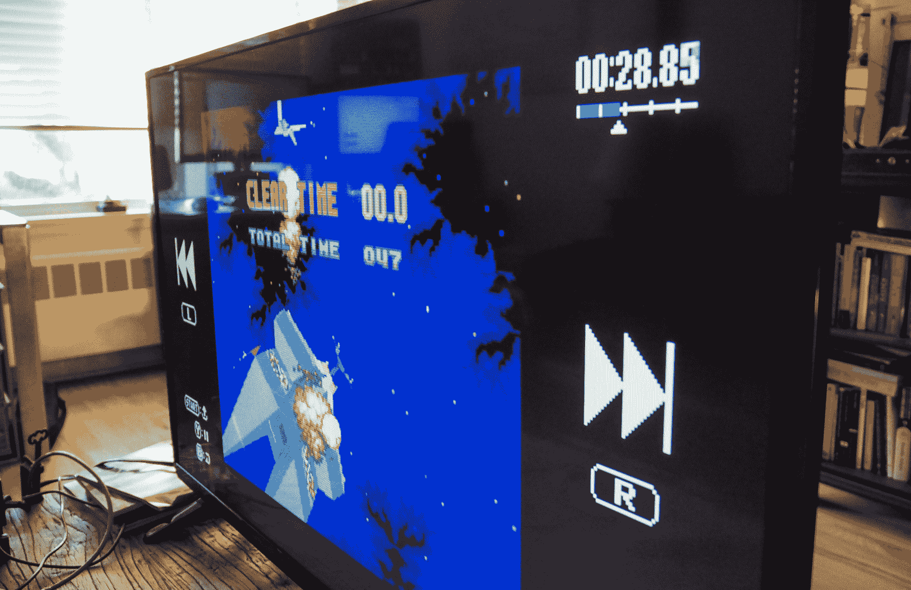](https://web.archive.org/web/20230327200802/https://techcrunch.com/wp-content/uploads/2017/09/snes-classic-edition-rewind.jpg)

你需要阅读多少时间，以及跳转的粒度，因游戏而异。在 Kirby Super Star 和其他动作游戏中，它给了我 40-50 秒的时间来跳过，每次 10 秒。但在《最终幻想 3》和其他 RPG 中，我有整整五*分钟*，一次经历一分钟。可能是因为在这些比赛中失误的速度较慢。

这是一个方便的功能，但如果你只是想重做最后一两分钟，激活起来有点麻烦。我们这些玩了多年模拟器的人已经习惯了无限制的倒带和持续的快速保存，任天堂可能会这样做——但这有点违背了事情的精神。他们想让你像玩原版游戏一样玩这些游戏，除了一些头疼的问题。

说到仿真，我没有发现任何不寻常的人工制品，我发现的那些我可以在我原来的 SNES 上复制——所以看起来任天堂在这里组装的仿真器与 NES CE 的质量相当。调色板看起来很亮，游戏本身也没有变化(比如修复小故障)。

[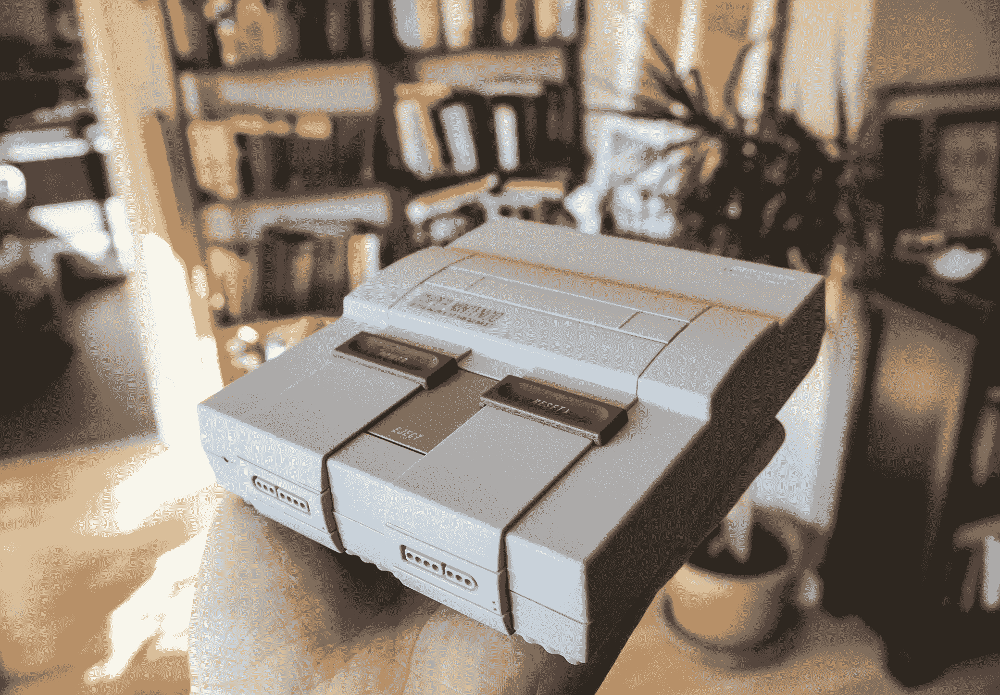](https://web.archive.org/web/20230327200802/https://techcrunch.com/wp-content/uploads/2017/09/snes_classic-9220028.jpg) 在比较《马里奥赛车》和它的原版《SNES 双胞胎》时，我感觉我注意到了操控上的细微差别，但我不能确定。可能我只是不习惯这台电视或高清演示。如果有差异，比如说，输入延迟，而我没有设备来测试和确定，那肯定是非常小的。

和它的前身一样，SNES CE 让你在三种图形模式中进行选择: **4:3** ，这是你最初体验游戏时可能体验到的更加宽广的视角；**像素完美**，完全不扭曲视图，将像素显示为正方形；和 **CRT 滤波器**，其将扫描线添加到 4:3 画面。

现在，在 NES CE 上，我更喜欢 4:3 或像素完美，这取决于游戏。那个控制台上的模拟电视滤波器对我来说似乎太重了，降低了信号质量。

[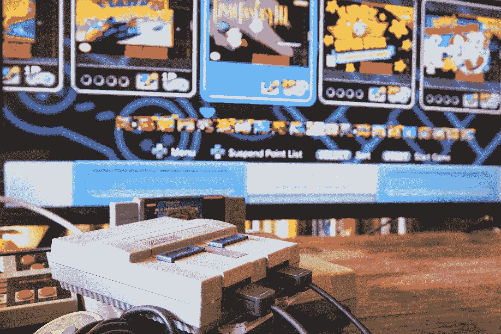](https://web.archive.org/web/20230327200802/https://techcrunch.com/wp-content/uploads/2017/09/snes_classic-9220038.jpg)

然而，在 SNES 消费电子展上，我发现这两种模式让艺术品看起来比我记忆中的更加块状。我知道这只是一种错觉，但我眼中的扫描线实际上似乎增强了细节，而不是模糊了细节。我在《最终幻想 3》里一个特别丰富的场景里来回切换，像是白天和黑夜。我真的无法解释；这可能是艺术风格的使用(更多的细节，更多的颜色，更多的曲线)，但无论如何，我敦促你至少尝试扫描线。当然，您的里程可能会有所不同。

也有你可以选择的背景，因为无论你做什么，你都不能让一个 SNES 游戏填满整个 16:9 电视。有些是静态的，我不是很喜欢。但是其他的就像偏光一样，改变以反映场景的主色。对于一些游戏来说，这可能会分散注意力，但你至少应该试一试，看看它是否适合你。由于游戏只在屏幕中央占据一个明亮的正方形(或 4:3 的区域)，我认为这有助于减少边缘(字面上)。

最后一个值得一提的功能是您的演示。如果你让游戏机停留一分钟左右，它会切换到吸引模式，展示一个游戏——事实上，是你的实际游戏。虽然这很有趣，但它没有太多的逻辑，当你查找 FAQ 时，你很可能会看到自己坐在暂停屏幕上，就像你看到一些胜利的老板打架一样。如果能够在你点击重置时将最后 30 秒保存为这些演示中的一个就好了。

## 这是给谁的？为什么不用原来的 SNES？

[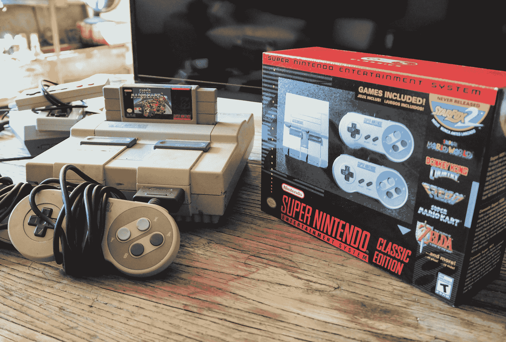](https://web.archive.org/web/20230327200802/https://techcrunch.com/wp-content/uploads/2017/09/snes_classic-9220026.jpg) 事情是这样的。我有一把 SNES，现在还在用。但事实是，视频输出，即使在最好的情况下，也无法真正匹配一个原生的 720p 图像。复合电缆不能产生高保真图像。

我在比较马里奥赛车控制的时候碰到了这个。它只是看起来*，所以*在高清(当然有扫描线)更好。我在模拟器中摆弄了 15 分钟的视频选项，得到了正确的扫描线权重、blitter 选项、bloom 和失真、模拟输入模拟，当然还有滤波方法(老实说，双线性很好)。SNES CE 有一个很好的外观，将适用于大多数开箱即用的电视。

因为它看起来很好，因为它是便携式的，因为它有各种最著名的游戏*和*几个我可以工作几个月或几年，它很可能会取代我的 SNES，除非在特殊场合，或者至少直到我能找到一个好的信号处理器。我认为这是大多数人重温这些 16 位经典的一种更容易、更好的方式。我更关心人们是否在第一时间体验了超级大都会，而不是他们是否真实地看到了它当年的样子。

## 运动会

我将逐一介绍这些游戏，因为它很有趣——但让我们把这个拿出来:这是一个精彩的游戏选择，在单人和多人模式下都有数百小时的乐趣。虽然有一些高调缺席(超时空触发器，食人魔战斗，超级马里奥全明星)，但这里的东西更多，*多*绰绰有余，足以证明价格。

还有，这里显然有一个很突出，那就是星狐 2。《星狐 2》是在原版游戏之后开发的，但从未正式发布(任天堂将精力集中在 N64 和星狐上)，是一款雄心勃勃的游戏再造。

[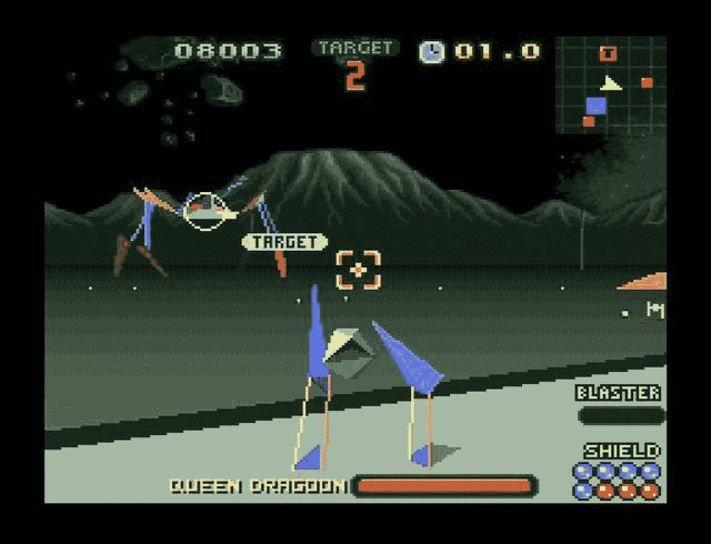](https://web.archive.org/web/20230327200802/https://techcrunch.com/wp-content/uploads/2017/09/star-fox-2.png) 【续集】不是让你以设定的速度在一系列走廊中漫游，保护你倒霉的队友并打倒老板，而是让你自由地在太阳系地图上导航，这在以前只是一个漂亮的进度指示器。你必须通过拦截来袭导弹来保卫你的家园，消灭它们的来源(战列舰)，夺回被占领的星球(通过转换成一个笨拙但有趣的步行坦克)。

我不想太破坏它，但我可以告诉你，Star Fox 2 是一个非常有趣的游戏，尽管它从一开始就遇到了控制台的限制。不要期待《明星公民》——但要准备好惊喜于一款明显领先于时代的游戏。

这个离群值被发送出去，我们在这里大致按类型浏览其余部分:

## 平台玩家

**超级马里奥世界**

[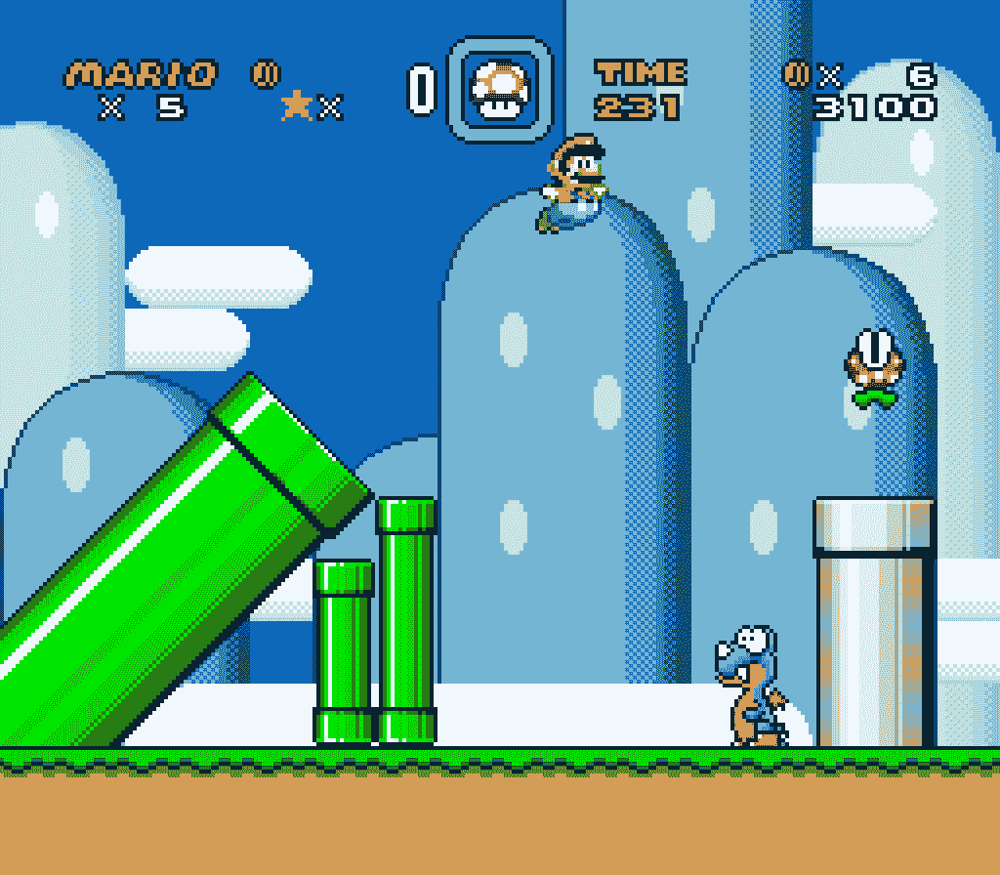](https://web.archive.org/web/20230327200802/https://techcrunch.com/wp-content/uploads/2017/09/super-mario-world.png) 超级任天堂的推出游戏，SMW 是一颗完美无瑕的宝石，将简单的游戏性元素与复杂的关卡和世界设计结合在一起。秘密无处不在，开关宫殿甚至提供了一种大都市的氛围。

专业提示:地图上的黄色圆点表示一个简单的关卡，而红色圆点表示一两个秘密出口。用这个来集中你的探索努力。

**超级恶魔城 IV**

[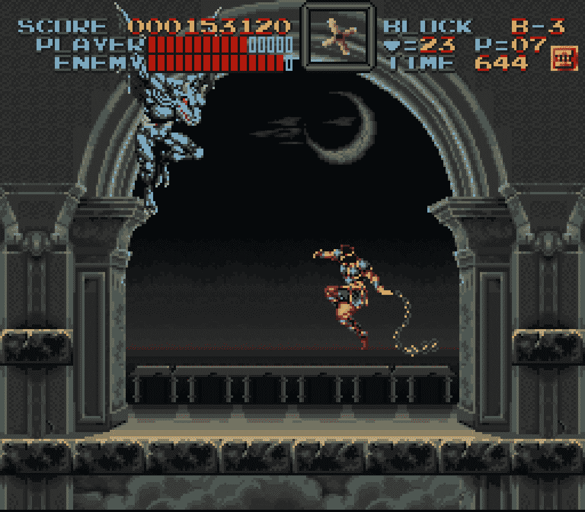](https://web.archive.org/web/20230327200802/https://techcrunch.com/wp-content/uploads/2017/09/super-castlevania-iv.png) 在西蒙的任务的愚蠢秘密和 III 的混乱游戏选择之后,《恶魔城 IV》作为一款展示动作游戏回归了它的本源。这一次控制有更多的细微差别，你的鞭子不仅仅是用来鞭打傻瓜。

**专业提示**:你可以通过连续杀死 10 个敌人获得一个子武器的乘数，然后用它得到一根蜡烛。

**大金刚之国**

[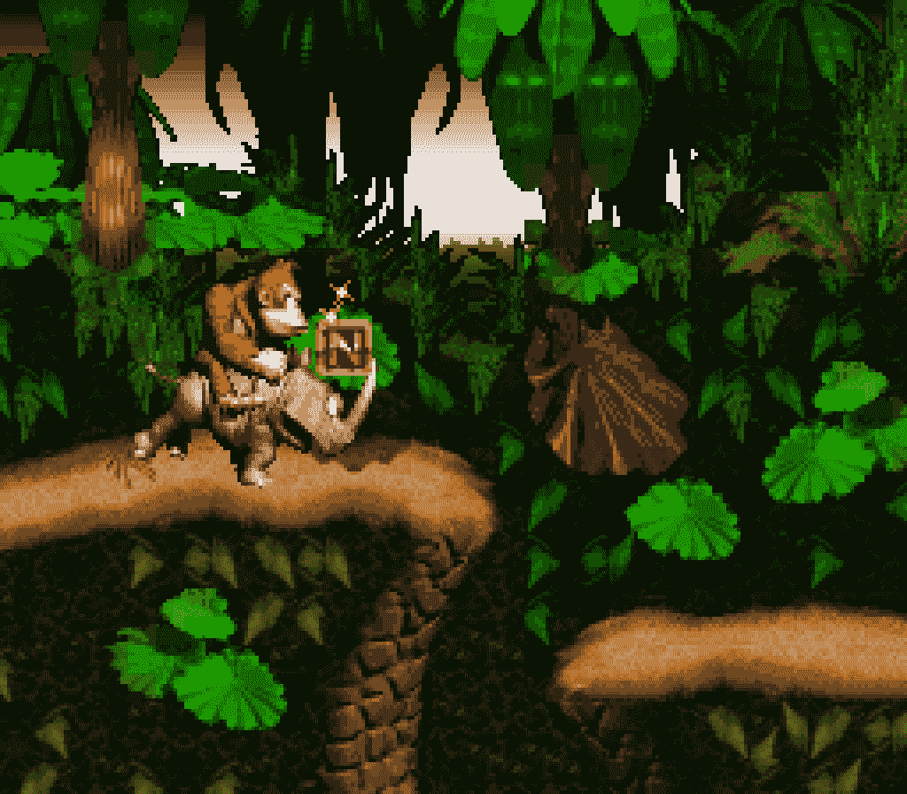](https://web.archive.org/web/20230327200802/https://techcrunch.com/wp-content/uploads/2017/09/donkey-kong-country.png)DKC 的仿 3D 图形还没有真正老化好(虽然它们有某种奇怪的魅力)，但游戏的传奇平台化仍然令人惊叹。续集可能增加了更多的奇谈怪论，但原著是无可指责的。

**专业提示**:扮演吹牛老爹以获得最佳效果，并练习你的翻滚跳跃。

**超级男人 X**

[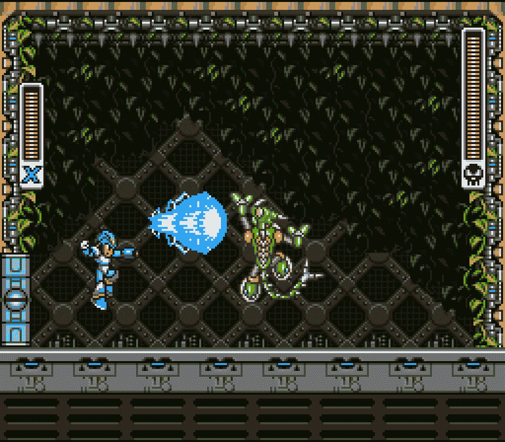](https://web.archive.org/web/20230327200802/https://techcrunch.com/wp-content/uploads/2017/09/mega-man-x.png) 虽然《百万富翁游戏 2》的纯度可能仍然是最好的，但 X 是一个受欢迎的变化，为该系列带来了急需的垂直和生活质量的变化。

**专业提示**:目标是先冲刺(企鹅阶段)，这样既可以加快其他阶段的速度，又可以摆脱糟糕的情况。

**科比超级巨星**

[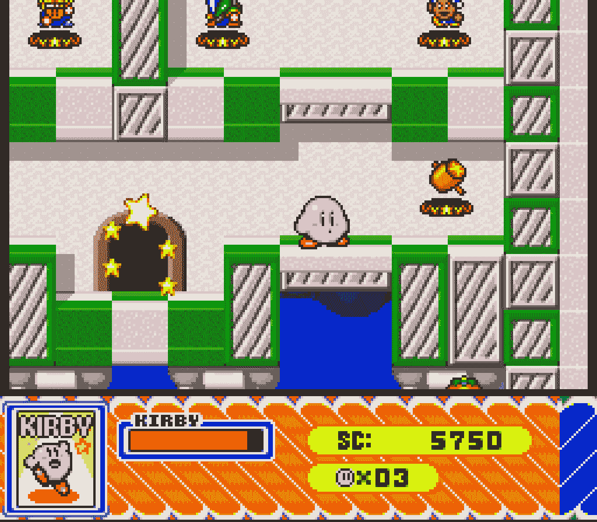](https://web.archive.org/web/20230327200802/https://techcrunch.com/wp-content/uploads/2017/09/kirby-super-star.png) 由任天堂充满希望的新主角主演的一系列迷你游戏，超级明星绝对是一个与朋友一起玩的有趣游戏，但它并不是游戏界的一个里程碑。股票动作平台是坚实的，迷你游戏是一个笑话，2 人游戏有一个有趣的转折。一个简单的拿起和玩游戏的朋友谁可能不符合街头霸王 2。

**专业提示**:剑是国王的武器。

**耀西岛**

[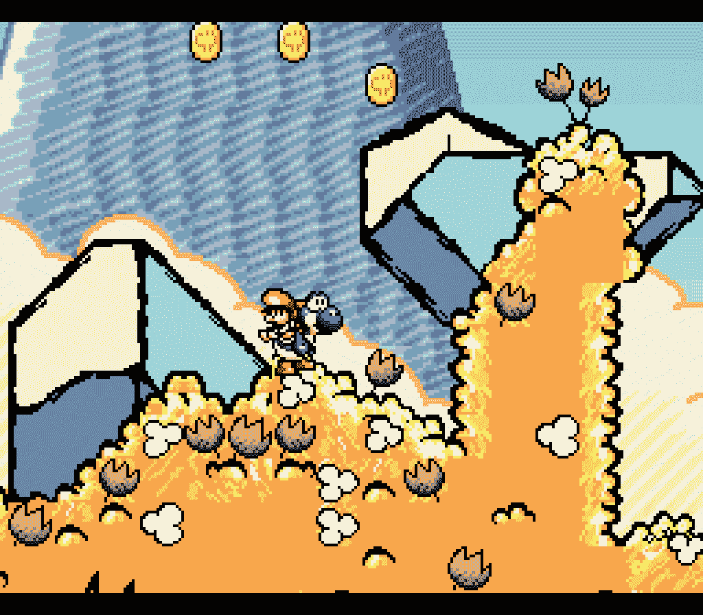](https://web.archive.org/web/20230327200802/https://techcrunch.com/wp-content/uploads/2017/09/yoshis-island.png)Yoshi ' s Island 可能是主机上技术最先进的游戏，它融合了游戏创意、创意水平设计和 SNES 的图形能力。艺术指导也非常迷人。从技术上讲，这是《超级马里奥世界》的续集，但这里还有更多精彩。

**专业提示**:将你的控制模式切换到“仓促”，让战争之卵飞起来。

**超级食尸鬼&幽灵**

[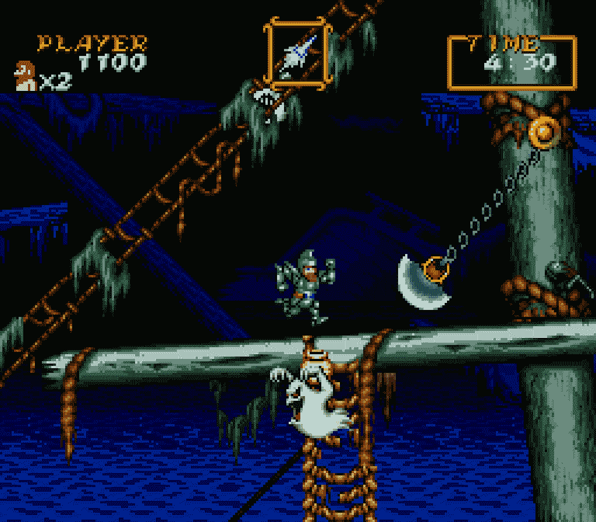](https://web.archive.org/web/20230327200802/https://techcrunch.com/wp-content/uploads/2017/09/super-ghouls-n-ghosts.png) 不会说谎，我不太喜欢这个。控制是限制性的，这是非常困难的，即使有 9 条命和简单模式，如果没有大量的练习，你也很难走远。

**专业提示**:准备受死吧。

## 赛车和运动(ish)

**马里奥赛车**

[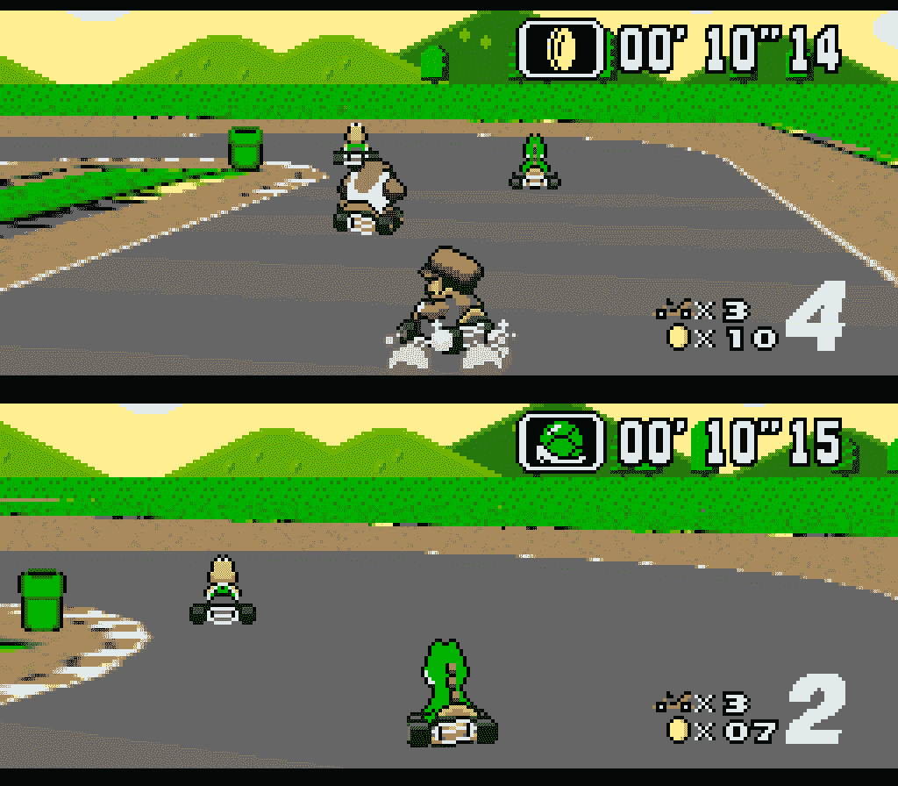](https://web.archive.org/web/20230327200802/https://techcrunch.com/wp-content/uploads/2017/09/super-mario-kart.png) 最早的《马里奥赛车》是我最喜欢的游戏之一，也可能是我玩的时间最长的一款，它是开启了一个王朝的 Mode 7 赛车。控制很简单，而且非常微妙；GPs 具有挑战性(电脑无耻地作弊)；战斗模式是无穷无尽的娱乐——我们以前肯定连续打了 100 场比赛。

**专业提示**:使用 Toad 进行 GPs 直到 150CC，然后切换到布瑟。掌握权力滑动或死亡。

**F-Zero**

[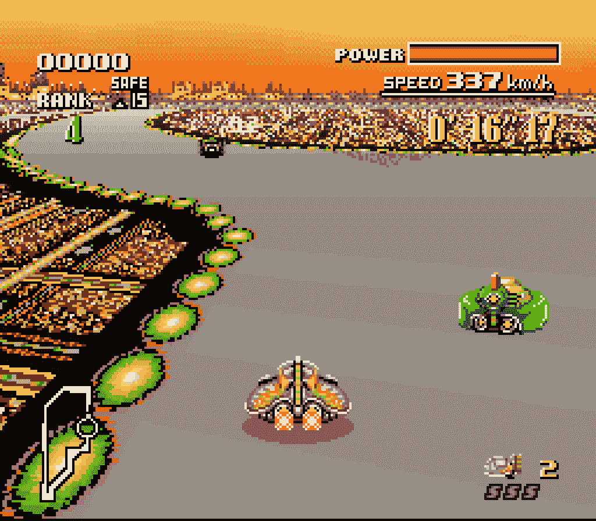](https://web.archive.org/web/20230327200802/https://techcrunch.com/wp-content/uploads/2017/09/f-zero.png) 一个早期的 SNES 头衔，F-Zero 并不精确，但它是投掷控制器的乐趣。比赛的性质意味着从严重错误中恢复几乎是不可能的——但是让你的对手在困难的赛道上跑得完美是令人兴奋的。

**专业提示**:红色飞船看起来很傻，但是转弯很好，有最好的最高速度。不要忘了通过按住来缓和你的着陆！

**街头霸王 2 Turbo**

[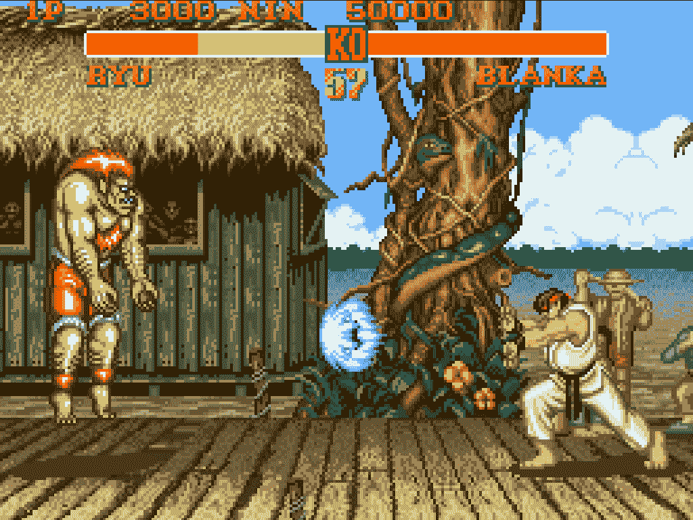](https://web.archive.org/web/20230327200802/https://techcrunch.com/wp-content/uploads/2017/09/street-fighter-ii.png) 在这份榜单的所有游戏中，《街头霸王 2》是最不需要介绍的一款。我认为，这是游戏的最佳版本——超级添加了 T.Hawk、Cammy 和其他人，但原始船员绰绰有余。

**专业提示**:学习 Ryu 或春丽是一个好的开始，但要了解一个不寻常的角色，让它混合起来，给期待平常的对手一个惊喜。

**科比的梦想历程**

[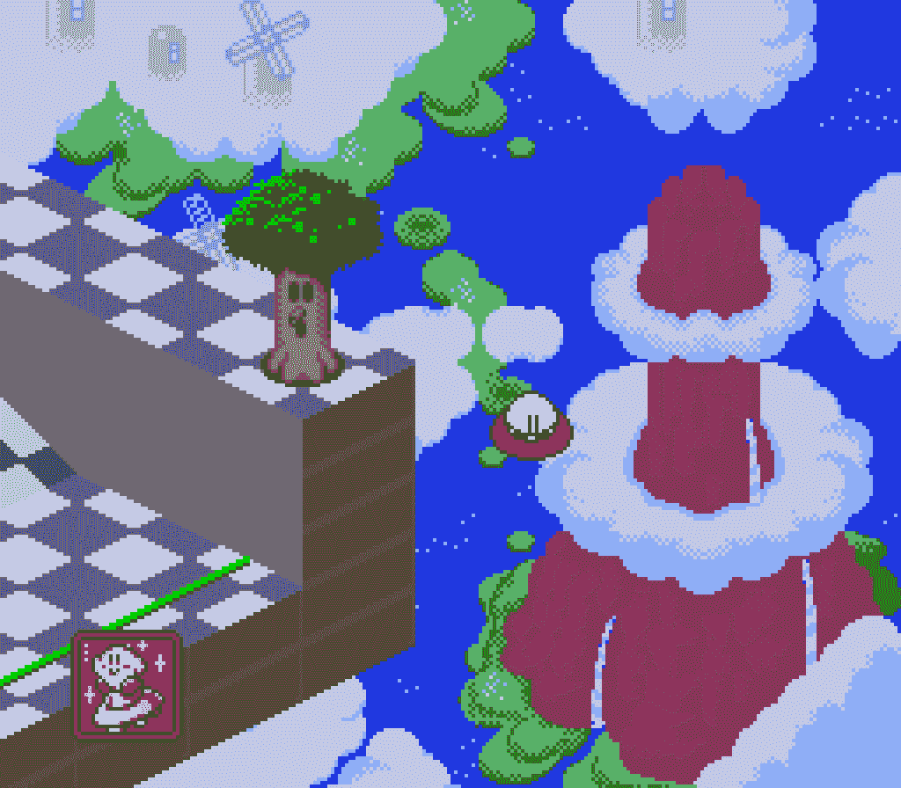](https://web.archive.org/web/20230327200802/https://techcrunch.com/wp-content/uploads/2017/09/kirbys-dream-course.png) 这里有一只奇怪的鸟。这基本上是一个迷你高尔夫球游戏，带有科尔比服饰和独特的科尔比魅力。3D/等轴测方面做得非常好，控制也很简单——但舞台肯定不是这样。并非对每个人都是如此，但这是一种不同寻常的奇怪而迷人的突破。

**亲提示**:轻轻一碰把它掉在杯子里。

**超级打卡！！**

很像原版，但是当然有更好的图形和更大的可打面孔。如果你喜欢第一个，你很可能会喜欢第二个。我也觉得更难。

**专业提示**:每次战斗前暂停游戏，燃烧几个回合学习对手的模式。总比输了又得从头再来好。

## 动作和冒险

**塞尔达传说:过去的链接**

最近，ALttP 在《连接世界》中被重新制作成了 3DS 的版本，但是原版仍然是塞尔达最好的版本之一。一个充满秘密的巨大世界，一个开放的进程结构，和挑战性的地下城——这是你想从塞尔达得到的一切。

**专家提示**:尽快准备好瓶子，为了保险起见，在瓶子里装满仙女。

**超级银河战士**

[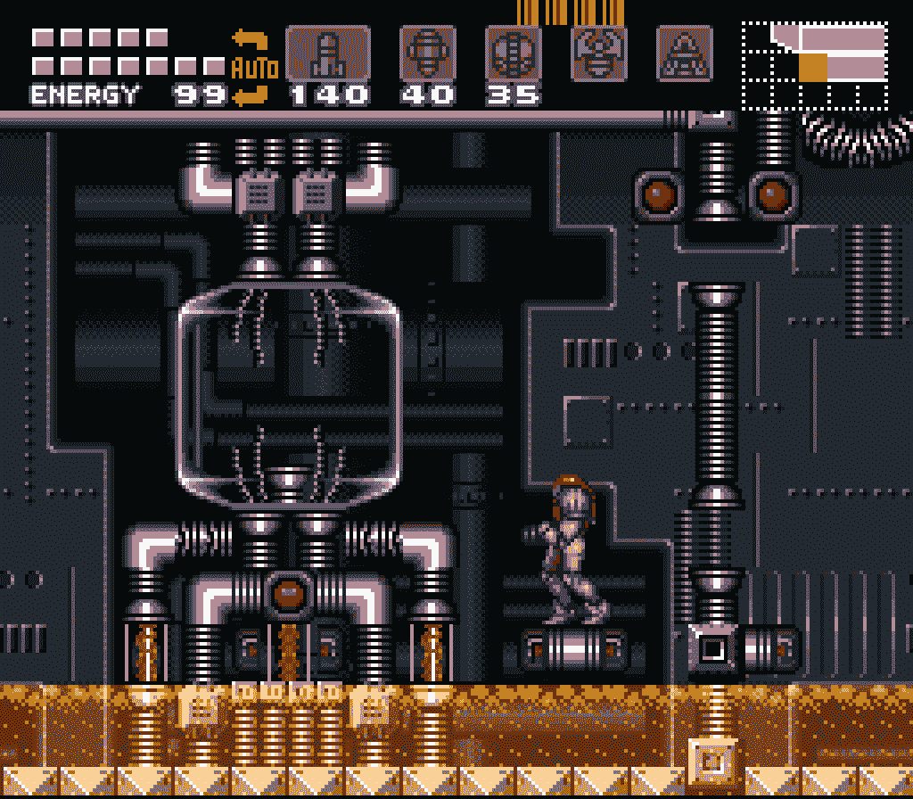](https://web.archive.org/web/20230327200802/https://techcrunch.com/wp-content/uploads/2017/09/super-metroid.png) 另一部空前经典的《超级大都会》是《大都会》的阿尔法和欧米茄，这是一种它基本上发明了并且仍然影响着的流派。诡异的气氛，错综复杂和精心策划的世界，以及精确的控制使这个游戏成为一个真正的杰作。慢慢来，在黑暗中把音量调大。

**专业提示**:你可以(偶尔必须)在菜单中打开和关闭你套装的各种功能。获取 x 射线束并照射到各处*。*

 ***星狐**

好吧，事实是星狐并没有变得特别好:它的 3D 图像，在当时令人兴奋，现在已经过时了。虽然控制并不差，但受到游戏 15FPS 限制的阻碍。你可能会死于减速和奇怪的碰撞检测。但是拜托。星狐很牛逼。

**专业提示**:做桶滚！(真的，你需要做很多，所以要练习)

**魂斗罗 III:外星战争** 

[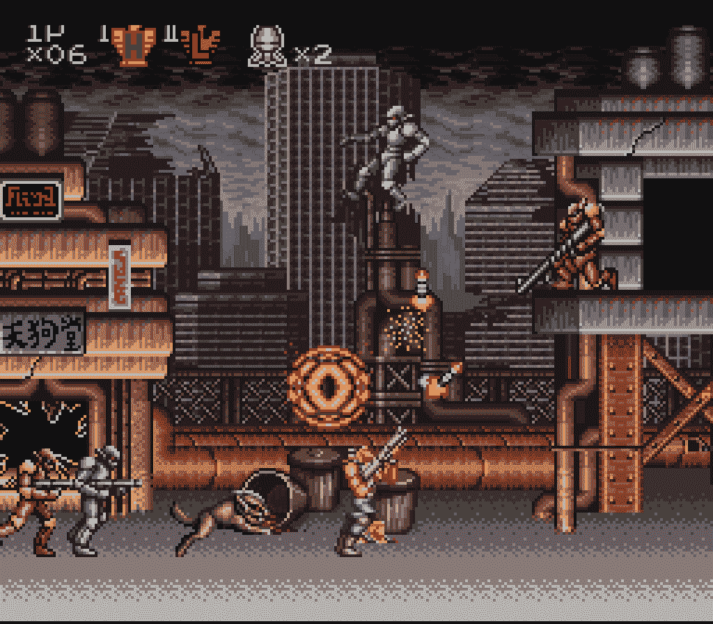](https://web.archive.org/web/20230327200802/https://techcrunch.com/wp-content/uploads/2017/09/contra-iii.png) 锡上到底写着什么。野蛮，爆炸性的 2 人行动，完全奇怪的自上而下的模式 7 阶段。

**专业提示**:蔓延仍然规则，但你的默认武器实际上是体面的。

## RPG

**最终幻想三(六)** 

《最终幻想》实际上是第六部，但只是在美国上映的第三部，这仍然被许多人认为是该系列的巅峰之作。一个跨越世界的故事；不同能力、个性和动机的可玩角色；秘密和支线任务丰富；像素艺术的表现力仍然令人惊叹。FFIII 问世时颇具启发性，至今仍是 16 位 RPG 时代的必要条件。

**亲提示**:不要为自己糟蹋任何东西！不到最后一刻，不要离开…让我们称它为神奇的岛屿吧。就像最后一刻。当它发生的时候你会知道。相信我。

**法力的秘密**

[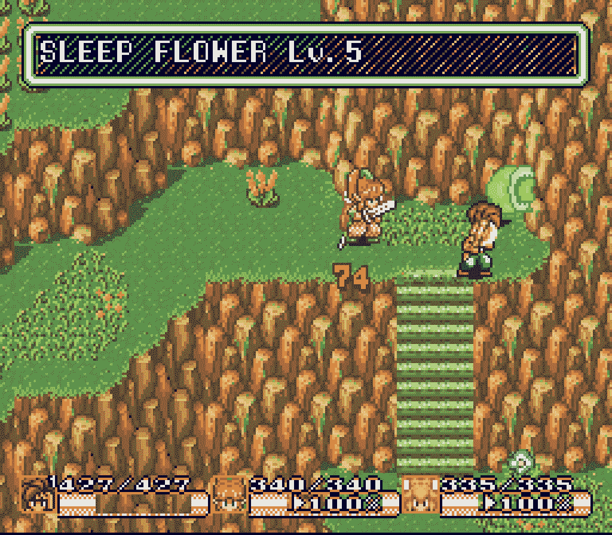](https://web.archive.org/web/20230327200802/https://techcrunch.com/wp-content/uploads/2017/09/secret-of-mana.png)Square 最值得纪念的 SNES RPG 中的第二个(超时空触发器将是第三个)，法力的秘密是第一个真正无愧于这两个头衔的动作 RPG 之一。虽然它的魔法系统被打破了，但游戏的其余部分非常可爱，玩起来超级有趣。另外你可以带一个朋友来，这很好，因为你的同伴的 AI 相当糟糕。

专业提示:用所有的武器练习，因为你永远不知道在给定的场景中哪一个是你最强大的。

**超级马里奥 RPG**

比 Square 的票价更轻松的是，SMRPG 尝试了一些新奇的东西，并立即成为经典。主动战斗是有趣的，探索世界是一种乐趣。

**专业提示**:在早期尽可能多地使用马里奥的跳跃“咒语”来给它充电，以后它会成为你的救命稻草。

**接地**

好吧，我把这个放在最后是有原因的:这是我失去信用的地方。事实是我已经等了很多年来玩 Earthbound，因为我希望它会有一个像样的官方重新制作。然而，既然我已经获得了 SNES CE，我就要去争取——你也应该这样做。一直听说这个系列有多精彩，很期待。

**专业提示**:告诉任天堂把续作带过来！

* * *

结束了！

你有没有向下滚动到这里，寻找是否购买这个东西的建议？我的推荐是*地狱是的*。这里有数百小时的令人惊叹的游戏，几乎适合每一种口味(只要你的口味是 16 位任天堂游戏)。80 美元买这一切真是太便宜了。*