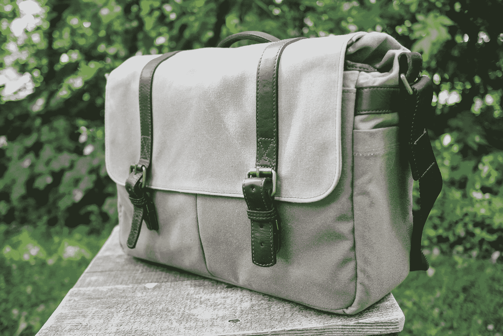
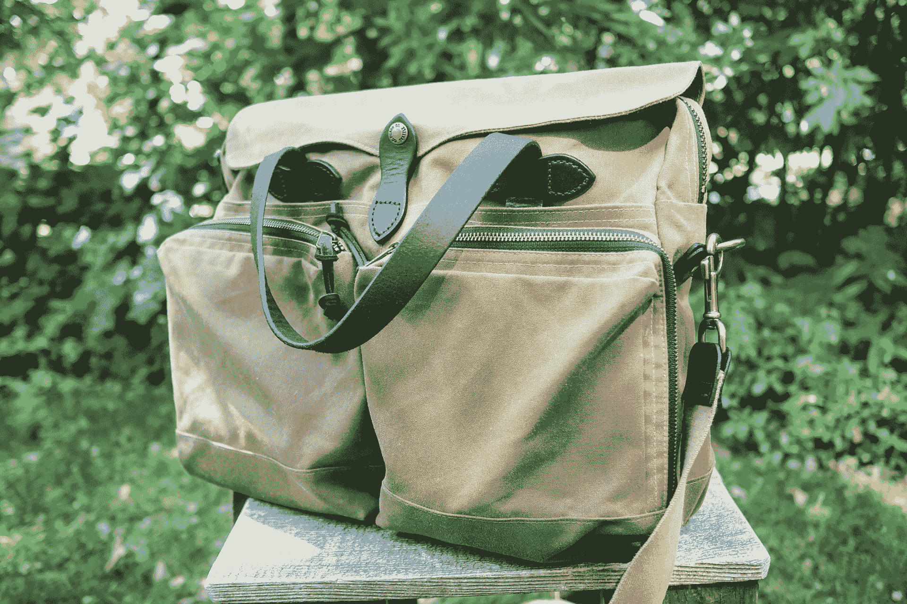
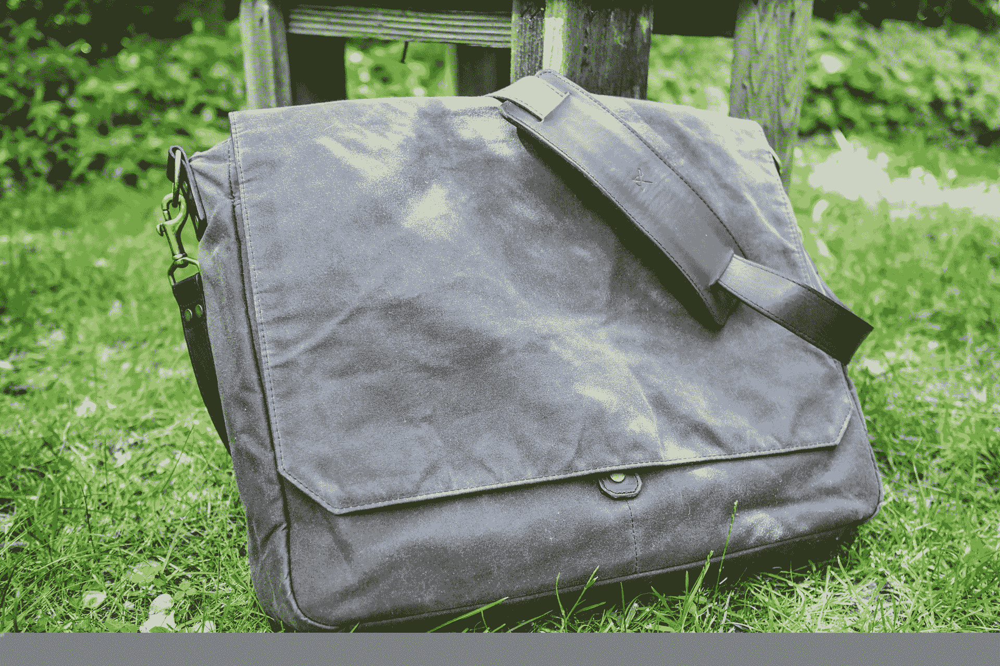
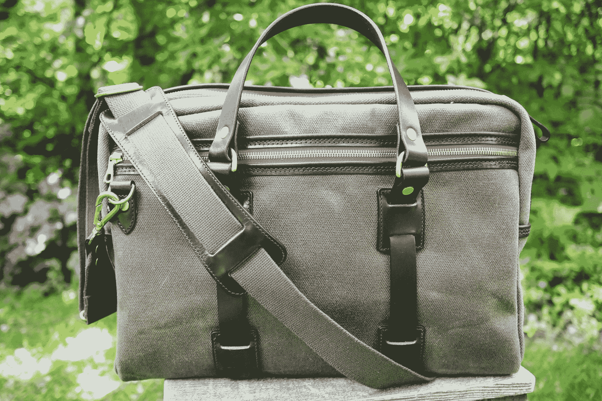
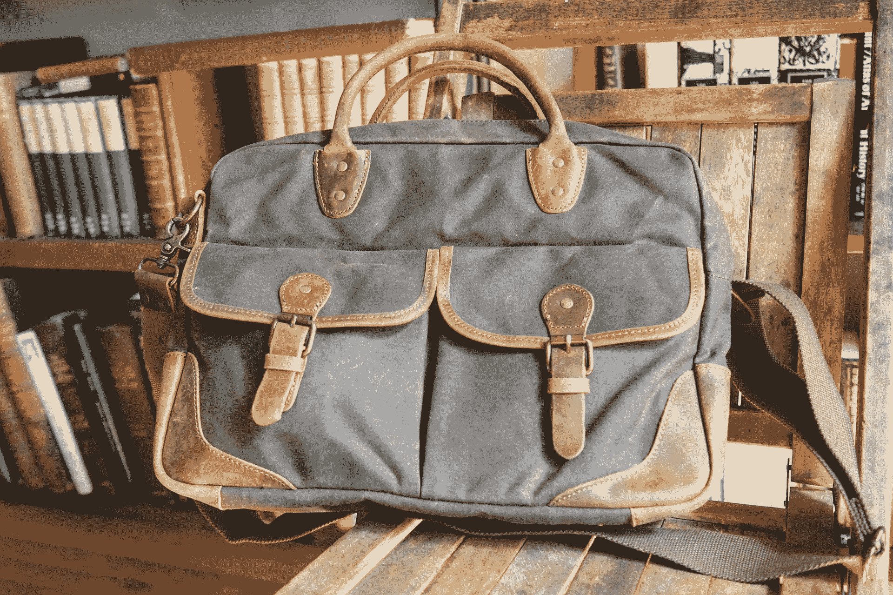

# 点评:Filson、Ona、Croots 等品牌的蜡制帆布包 

> 原文：<https://web.archive.org/web/https://techcrunch.com/2018/06/20/review-waxed-canvas-bags-from-filson-ona-croots-and-more/>

欢迎来到 2018 年[包包](https://web.archive.org/web/20221025222420/https://techcrunch.com/tag/bag-week-2018/) 周。每年，你在 TechCrunch 的忠实朋友都会花整整一周的时间来看包包。为什么？因为包——经常被忽视，但装满了我们重要的电子产品——是我们技术风格的外在表现，我们很少考虑在哪里保存我们最珍贵的财产。

如果你在寻找一件好的夹克或包包，你有自己的材料选择:皮革、厚重的尼龙、防水的合成纤维织物，比如 Gore-Tex……但在我看来(而且不是一点点),它们中的王者是上蜡的帆布。柔韧但有保护性，防风防水但透气，开始很帅但有自己的特点，对我来说，上蜡的帆布达到了属性的完美平衡。我把自己披在上面，如果是包，就把它披在自己身上。

主要的警告是它并不便宜——当然，你可以在亚马逊上花 30 或 40 美元买到一个包，但如果你想要一个可以用很多年的东西，并且随着时间的推移越来越好，你会花更多的钱。

这里的包很贵，但就像皮革一样，工艺和材料质量对你最终得到的是一件不断变质的物品还是一件独立的物品至关重要。就像许多事情一样，你付出什么就会得到什么——当然，在一定程度上。

我从各种各样的生产商那里收集了一些包，并在过去的几个月里，在日常使用和外出旅行中尝试了所有的包。我关注的是“适合一个中型笔记本电脑，有空间放几本书和一个相机”的尺寸，但许多制造商有很多品种可供选择。

查看每个包下的图库，看看我挑出的好的或令人不快的例子。(由于我们系统中的一个错误，画廊都很高。别担心。)

### ONA 联合街(299 美元)和布里克斯顿(289 美元)

**优点:**刚性和填充，可定制的分隔，漂亮的按扣

**缺点:**廉价感的内饰，笨重，可以更蜡

Ona 的包，至少这些包，比其他包更针对笔记本电脑和相机的组合，有额外的填充物和内部隔板，用于放置身体和额外的镜头。

几年前，在之前的包包周期间，我回顾了联合街，我非常喜欢它，所以我决定买一个。它是这两个包中较大的一个，可以装一台 15 英寸的笔记本电脑和一台带额外镜头或两个小镜头的 DSLR。

不仅整个内部衬有衬垫，而且分隔物也有衬垫，主翻盖本身也很坚固，有助于保护我的装备免受摔踢。底部虽然也有衬垫，摸起来也很柔软，但已经经历了多年的快速移动和放置在崎岖的地形上。

我喜欢弹簧自锁搭扣，尽管当我第一次拿到包时，我确信它们会是第一个失败的东西。七年过去了，拍了成千上万张照片，它们仍然很强大，当我担心其中一张会出问题时(事实并非如此)，Ona 很高兴地给我送来了一张新的。

它是我很长一段时间的备用，我现在还保留着它。它在某些方面老化得很好，但在其他方面就不那么好了——它打蜡的正面经受住了多年的刮擦和沿地板滑动，非常光滑，仍然防水。我不知道他们是怎么做到的。另一方面，有些地方已经磨出了洞，固定后挡板的磁铁(一个聪明的想法)最终钻了出来。

较新的感觉很轻蜡，但我知道它在那里。也就是说，如果你想要完整的蜡状外观和感觉，它可以使用更多。真的是口味问题。

[gallery ids="1660239，1660237，1660238，1660236，1660241，1660240"]

内部是最薄弱的环节。对我来说，毛绒绒的内部感觉很便宜(尽管它不可否认地具有保护作用)，没有内部口袋，Velcro 隔断的反复粘贴和松开会在某些地方磨损材料。虽然能够定制内部空间对摄影师来说非常宝贵，但在我看来，几个强有力的内部决定会使它成为一个更好的通用包。

Brixton 是 Union Street 的小兄弟，配备了一台 13 英寸的笔记本电脑，摄像头也少了一些。它们有许多共同的品质，包括价格(只有 10 美元的差异)，最终决定是你需要什么，而不是哪个更好。

对我来说，这是一个掷硬币的决定。我喜欢 Brixton 外部开放的独立口袋，用于存放过滤器和电缆等物品，但 Union Street 的拉链前袋更适合存放钢笔、电话和更贵重的东西。就我个人而言，我更喜欢联合街的外观，它有铆接的皮带和不间断的蜡帆布盖。

如果我必须选择，我会再次选择联合街，因为它并没有大到变得累赘，但额外的空间可能会决定是否需要打包第二个包。

### 菲尔森 24 小时锡制公文包(395 美元)

**优点:**多才多艺，做工精良，有保证，宽敞

**缺点:**较轻的材料和蜡，松软的把手，风暴襟翼吹毛求疵

一个多世纪以来，Filson 一直是西雅图的备用产品，其标志性的蜡帆布夹克覆盖了臀部、户外运动者和游客的身体。他们最实用的包是这个，[24 小时锡制公文包](https://web.archive.org/web/20221025222420/https://www.filson.com/24-hour-tin-briefcase.html)，顾名思义，它更像是旅行包。

这个包有一个大的主隔间，有一个填充的笔记本电脑区，可以轻松容纳 15 英寸的笔记本电脑，里面有几个口袋，可以放置牙刷和笔等。外面是一对大尺寸的拉链口袋，可以从顶部或侧面打开；里面是组织条和分袋，用来装笔等等。

这绝对是我试过的包中最好的多面手——无论是在家里当日常司机还是在机场都一样。本质上，它是完美的“个人物品”随身携带。当我出门旅行时，我总是会带上这个包，因为它适应性很强。虽然它看起来有点笨重，但当它没有装满时，它会很好地变平，但当它被紧紧地包装起来时，它看起来并不奇怪。

[gallery ids="1660230，1660234，1660231，1660229，1660227，1660226，1660224"]

Filson 的一个好处是，如果它出现问题或出现故障，我是说永远不会，你可以把它带进去，他们会免费修理或修补它。我已经用我的夹克做到了这一点，100%棒极了。泪水留下的伤疤造就了更多的性格。

另一方面，与许多菲尔森产品不同，这款产品感觉只有轻微的打蜡。如果你想要更多的保护免受雨淋，你会想自己添加一些蜡，而不是每个人都想做的事情。你最终会重新给这些包打蜡，但是这个看起来需要马上打蜡。这种材料比其他一些袋子轻一点，但这可能是一个加号或减号。我不介意它更结实一点，就像他们的“粗糙斜纹”

把手做得很好，也很厚，但是在不需要的时候会掉下来。覆盖顶部拉链的防风盖虽然很受欢迎，但感觉好像扣在了错误的一侧——这使得装上或拆下它成了一件双手的事情。当它没有装满的时候，这个包可能会有点走样——它并没有真正准备好进入董事会。为此，你想下面的克鲁茨或欧内斯特亚历山大。

### 欧内斯特·亚历山大·沃克和哈德森——385 美元

**优点:**质地和颜色都很棒，款式细节不错，低调

**缺点:**哈德森路上不切实际的关闭，沃克的空间有限，看起来有点折中

注意:我试了这个制造商的两个包，不幸的是这两个包都卖完了。我问他们什么时候会回到市场上，但现在你可以把这个评论作为欧内斯特·亚历山大包质量的一般指标。

我一开始就喜欢的是[沃克](https://web.archive.org/web/20221025222420/https://www.ernestalexander.com/collections/messenger-bags/products/walker-wax-messenger)；它有一个令人愉快的光滑，最小的外观，材料漂亮的巧克力色已经开始穿得很好。但是打开盖子，你就有了这个可爱的蓝色精细画布(也有一个相反的方案)。对我来说，这是所有包中最精致的一款。我喜欢外面没有摁扣、夹子或任何可见的东西——只有一大片美丽的材料。

这是一个细长的包，但并不局限于此；如果你需要携带的东西不笨拙或不笨重，那里面就有足够的空间。书籍、带平面镜头的无反光镜相机、笔记本电脑——当然。但你绝对不是在装一套备用衣服或一些杂货。

小型拉链外袋非常适合放电话或电缆，而深的内袋和外袋很容易拿取，而且相对宽敞。如果你控制你的装载量，这里有足够的空间放很多东西。

[gallery ids="1660219，1660221，1660218，1660222，1660217，1660216"]

不幸的是，如果你*不*控制它，袋子很容易弯曲变形。因为顶部的盖子在中间与底部相连，如果装得太满，整个东西会笨拙地鼓起，顶部会翻出来。唉，背带往往会拉拽翻盖，使其两侧向上拉离夹子。甚至不要试图拿起它与皮瓣分离。

将夹子放在翻盖下面也是一个复杂的过程——你必须抬起一边才能够到它，因为环在不使用时会翻下来，所以将两部分放在一起就变成了双手操作。一个更坚固、更固定的环会使这变得更容易。但这都是打着风格的旗号，圆滑的外表或许可以弥补这些挑剔的方面。

斜跨肩带有很多额外的材料，但我把它打成了一个整洁的小结。实际上，我认为它工作得很好。

较大的 [Hudson](https://web.archive.org/web/20221025222420/https://www.ernestalexander.com/collections/messenger-bags/products/hudson-wax-messenger) messenger 我准备喜欢，但最终无法推荐。从理论上来说，它很棒，有磁性口袋盖，有大量的空间，是学步车的简单性和 Filson 包的多功能性的结合。但是封闭系统太麻烦了。

这是一个简单的腰带样式的两条带子，如果你经常打开和关闭包，反复这样做是一个巨大的痛苦。与 Ona closures 相比，它将速度与皮带式调节的灵活性结合在一起，只需要永远进入哈德逊。如果他们针对这一点对这款包进行了修改，我会衷心推荐这款包。

### Croots 英格兰复古帆布笔记本电脑——500 美元

**优点:**造型美观，填充精良，做工精良，用料上乘

**缺点:**软皮手柄，磨损不均匀，笔记本电脑隔层，价格昂贵

有一次在野外遇到了一个 Croots 包，我知道我必须把这个长期打蜡的帆布球员包括在内。克罗茨打蜡帆布不像菲尔森或 ONA 那么油，更像厚重的帆布。它摸起来非常结实，并且能很好地保持形状。然而，这是在光谱的高端。

也就是说，由于其硬度，[复古帆布电脑包](https://web.archive.org/web/20221025222420/https://crootsengland.co.uk/shop/range/vintage-canvas/vintage-canvas-laptop-bag.html)似乎想在突出的地方过早磨损，比如缝线附近的角落或褶皱。磨损过程将这种材料从光滑、近乎弹道般的尼龙质地转变为粗糙模糊的质地，对此我不太确定。仅仅使用了几个星期，老化就已经让我有点担心了，但它也是非常厚的画布。

这个设计比欧内斯特·亚历山大的包要复杂一些，但是非常漂亮，而且非常实用。我喜欢橄榄色，它与拉链的红色衬背形成了美丽的对比。一点也不像圣诞节，别担心。

皮带是一个突出的特点。厚厚的皮革手柄连接在拉链和后口袋下方的 D 形环上，D 形环又连接到整个包下的独立皮革肩带上。首先，这意味着手柄很容易向下翻转，因为 D 形环在它们的环中旋转。铆接结构也意味着整个表带组件无需担心缝合问题。环的底部对下面的帆布起到了一点基本的保护作用。

[gallery ids="1660207，1660206，1660210，1660211，1660212，1660209，1660208，1660204，1660214"]

这也意味着当你走路的时候，外侧的把手倾向于不优雅地拍打着侧面；内侧的，向上或向下，会摩擦你的侧面或背部。然而，你可以花点力气把它们放进侧袋里，这是一种体贴的做法。

内部是一个可爱的红色阴影，有几个大的宽松的口袋和一些笔记本等硬皮革口袋。不幸的是，笔记本电脑的口袋比例失调:它非常宽敞，足以容纳三到四台笔记本电脑，但关闭它的按钮太低了，我无法将它固定在一台 13 英寸的 MacBook Pro 上。认为它可以容纳 15 英寸的想法是可笑的。

不过，有很多填充物，所以我不担心周围会有什么东西碰撞。还有一个单独的相机插入选项，尽管大型单反用户可能会想要放大。

那里没有太大的空间，但这绝对是一个日常司机公文包，而不是过夜包——也许是飞机上的“私人物品”，但出于空间原因，我会选择菲尔森或 ONA。然而，作为一个包带去工作的咖啡馆，或书店，这是一个伟大的选择，一个惊人的。[飞行包](https://web.archive.org/web/20221025222420/https://crootsengland.co.uk/shop/range/vintage-canvas/flight-bag.html)是一个稍微更昂贵和独特的选择。

### 动感地带——30 美元

**优点:**价格、磁性搭扣、皮革边缘细节

**缺点:**廉价的内饰和皮革，笔记本电脑的填充物很少

为了平衡这篇评论中公认的非常昂贵的包，我决定也从亚马逊上买一个便宜的。正如我所料，它没有达到其他产品的质量水平，但 30 美元很便宜。如果你想体验上蜡帆布的演变和磨损，像这样一个便宜的包是一个很好的尝试。

[S-Zone 的](https://web.archive.org/web/20221025222420/https://www.amazon.com/gp/product/B01H6XP56M/)面料有点薄，但很结实，一开始有点僵硬，但没关系——在你使用包时会变松。然而，内部是一种廉价的合成材料——它会工作，但你不会感觉像皇室成员一样使用它。

到处都是皮革细节，有些地方感觉很结实，比如肩带的附件和角落，那里有很大的补丁，可以很好地磨损。但是手柄感觉像是等待发生的麻烦。

[gallery ids="1660249，1660246，1660244，1660247，1660243，1660248，1660245"]

皮革本身已经被放松，而不是 D 形环来允许它向下翻转，因此它在连接处上方具有额外的柔韧性。下来的时候，包着手柄皮的细绳子就露出来了；我只能看到它被浸湿，弯曲，再浸湿，弯曲，变得越来越弱。

前面的口袋有点紧，但我喜欢这个小小的磁性按扣——不用看就能轻松打开和关闭。只是小心不要塞太多东西在里面，否则搭扣承受不了压力。里面的空间很大，比克鲁茨或欧内斯特·亚历山大大，但比 ONA 或菲尔森小。

但是还有一个奇怪的设计选择，就是将填充物放在笔记本电脑部分的分隔物中，而不是放在外面。皮革边角部分刚好在它前面！这意味着笔记本电脑的角落和地面之间唯一的东西就是尼龙和帆布——它们并不能起到多大的缓冲作用。虽然其他包在这一区域没有专门的衬垫，但它们似乎都能更好地缓解这一问题，S-Zone 包将您的笔记本电脑置于最危险的撞击地面的位置。

* * *

希望这些东西的高价格不会让你失去兴趣——关注销售，你甚至可以以巨大的折扣买到这些高端产品(这就是我自己能够买得起它们的原因)。

你有什么建议让我们下次做包包周的时候看看这些系列的包包吗？在评论里告诉我！

