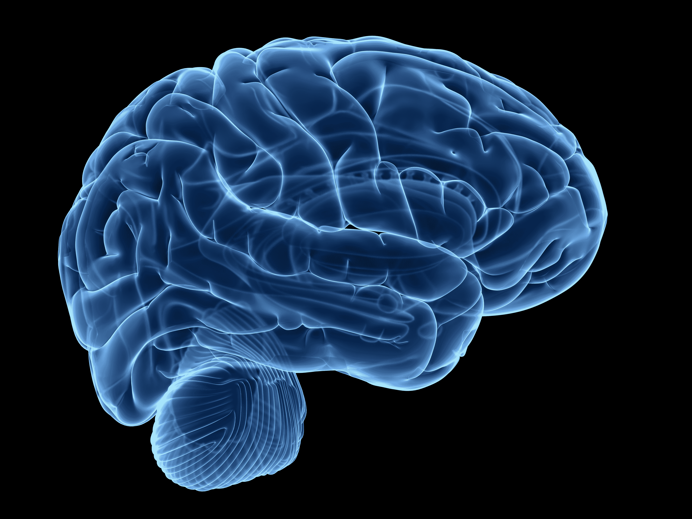
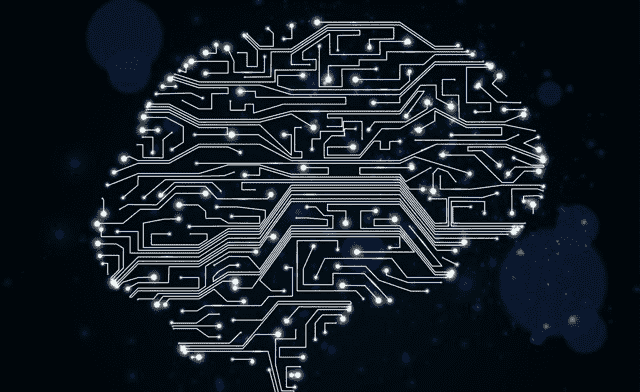
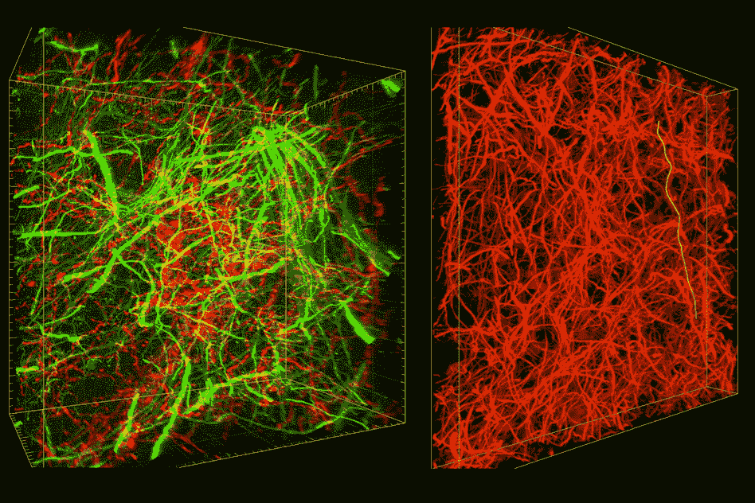

# 修正去年的研究结果，Posit Science 仍然有效地对抗痴呆症 

> 原文：<https://web.archive.org/web/https://techcrunch.com/2017/11/16/revising-the-results-of-last-years-study-posit-science-still-effectively-combats-dementia/>

来自顶尖大学的研究人员修正了他们长达十年的头条研究结果，他们仍然相信应用程序开发商 [Posit Science](https://web.archive.org/web/20221007134842/https://www.brainhq.com/) 的大脑训练实际上可以降低老年人患痴呆症的风险。

这项开创性的研究对于治疗与衰老相关的神经系统疾病仍然具有不可思议的意义，并有助于验证基于应用的治疗作为一种治疗和预防干预的使用。

尽管[美国的痴呆症发病率正在下降](https://web.archive.org/web/20221007134842/https://www.nytimes.com/2016/11/21/health/dementia-rates-united-states.html)，但去年仍有 400 万至 500 万美国人接受了痴呆症治疗。

这种疾病在美国是最昂贵的——2010 年，美国国家老龄研究所的一项研究被《纽约时报》引用*估计，2010 年，痴呆症患者每年花费医疗保健系统高达 2150 亿美元——超过心脏病和癌症，分别花费 1020 亿美元和 770 亿美元。*

现在，修改后的研究结果已经发表在阿尔茨海默氏症协会的同行评审杂志[阿尔茨海默氏症&痴呆症:转化研究&临床干预](https://web.archive.org/web/20221007134842/https://www.journals.elsevier.com/alzheimers-and-dementia-translational-research-and-clinical-interventions/)上。他们指出，在教室环境中进行的大脑训练可以显著降低老年患者患痴呆症的风险。

图片:塞巴斯蒂安·考利茨基/盖蒂图片社

来自印第安纳大学、宾夕法尼亚州立大学、南佛罗里达大学和现代治疗学的研究人员进行了为期十年的研究，跟踪了 2802 名健康的老年人(平均年龄为 74 岁)，他们经历了三种不同类型的认知训练。

这项随机研究把一组人放在教室里，教他们不同的记忆增强策略；另一组接受基本推理技能的课堂训练；而第三组在课堂上接受个性化的电脑化大脑训练。对照组没有接受任何训练。

认知训练组的人在研究的前五周接受了 10 个小时的训练。六周后，他们接受了测试，并在 1 年、2 年、3 年、5 年和 10 年后接受了后续测试。

一小部分参与者在第一年和第三年评估前的几周接受了较小的强化治疗。

十年后，研究人员没有发现对照组和推理或记忆策略组的参与者之间痴呆症发病率的差异。但大脑训练组显示出明显的差异，研究人员发现，接受计算机化训练的那组痴呆症发病率降低了 29%。

“与对照组相比，相对少量的训练在 10 年期间使患痴呆症的风险降低了 29%，”文章的主要作者、南佛罗里达大学医学院教授 Jerri Edwards 博士在一份声明中说。"而且，当我们观察剂量反应时，我们发现那些训练越多的人得到的保护越多."

为了将这项研究放在背景中，佛罗里达的研究人员比较了与大脑训练相关的痴呆症风险降低与降压药对心力衰竭、心脏病或中风的风险降低。他们发现，相比之下，大脑训练的效果要高两到四倍。

Posit Science 的首席执行官 Henry Mahncke 博士在一份声明中说:“没有健康专家会建议任何高血压患者放弃处方药提供的保护。”“我们预计这些结果将促使医学界更加密切地关注这些锻炼对老年人和临床人群的保护作用。”

这项研究部分由美国国立卫生研究院资助进行，作为其独立和重要老年人高级认知训练研究的一部分，并完善了去年发表的早期研究。

Posit Science 的大脑训练练习最初是由伯明翰阿拉巴马大学的 Karlene Ball 博士和西肯塔基大学的 Dan Roenker 博士开发的。

该公司拥有这项练习的独家许可，这项练习要求用户识别同时显示的视野中心和周边视野中的物体。当用户正确识别对象时，呈现图像的速度会加快。

这并不是第一项显示 Posit Science 的大脑训练技术如何帮助神经疾病的研究。

10 月，发表在《临床精神病学杂志》上的一份报告显示，大脑训练可以改善双相情感障碍患者的认知能力。基于哈佛医学院和麦克林医院的研究，这项研究发现，使用 Posit Science 的 BrainHQ 应用程序推动了双相患者整体认知能力测量的改善。

“记忆、执行功能和处理速度的问题是双相情感障碍的常见症状
，对个人的日常
功能和整体生活质量有直接的负面影响，”首席研究员伊夫·莱万多夫斯基博士说，他是麦克林精神分裂症和双相情感障碍项目
之一的临床编程主任
，当时是哈佛医学院的助理教授。“改善这些认知功能障碍对于帮助双相情感障碍患者提高他们在社区中茁壮成长的能力至关重要。”

这两项研究都很重要，都证实了一个论点，即基于计算机的治疗和干预可以在治疗和预防神经疾病方面发挥作用。

它们也有助于对抗伪科学解决方案和叫卖者对市场上其他大脑训练产品的虚假宣传。例如，大脑游戏制造商 Lumosity 不得不为美国联邦贸易委员会的虚假广告支付 200 万美元的罚款。

但是，像与英国国民医疗服务体系合作的 [MindMate](https://web.archive.org/web/20221007134842/http://www.mindmate-app.com/) 或剑桥研究人员开发的[Game On 这样的应用程序，在帮助缓解或抵消痴呆症的发作方面显示出真正的前景。](https://web.archive.org/web/20221007134842/https://www.alzheimers.net/brain-training-game-show-app-improves-memory/)

马赫克博士说:“现在有超过 100 项同行评议的研究，对不同人群进行大脑锻炼和评估的好处。”“基于神经可塑性的机制推动这种类型的训练在大脑中产生有益的变化，这种机制得到了很好的证明，甚至越来越多地被没有直接参与其开发的大脑科学家所理解。这种类型的训练利用可塑性，让大脑进入一个向上的螺旋，朝着更好的身体和大脑功能健康发展。”