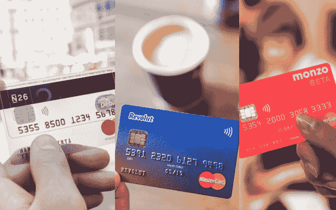

# Revolut 将移动银行与加密货币交易相融合

> 原文：<https://web.archive.org/web/https://techcrunch.com/2017/12/05/revolut-cryptocurrency/>

Revolut 正在合并传统银行和加密货币，让您可以购买、出售、交易和持有比特币、莱特币和以太以及 25 种世界法定货币。这家获得 9000 万美元融资的移动银行初创公司正试图消除新旧资金之间的鸿沟。

Revolut 的首席执行官 Nikolay Storonsky 今天在 [TechCrunch 的 Disrupt 柏林会议](https://web.archive.org/web/20230307142249/https://techcrunch.com/event-info/disrupt-berlin-2017/)上宣布，加密货币交易将于周四向所有 Revolut 用户开放。如果你通过 Revolut 的借记卡消费，并且用完了法定货币，它会自动将必要数量的加密货币转换为法定货币，以资助你的交易。

“尽管是目前世界上最热门的趋势之一，但众所周知，接触加密货币既耗时又昂贵，”斯托龙斯基写道。

此举是因为加密货币在世界眼中变得越来越合法，此前比特币每枚突破 1 万美元，传统期货交易所准备在本月允许比特币期货交易。

虽然加密货币可能被视为脱离 Revolut 核心业务的利基产品，但 Storonsky 认为加密正在成为主流，并将很快成为所有银行业务的重要组成部分。他举例说，在 Revolut 为期一周的加密测试中，1 万名客户交易了 100 万美元的加密货币。

Revolut 首席执行官尼古拉·斯托龙斯基

当该功能于周四向所有用户开放时，Revolut 承诺提供最具竞争力的加密交易费率，仅收取统一的预付 1.5%的费用，而没有其他隐藏费用，在其他平台上，这些费用可能高达 5%至 9%。客户将能够通过 Revolut 的所有基础货币进行购买，因此如果你想以瑞士法郎购买，就不需要额外的外汇费用。

在短短两年内，Revolut 在欧洲注册了超过 100 万用户，处理了 4200 万笔交易，并声称为客户节省了 1.6 亿美元的外汇费用。它发展迅速，新客户注册率比三个月前翻了一番。虽然 N26 和 Monzo 等现代化借记卡市场有很多参与者，但 Revolut 还允许您每月以 16 种货币向€汇款 5000 英镑，而不收取任何费用。

随着这些创业公司争夺位置，他们都在寻找差异化优势。拥抱加密货币可能会吸引金融科技的早期采用者使用 Revolut。