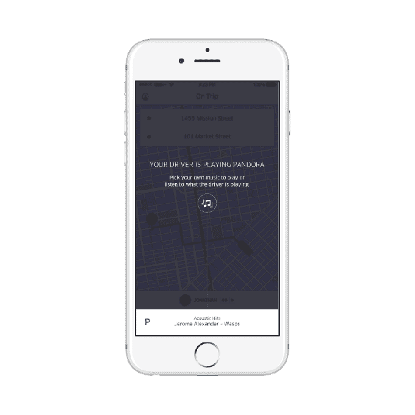
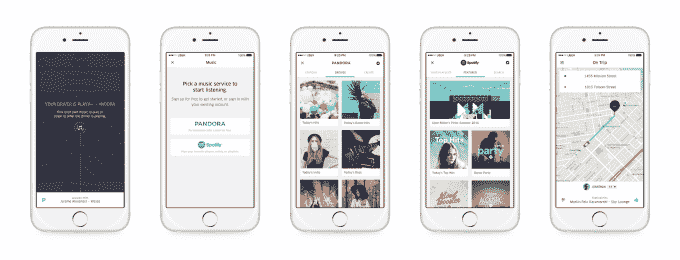

# 骑手们现在可以在他们的优步 TechCrunch 上观看来自潘多拉的视频

> 原文：<https://web.archive.org/web/https://techcrunch.com/2016/09/08/riders-can-now-stream-from-pandora-in-their-uber/>

优步今天上午[宣布](https://web.archive.org/web/20221006075446/https://newsroom.uber.com/ridermusic/)扩大与 Pandora 的关系，这将使音乐服务与 Spotify 一起集成到优步骑士移动应用程序中。美国、澳大利亚和新西兰的优步用户现在可以从优步应用程序访问他们的 Pandora 帐户，以便在车内收听他们自己喜欢的电台和艺术家。这家打车公司曾在 2014 年[宣布](https://web.archive.org/web/20221006075446/https://beta.techcrunch.com/2014/11/14/uber-music/)与 Spotify 达成类似协议。

[今年 6 月](https://web.archive.org/web/20221006075446/http://press.pandora.com/phoenix.zhtml?c=251764&p=irol-newsArticle&ID=2180154)，[优步与潘多拉](https://web.archive.org/web/20221006075446/https://beta.techcrunch.com/2016/06/27/pandora-hopes-youll-listen-to-more-stations-in-an-uber/)合作，将音乐服务引入司机的应用程序，允许他们直接从他们自己的优步应用程序中播放音乐，创建电台，竖起大拇指点歌，发现新的艺术家。

有趣的是，现在优步的车手和车手都可以从 Pandora 播放音乐，这就出现了音乐冲突和电台接管的情况。也就是说，优步车手可以启动应用程序，查看他们的司机正在播放哪些电台，然后登录自己的潘多拉账户，根据自己的喜好改变曲调。

这看起来可能会让司机感到厌烦——毕竟，当 Spotify 合作关系首次宣布时，有些人担心让乘客选择音乐会让司机失去人性。

但另一方面，出于礼貌，今天许多司机确实会问乘客音乐是否可以，或者乘客是否想听另一个电台。通过提供连接 Spotify 或 Pandora 的能力，优步应用程序只是将这种切换体验数字化，即使它并没有消除对相关社交细节的需求。(你懂的，还是先*问*好。)

潘多拉表示，自从在优步司机应用程序中推出以来，司机已经播放了超过 400 万小时的音乐——6000 万首歌曲——最受欢迎的电台是德雷克、未来、碧昂斯、阿黛尔和布鲁诺·马斯。

要在骑手端使用这项新功能，你需要预订一台与音乐相关的优步。这意味着司机必须通过 AUX、蓝牙或 USB 连接他们的手机；然而，他们不需要有自己的潘多拉账户，也不需要目前正在播放音乐。

当司机在路上时，你会看到选项出现，为你的旅程选择音乐。如果驱动程序已经在播放 Pandora，你可以看到他们在播放什么。然后你可以点击屏幕底部的音乐栏，登录 Pandora，选择你的电台。当你上车时，你的音乐就会开始播放。

这也是骑手可以像以前一样选择与 Spotify Premium 帐户联系的方式。Spotify 整合现已在所有 59 个有音乐服务的市场上线。

优步说，骑士音乐目前只在 iOS 上可用，Android 支持将在未来的版本中推出。