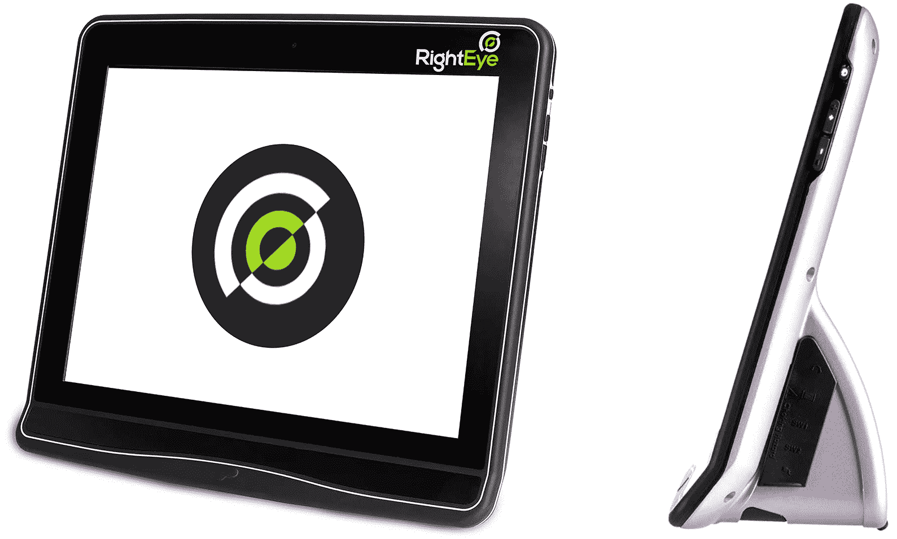
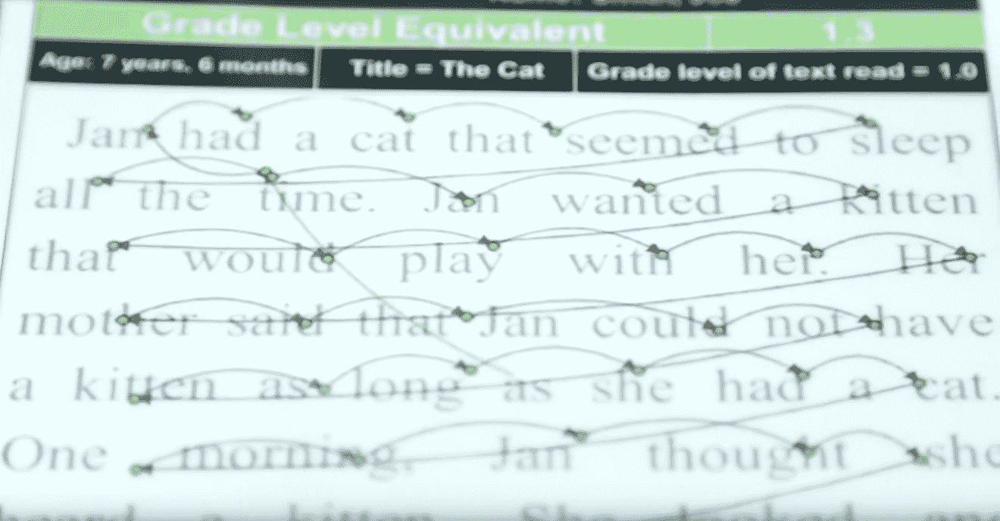
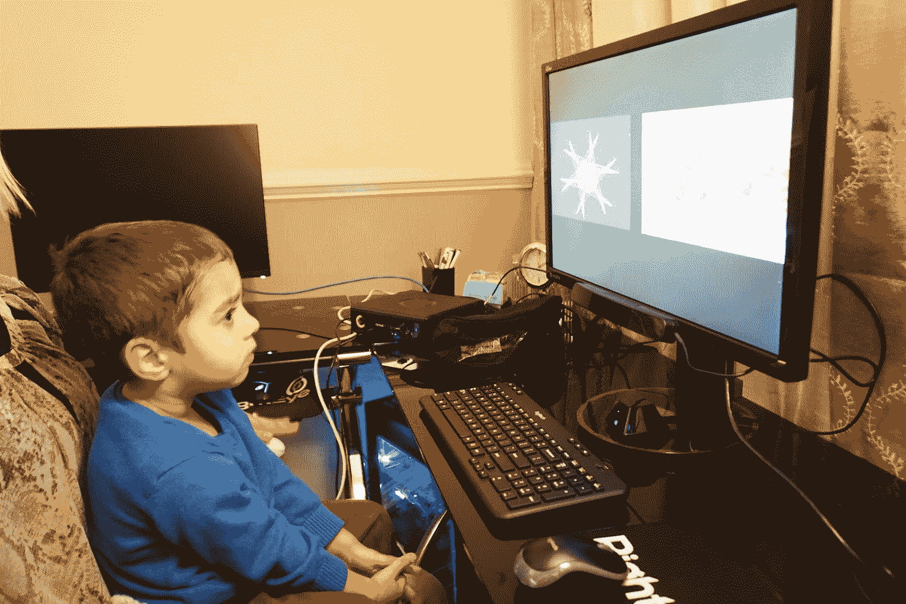
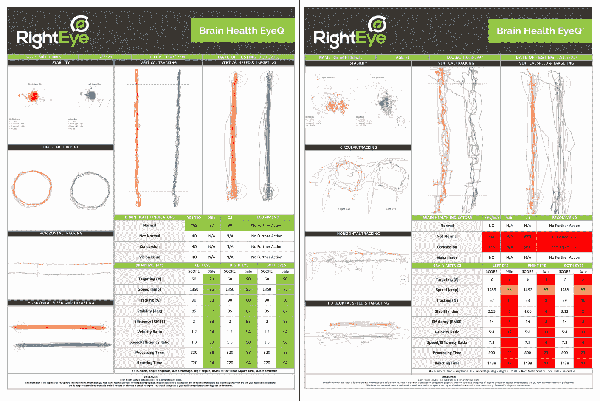

# RightEye 的便携式眼球追踪测试在五分钟内捕捉到脑震荡和阅读问题 

> 原文：<https://web.archive.org/web/https://techcrunch.com/2018/02/17/righteyes-portable-eye-tracking-test-catches-concussions-and-reading-problems-in-five-minutes/>

他们说眼睛是心灵的窗户，但从生理学角度来说，它们其实是大脑的窗户。

[右眼透过那扇窗户](https://web.archive.org/web/20221207024435/https://www.righteye.com/)来检测由脑震荡和其他脑部问题引起的常见但往往很微妙的视力问题。它的快速便携式眼球追踪站可以在几分钟内告诉你是否应该去看医生——或者考虑成为一名职业球员。

事实证明，从一个人的眼球运动可以看出很多东西。我们自己可能没有注意到，但我们在执行一些基本任务的方式和表现方面都有所不同，从来回扫视眼睛到平稳地跟踪移动的目标。例如，当沿着直线移动时，你的眼睛可能会过度矫正，不能正确排列，或者上下移动。

对于健康的个体来说，这些变化在安全范围内，只是身体之间普通差异的一部分。但是，某些远远超出基线的模式可能是脑震荡和眼肌问题等疾病的强有力指标，甚至是帕金森和自闭症谱系障碍。

 RightEye 用一个看起来有点像一体机的定制设备追踪这些动作；它使用了一个 [Tobii 眼球追踪模块](https://web.archive.org/web/20221207024435/https://beta.techcrunch.com/2017/02/19/unlocking-the-potential-of-eye-tracking-technology/)，内置于一台装载了简单测试库的专用计算机中。一个基本的 EyeQ(他们称之为 EyeQ)测试需要五分钟左右，更专业的测试只需要增加几分钟，结果就可以立即得到。

给你一个想法:一个游戏形式的测试让你保卫一个空间站，通过观察摧毁来袭的飞船。但是某些颜色的飞船你不能摧毁——这意味着你必须在你的周边视觉中发现它们，并且避免看它们。在另一项测试中，你在屏幕相对两侧出现的两个目标之间快速扫视眼睛，展示准确性和功能性迅速扫视(由你的眼部肌肉做出的微校正)。

每只眼睛都被独立跟踪，它们作为一对匹配的眼睛的表现被即时评估。一个易于理解的结果表显示了他们的实际运动，以及他们如何(如果有的话)偏离基线。

它很紧凑，可以在电池上运行大约 8 个小时，使其成为医院外部署的理想选择:从学校护士办公室到 NFL 比赛的边线，甚至在家里。

[YouTube https://youtu.be/j5tHtHl6Hy8]

我在 CES 上亲自测试了这款设备(我的视力还可以，但我想再赛一场)，后来我和 RIghtEye 的总裁芭芭拉·巴克利(Barbara Barclay)聊了聊。无论如何，从她的热情来看，这项技术最令人兴奋的两个应用是识别儿童与视觉相关的认知问题，以及为运动员创造一种视力健康测试。

假设一个孩子在学习阅读方面有困难，或者在课堂上不能集中注意力。最近一个想法是频繁添加。但很有可能是视力问题。眼睛跟踪方式的细微差异，也许是在跟踪一行文本时偏离水平方向，很容易使在页面或黑板上阅读感到沮丧甚至痛苦。哪个三年级的孩子会坚持下去？

一项以阅读为重点的测试跟踪眼睛如何沿着一行文本移动。

这并不是什么突破性的新想法——但是可靠而客观地评估个体的眼球运动只是你去看专家时才能做的事情，也许是在对一种行为的其他解释不成立之后。RightEye 的测试实际上是自动运行的，可以在几分钟内检测或消除视力问题的可能性。老实说，我觉得一个孩子可能会觉得这很有趣。

巴克利对此有亲身经历，她自己的女儿有健康问题，只有在多次错误开始后，才发现他们的根源是系统指示的相对简单的视力问题。

2016 年，RightEye 获得了一对测试的权利，这些测试基于将眼球运动模式与帕金森氏症和亨廷顿氏症以及自闭症谱系障碍联系起来的研究。这不是灵丹妙药，但同样，快速和简单的测试性质使它们成为常规筛查的理想选择。

自闭症谱系测试只针对 1 至 3 岁的儿童，观察人物图像和几何图形图像之间的眼球运动。事实证明，对形状的留恋多于对人的留恋，这是一个很好的迹象，表明至少孩子应该接受进一步的测试。

 帕金森氏症和亨廷顿氏症测试关注的是在这些疾病中发现的伴随运动退化的更好理解的模式。它们可以用于任何年龄的人，并且(使用早期的眼球追踪装置)有助于许多疾病的识别。

巴克利用一种非常不同但可能更直接有益的方式告诉我，这种测试也是一种发现另一端异常者的方法:即拥有超视力的人。

完全有可能有人可以参加测试，他们的结果将显示他们有更快、更准确的迅速扫视，更快的目标获取，以及比基线更好的连续物体跟踪。如果你是击球手、守备员、守门员、防守严密的人，这是一笔巨大的资产——几乎任何事情，真的。

健康眼球运动报告(左)和脑震荡眼球运动报告(右)的示例。

如果你是一名球探或教练，这也是一笔巨大的财富。如果洛佩兹在球场的左侧接球很好，但在右侧却不行，你可以看看他在越过他的左肩看球时，他的眼睛一直向右看，是否有跟踪球的困难。

不仅如此，如果他们有困难，你还可以在球场上测试脑震荡或其他创伤的影响。考虑到这种损伤的广泛性和反复脑震荡的巨大危险，及早检测确实可以挽救生命。

巴克利告诉我，现在有 7 支 MLB 球队正在使用 RightEye 技术进行球员评估。至于医疗方面的事情，她说公司目前有 200 个客户。新的硬件应该有助于提高这个数字。

或许更重要的是，它得到了该国最大的视力保险公司 VSP 的支持(因此也有影响力)。这既是一个巨大的信任投票，也是一个重大的进步——没有什么比知道一个系统在他们现有的保险范围内更能让人们更快地使用它。