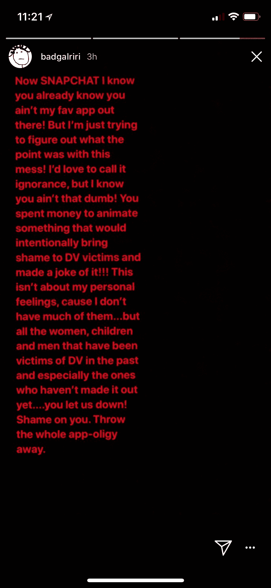

# 蕾哈娜称 Snapchat 为不重视家庭暴力的五音不全广告 

> 原文：<https://web.archive.org/web/https://techcrunch.com/2018/03/15/rihanna-calls-out-snapchat-for-tone-deaf-ad-that-made-light-of-domestic-violence/>

# 蕾哈娜呼吁 Snapchat 为五音不全的广告，使家庭暴力轻

蕾哈娜对 Snap 在 Snapchat 上播放的五音不全的广告感到不满。几天前，Snap 上出现了一则广告，暗指克瑞丝·布朗在 2009 年对蕾哈娜的暴力袭击。

这是一个名为“你愿意吗”的游戏广告，问人们是否愿意“打蕾哈娜还是打克瑞丝·布朗”Snap 已经移除了该广告，但蕾哈娜今天表示，她担心它向其他家庭暴力幸存者传递的信息。

以下是她在 Instagram 故事中所说的话:

> 现在 SNAPCHAT 我知道你已经知道你不是我最喜欢的应用程序了！但我只是想弄清楚这一团乱到底有什么意义！我很想称之为无知，但我知道你没那么傻！你花钱拍了一些故意给家庭暴力受害者带来耻辱的东西，还拿它开玩笑！！！！这不是关于我个人的感受，因为我没有太多的感受…而是关于所有在过去成为家庭暴力受害者的女人、孩子和男人，尤其是那些还没有走出家庭暴力的人…你让我们失望了！你真可耻。扔掉整个应用程序。

在给 TechCrunch 的一份声明中，Snap 首先为广告的出现道歉。当被直接问及蕾哈娜的信息时，Snap 称该广告“令人恶心”。

“我们很抱歉我们犯了一个可怕的错误，让它通过了我们的审查程序，”Snap 发言人说。“我们正在调查这是如何发生的，以便我们可以确保它不会再次发生。”

Snap 此后还阻止了《你愿意吗》的制造商在其平台上做广告。周一，当人们第一次注意到这个广告时，Snap 说它经过了审查，但被错误地批准了。

Snap 本周早些时候表示:“我们意识到这一点后，上周末就立即撤下了该广告。”。

在种族主义 GIF 出现后，Snapchat 和 Instagram 不得不取消 Giphy GIF 贴纸功能。

需要澄清的是，根据该公司的广告政策，这则广告本来就不应该被批准。以下是蕾哈娜的 Instagram 帖子:

