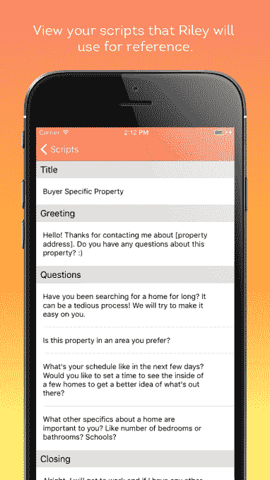

# Riley 筹集了 310 万美元来帮助房地产经纪人对他们的线索进行评级和回复 

> 原文：<https://web.archive.org/web/https://techcrunch.com/2017/05/26/riley-seed-funding/>

# Riley 筹集了 310 万美元来帮助房地产经纪人评估和回复他们的线索

企业通常花费大量时间和金钱来吸引潜在客户。现在，一家名为 [Riley](https://web.archive.org/web/20221025222551/https://getrileynow.com/) 的初创公司旨在帮助他们对这些销售线索进行优先排序。

莱利是 Y Combinator 冬季班的一员。(事实上，该公司首席执行官丹尼尔·艾哈迈迪扎德(Daniel Ahmadizadeh)表示，他和他的联合创始人赫尔松·塔维拉斯(Helson Taveras)在加入之前，曾多次申请不同的产品和创意。)这家初创公司今天宣布，它已经筹集了 310 万美元的种子资金。

当前版本的 Riley 专注于房地产经纪人。如果你看到一个使用 Riley 的代理的广告或列表，并决定向他们提供你的信息，你会在几分钟内收到代理的“办公室经理”或“助理”的短信，询问一些关于你和你在寻找什么的基本问题。

因此，即使代理人很忙或正在睡觉，潜在客户仍然可以立即得到回应。它不仅仅是一个简单的自动回复器——赖利有一个现场门房团队(Ahmadizadeh 说他们现在大多是大学生),他们按照脚本工作。随着时间的推移，随着房地产经纪人对他们的表现进行评级并审查他们的剧本，门房应该会变得更好。

每次谈话后，Riley 会告诉代理人应该先追踪哪些线索。

【T2

Ahmadizadeh 说:“当房地产经纪人早上醒来时，他们会知道应该关注哪个热门线索，而不是其他九个在半夜出现的冷门线索。”

赖利的资金来自 YC、FundersClub、Social Capital、Fuel Capital、Kleiner Perkins Caufield & Byers、Liquid 2 Ventures、Draft Ventures 和包括 WayUp 首席执行官 Liz Wessel 和 YC 的 Michael Seibel 和 Paul Buchheit 在内的天使投资人。

Ahmadizadeh 说，Riley 已经开发了软件，使门房的互动更容易，随着时间的推移，他希望自动化更多的过程——尽管即使在当前的系统下，Riley 每个月已经管理超过 10 万次对话。

此外，他最终计划扩展到与房地产经纪人的合作之外:“我们的长期想法是垂直不可知论者——不仅仅是房地产——和沟通渠道不可知论者。”