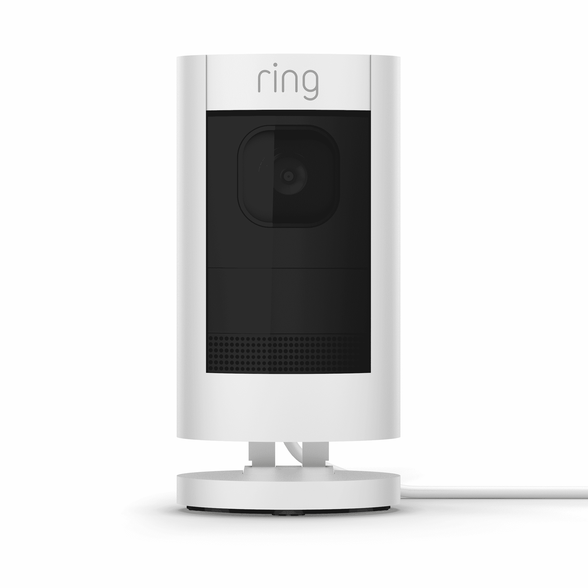

# Ring 首次推出新型室内/室外安全摄像机和 LED 照明技术 

> 原文：<https://web.archive.org/web/https://techcrunch.com/2018/01/08/ring-debuts-new-indoor-outdoor-security-cameras-and-led-lighting/>

Ring 在 CES 2018 上展出了几款新产品，包括新版本的 Stick Up Cam 安全摄像机，以及功能升级的 Stick Up Cam Elite。在收购 Mr. Beams 后，该公司还推出了新的智能照明产品，该公司致力于创造用于道路、聚光灯和其他户外用途的联网 LED 灯。

Ring 的新 Stick Up Cam 可以在室内或室外工作，具有完全不受天气影响的外壳，并且由于内置的可充电电池，它可以无线操作。它可以与 Ring 现有的太阳能电池板配合使用，如果你已经使用了一个带有原始 Stick Up Cam 的太阳能电池板，它可以提供 1080p 高清视频，通过内置扬声器和麦克风提供双向音频，以及用于运动检测的被动红外感应。

[gallery ids="1583789，1583791"]

精英版还增加了以太网电源或墙壁插座电源支持，以及有线和无线连接选项，以防您在室内或室外方便地使用电源传输以太网端口。这是一种方便的单电缆解决方案，无需充电。

环形光束 LED 灯有通道灯、楼梯灯和聚光灯三种类型，提供相对易于安装、节能的连接 LED 灯，可以轻松与您现有的环形设备(包括安全摄像头和环形视频门铃)配合使用，以增加安全性和便利性，如允许您在您的前走道上安装当系统检测到运动时触发的灯。

[gallery ids="1583787，1583788，1583786，1583785，1583784"]

Ring 还透露，从今年春天开始，它将于 2018 年开始发运去年宣布的 Ring Alarm 家庭安全系统。